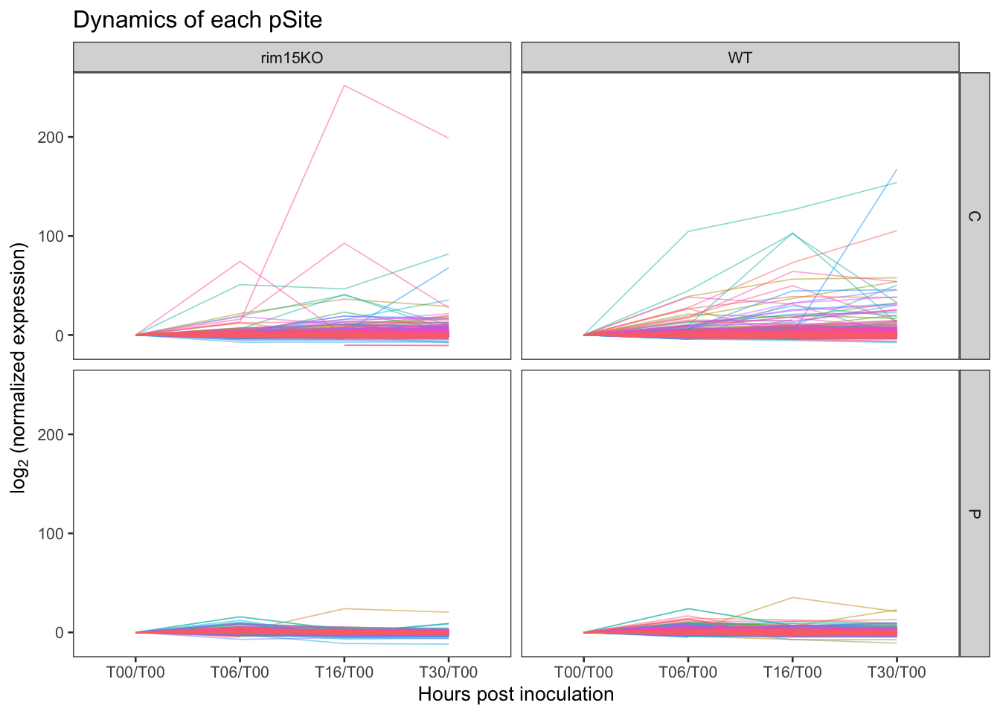
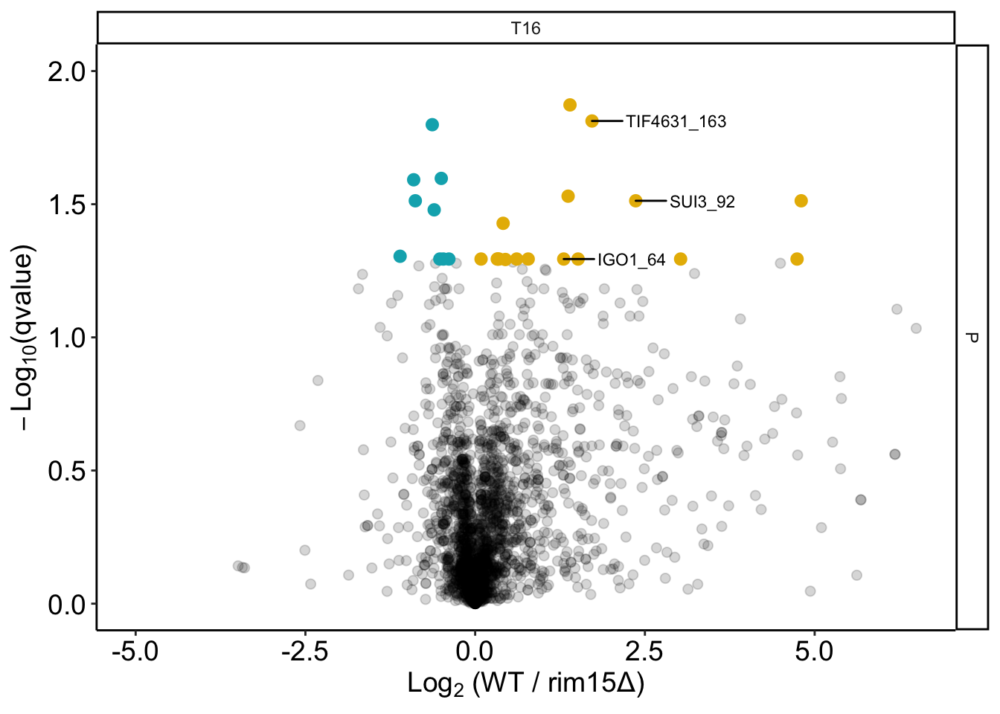

#read in files
#load packages

```r
library(ggplot2)
library(reshape2)
library(tidyverse)
## ── Attaching packages ───────────────────────────────────────────────── tidyverse 1.3.0 ──
## ✓ tibble  3.0.1     ✓ dplyr   0.8.5
## ✓ tidyr   1.0.2     ✓ stringr 1.4.0
## ✓ readr   1.3.1     ✓ forcats 0.5.0
## ✓ purrr   0.3.4
## ── Conflicts ──────────────────────────────────────────────────── tidyverse_conflicts() ──
## x dplyr::filter() masks stats::filter()
## x dplyr::lag()    masks stats::lag()
library(GGally)
## 
## Attaching package: 'GGally'
## The following object is masked from 'package:dplyr':
## 
##     nasa
library(ggpubr)
## Loading required package: magrittr
## 
## Attaching package: 'magrittr'
## The following object is masked from 'package:purrr':
## 
##     set_names
## The following object is masked from 'package:tidyr':
## 
##     extract
library(ggrepel)
library(gridExtra)
## 
## Attaching package: 'gridExtra'
## The following object is masked from 'package:dplyr':
## 
##     combine
library(devtools)
## Loading required package: usethis
library(ggfortify)
library(limma)
library(broom)
library(pheatmap)
```

#read in protein files

```r
#set working directory
#read in protein groups 
proteinGroups <- read_csv("./data/proteinGroups.csv")
## Parsed with column specification:
## cols(
##   .default = col_double(),
##   `Protein IDs` = col_character(),
##   `Majority protein IDs` = col_character(),
##   `Peptide counts (all)` = col_character(),
##   `Peptide counts (razor+unique)` = col_character(),
##   `Peptide counts (unique)` = col_character(),
##   `Protein names` = col_character(),
##   `Gene names` = col_character(),
##   `Fasta headers` = col_character(),
##   `Sequence lengths` = col_character(),
##   `Identification type phospho_C_T00_R1` = col_character(),
##   `Identification type phospho_C_T00_R2` = col_character(),
##   `Identification type phospho_C_T00_R3` = col_character(),
##   `Identification type phospho_C_T06_R1` = col_character(),
##   `Identification type phospho_C_T06_R2` = col_character(),
##   `Identification type phospho_C_T06_R3` = col_character(),
##   `Identification type phospho_C_T16_R1` = col_character(),
##   `Identification type phospho_C_T16_R2` = col_character(),
##   `Identification type phospho_C_T16_R3` = col_character(),
##   `Identification type phospho_C_T30_R1` = col_character(),
##   `Identification type phospho_C_T30_R2` = col_character()
##   # ... with 245 more columns
## )
## See spec(...) for full column specifications.
```

#normalized ratios 
#add the corresponding attributes for time 0 in each condition
##build in ratio from Maxquant, un-normalized

```r
#extract the protome info
ratio_normed <- proteinGroups %>% 
  #select coloumns that contains the useful information - based on the experiments setups
  dplyr::select(`Protein IDs`, `Gene names`,`Protein names`, `Fasta headers`, contains("Ratio")) %>%
  dplyr::select(`Protein IDs`, `Gene names`, `Protein names`, `Fasta headers`, contains("proteome")) %>%
  dplyr::select(`Protein IDs`, `Gene names`, `Protein names`, `Fasta headers`, contains("normalized")) %>%
  #remove columns that is not important
  dplyr::select(-matches("_N_")) %>% 
  dplyr::select(-contains("variability")) %>%
  dplyr::select(-contains("count")) %>%
  dplyr::select(-contains("iso-count")) %>%
  dplyr::select(-contains("type"))

#extract data for time 0
T00_P <- ratio_normed %>% dplyr::select(`Protein IDs`, `Gene names`,`Protein names`, `Fasta headers`, contains("T00")) %>% 
  dplyr::rename(`Ratio M/L normalized proteome_P_T00_R1` = `Ratio M/L normalized proteome_C_T00_R1`,
         `Ratio M/L normalized proteome_P_T00_R2` = `Ratio M/L normalized proteome_C_T00_R2`,
         `Ratio M/L normalized proteome_P_T00_R3` = `Ratio M/L normalized proteome_C_T00_R3`,
         `Ratio H/L normalized proteome_P_T00_R1` = `Ratio H/L normalized proteome_C_T00_R1`,
         `Ratio H/L normalized proteome_P_T00_R2` = `Ratio H/L normalized proteome_C_T00_R2`,
         `Ratio H/L normalized proteome_P_T00_R3` = `Ratio H/L normalized proteome_C_T00_R3`,
         `Ratio H/M normalized proteome_P_T00_R1` = `Ratio H/M normalized proteome_C_T00_R1`,
         `Ratio H/M normalized proteome_P_T00_R2` = `Ratio H/M normalized proteome_C_T00_R2`,
         `Ratio H/M normalized proteome_P_T00_R3` = `Ratio H/M normalized proteome_C_T00_R3`)

ratio_normed_add<- dplyr::inner_join(ratio_normed, T00_P, by = c("Protein IDs","Gene names","Protein names","Fasta headers"))
  
#reshape the table into a tidy format 
ratio_normed_tidy <- melt(ratio_normed_add) %>%
  separate(variable, c("signal","channel","normed","sampleNum"), sep = " ") %>%
  separate(sampleNum, c("omic","nutrient","samplingTime","replicate"), sep = "_") %>%
  dplyr::select(-c("signal","omic","normed"))  %>%
  #select only wild type and ko ratios individually
  dplyr::filter(channel %in% c("H/L","M/L","H/M"))
## Using Protein IDs, Gene names, Protein names, Fasta headers as id variables

#box plot
ggplot(ratio_normed_tidy, aes(x=samplingTime, y=value, fill = channel)) + 
  geom_boxplot(position=position_dodge(0.8))+#, outlier.shape = NA) +
  #
  facet_grid(nutrient~replicate) +
  theme_classic() +
  scale_color_manual(values=c("#13b1f0","#e7c100","#eb5534"))+
  scale_fill_manual(values=c("#13b1f0","#e7c100","#eb5534"))+
  scale_y_log10() +
  ylab("Ratio")
## Warning: Removed 127128 rows containing non-finite values (stat_boxplot).
```


```r

#summary table
summary_table <- ratio_normed_tidy %>% 
  group_by (channel, nutrient, samplingTime, replicate) %>%
  dplyr::summarize (total = sum (na.omit(value)), mean = mean(na.omit(value)), median = median(na.omit(value)), entries = n())

non_NAs <- ratio_normed_tidy %>% 
  drop_na() %>%
  group_by (channel, nutrient, samplingTime, replicate) %>%
  dplyr::summarize (total = sum (na.omit(value)), mean = mean(na.omit(value)), median = median(na.omit(value)), entries = n())

non_NAs %>%
  #remove values that is 0
  ggplot(aes(x=samplingTime,y = entries, col = replicate, fill = replicate, group = replicate)) + 
  geom_point(aes(x=samplingTime,y = entries, col = replicate, fill = replicate))+
  geom_line(aes(x=samplingTime,y = entries, col = replicate, fill = replicate))+
  theme(axis.text.x=element_text(angle=0),legend.position="bottom")+
  facet_grid(channel ~ nutrient, scales = "free") +
  scale_color_manual(values=c("#789cff", "#656371", "#ff7369"))+
  scale_fill_manual(values=c("#789cff", "#656371", "#ff7369")) +
  theme_classic2() +
  xlab("Hours post nutrient depletion") +
  ylab("unique proteins identified")
## Warning: Ignoring unknown aesthetics: fill
```


```r

#look at the distribution of proteins 
ratio_normed_tidy %>%
  #remove values that is 0
  ggplot(aes(x=log2(value), col = replicate, fill = replicate)) + 
  geom_histogram(aes(y=..density..),  position="identity", alpha=0.1)+
  geom_density(alpha = 0.3)+
  theme(axis.text.x=element_text(angle=0),legend.position="bottom")+
  facet_grid(channel ~ nutrient + samplingTime, scales = "free") +
  scale_color_manual(values=c("#789cff", "#656371", "#ff7369"))+
  scale_fill_manual(values=c("#789cff", "#656371", "#ff7369")) +
  theme_classic2() +
  ggtitle("Ratio distribution")
## `stat_bin()` using `bins = 30`. Pick better value with `binwidth`.
## Warning: Removed 127128 rows containing non-finite values (stat_bin).
## Warning: Removed 127128 rows containing non-finite values (stat_density).
```


```r

#coorelation Among Replicates 
df_spread <- ratio_normed_tidy %>% 
  spread(key = replicate, value = value) 
  
ggscatter(df_spread, x = "R1", y = "R2", alpha = 0.3, merge = TRUE, size=0.8,  col= "channel", shape = "channel", palette = c("#50a3a4", "#fcaf38", "#f95335")) + # Add confidence interval)
  stat_cor(aes(color = channel), method = "pearson", label.x.npc = "left", label.y.npc = "top", size=2) +
  facet_grid(nutrient~samplingTime, scale='free') +
  theme_classic()+
  scale_y_log10()+
  scale_x_log10()+
  xlab("Rep1")+
  ylab("Rep2")+
  ggtitle("Scatter plot for Rep1 vs Rep2 (build-in ratio)")
## Warning: Removed 46273 rows containing non-finite values (stat_cor).
## Warning: Removed 46273 rows containing missing values (geom_point).
```


```r

  #coorelation between rep1 and rep3
ggscatter(df_spread, x = "R1", y = "R3", alpha = .3, size=0.8, cor.coef.size = 0.4,  col= "channel", shape = "channel", palette = c("#50a3a4", "#fcaf38", "#f95335")) + # Add confidence interval)
    stat_cor(aes(color = channel), method = "pearson", label.x.npc = "left", label.y.npc = "top", size=2)  +
    facet_grid(nutrient~samplingTime, scale='free') +
        theme_classic()+
    scale_y_log10()+
    scale_x_log10()+
    ylab("Rep3")+
    xlab("Rep1")+
    ggtitle("Scatter plot for Rep1 vs Rep3 (build-in ratio)")
## Warning: Removed 46530 rows containing non-finite values (stat_cor).
## Warning: Removed 46530 rows containing missing values (geom_point).
```


```r

##reversed build-in ratio by genotypes
##swith H/L to M/L
rep2_HL_ML <- ratio_normed_tidy %>% 
  dplyr::filter(channel == "H/L" & replicate == "R2" & nutrient == "P") %>%
  mutate(channel="M/L")
##swith M/L to H/L
rep2_ML_HL <- ratio_normed_tidy %>% 
  dplyr::filter(channel == "M/L" & replicate == "R2" & nutrient == "P") %>%
  mutate(channel="H/L")
rep2_MH_MH <-  ratio_normed_tidy %>% 
  dplyr::filter(channel == "H/M" & replicate == "R2" & nutrient == "P") %>%
  mutate(value=1/value)
##combine all new replicate 2 data
rep2 <- bind_rows(rep2_HL_ML, rep2_ML_HL,rep2_MH_MH)

#join the revised replicate 2 with the other data from replicate 1&3
#remove old data
new_re <- anti_join(ratio_normed_tidy,ratio_normed_tidy %>% dplyr::filter (nutrient == "P" & replicate == "R2"))
## Joining, by = c("Protein IDs", "Gene names", "Protein names", "Fasta headers", "channel", "nutrient", "samplingTime", "replicate", "value")

ratio_normed_tidy_re <- bind_rows(rep2, new_re) %>%
  mutate(channel=replace(channel, channel=="M/L", "rim15KO")) %>%
  mutate(channel=replace(channel, channel=="H/L", "WT")) %>%
  mutate(channel=replace(channel, channel=="H/M", "WT/rim15KO")) %>%
  dplyr::rename(genotype = channel)
  #replace NA values with 1, which assuming there is no changes
    #mutate(value = if_else(is.na(value), 1, value))

#box plot
ggplot(ratio_normed_tidy_re, aes(x=genotype, y=log2(value), fill = samplingTime)) + 
  geom_boxplot(position=position_dodge(0.8))+#, outlier.shape = NA) +
  facet_grid(nutrient~replicate) +
  theme_classic() +
    theme(axis.text.x=element_text(angle=0),legend.position="bottom")+
  #scale_color_manual(values=c("#13b1f0","#e7c100","#eb5534"))+
  #scale_fill_manual(values=c("#13b1f0","#e7c100","#eb5534"))+
  ylab("Ratio")
## Warning: Removed 127128 rows containing non-finite values (stat_boxplot).
```


```r

#box plot for different genotypes at T00
ggplot(ratio_normed_tidy_re %>% dplyr::filter(samplingTime == "T00"), aes(x=genotype, y=log2(value), fill = samplingTime)) + 
  geom_boxplot(position=position_dodge(0.8), outlier.shape = NA) +
  facet_grid(nutrient~replicate) +
  theme_classic() +
  theme(axis.text.x=element_text(angle=0),legend.position="bottom")+
  #scale_color_manual(values=c("#13b1f0","#e7c100","#eb5534"))+
  #scale_fill_manual(values=c("#13b1f0","#e7c100","#eb5534"))+
  ylab("log2(Ratio)")
## Warning: Removed 21176 rows containing non-finite values (stat_boxplot).
```


```r

#look at the distribution of proteins 
ratio_normed_tidy_re %>%
  #remove values that is 0
  ggplot(aes(x=log2(value), col = replicate, fill = replicate)) + 
  geom_histogram(aes(y=..density..),  position="identity", alpha=0.1)+
  geom_density(alpha = 0.3)+
  theme(axis.text.x=element_text(angle=0),legend.position="bottom")+
  facet_grid(genotype ~ nutrient + samplingTime, scales = "free") +
  scale_color_manual(values=c("#789cff", "#656371", "#ff7369"))+
  scale_fill_manual(values=c("#789cff", "#656371", "#ff7369")) +
  theme_classic2() +
  ggtitle("Scatter plot for Rep1 vs Rep3 (build-in ratio)")
## `stat_bin()` using `bins = 30`. Pick better value with `binwidth`.
## Warning: Removed 127128 rows containing non-finite values (stat_bin).
## Warning: Removed 127128 rows containing non-finite values (stat_density).
```


```r

#coorelation Among Replicates 
df_spread <- ratio_normed_tidy_re %>% 
  spread(key = replicate, value = value) 
  
ggscatter(df_spread, x = "R1", y = "R2", alpha = 0.3, merge = TRUE, size=0.8,  col= "genotype", shape = "genotype", palette = c("#50a3a4", "#fcaf38", "#f95335")) + # Add confidence interval)
  stat_cor(aes(color = genotype), method = "pearson", label.x.npc = "left", label.y.npc = "top", size=2) +
  facet_grid(nutrient~samplingTime, scale='free') +
  theme_classic()+
  scale_y_log10()+
  scale_x_log10()+
  xlab("Rep1")+
  ylab("Rep2")+
  ggtitle("Scatter plot for Rep1 vs Rep2 (build-in ratio)")
## Warning: Removed 46273 rows containing non-finite values (stat_cor).
## Warning: Removed 46273 rows containing missing values (geom_point).
```


```r

  #coorelation between rep1 and rep3
  ggscatter(df_spread, x = "R1", y = "R3", alpha = .3, size=0.8, cor.coef.size = 0.4,  col= "genotype", shape = "genotype", palette = c("#50a3a4", "#fcaf38", "#f95335")) + # Add confidence interval)
    stat_cor(aes(color = genotype), method = "pearson", label.x.npc = "left", label.y.npc = "top", size=2)  +
    facet_grid(nutrient~samplingTime, scale='free') +
        theme_classic()+
    scale_y_log10()+
    scale_x_log10()+
    ylab("Rep3")+
    xlab("Rep1")+
    ggtitle("Scatter plot for Rep1 vs Rep3 (build-in ratio)")
## Warning: Removed 46530 rows containing non-finite values (stat_cor).
## Warning: Removed 46530 rows containing missing values (geom_point).
```


```r
  
ratio_normed_core <- ratio_normed_tidy_re  %>%
  #drop_na("value") %>%
  #filter(genotype %in% c("rim15KO","WT")) %>%
  group_by(`Gene names`, samplingTime, replicate, genotype) %>%
  dplyr::mutate(nutrient_number = n()) %>%
  dplyr::filter(nutrient_number == 2) %>%
  group_by(`Gene names`, nutrient, samplingTime, replicate) %>%
  dplyr::mutate(genotype_number = n()) %>%
  dplyr::filter(genotype_number==3) %>%
  group_by(`Gene names`, nutrient, samplingTime, genotype) %>%
  dplyr::mutate(rep_numner = n()) %>%
  dplyr::filter(rep_numner == 3) %>%
  group_by(`Gene names`, nutrient, replicate, genotype) %>%
  dplyr::mutate(time_number = n()) %>%
  dplyr::filter(time_number == 4)

#heatmap of core data
df <- ratio_normed_core %>% 
  select(nutrient, `Gene names`, genotype, replicate, samplingTime, value) %>%
  unite(cond, nutrient, genotype, samplingTime, replicate) %>%
  spread(key = cond, value = value)

#heatmap
annotation_col <- names(df)[-1] %>% as.tibble() %>%
  separate(value, c("nutrient","genotype","samplingTime","rep"), sep = "_", remove = FALSE) %>%
  column_to_rownames(var = "value")
## Warning: `as.tibble()` is deprecated as of tibble 2.0.0.
## Please use `as_tibble()` instead.
## The signature and semantics have changed, see `?as_tibble`.
## This warning is displayed once every 8 hours.
## Call `lifecycle::last_warnings()` to see where this warning was generated.
library(RColorBrewer)
breaksList = seq(-0.07, 0.07, by = 0.0001)

pdf("./plots/ratio_normed_heat_all.pdf", width = 13, height = 13)
pheatmap(df[,-1] %>% drop_na(), colorRampPalette(rev(brewer.pal(n =10, name = "RdYlBu")))(length(breaksList)),
                   cluster_cols = T, scale = "row", 
                   annotation_col = annotation_col)
dev.off()
## pdf 
##   3

pdf("./plots/ratio_normed_heat_light.pdf", width = 10, height = 8)
pheatmap(df[,c(2:25,38:61)] %>% drop_na(), colorRampPalette(rev(brewer.pal(n =10, name = "RdYlBu")))(length(breaksList)),
                   cluster_cols = T, scale = "row", 
                   annotation_col = annotation_col)
dev.off()
## pdf 
##   3

#look at C sample alone
pheatmap(df[,c(2:25)] %>% drop_na(), colorRampPalette(rev(brewer.pal(n =10, name = "RdYlBu")))(length(breaksList)),
                   cluster_cols = T, scale = "row", 
                   annotation_col = annotation_col)

#look at P sample alone
pheatmap(df[,c(38:61)] %>% drop_na(), colorRampPalette(rev(brewer.pal(n =10, name = "RdYlBu")))(length(breaksList)),
                   cluster_cols = T, scale = "row", 
                   annotation_col = annotation_col)
#PCA overtime
#the column number here is determined by the conditions + replicates + mutant libraries
  dz <- data.frame(t(df[,c(2:25,38:61)] %>% drop_na()))
  dz[,ncol(dz)+1] <- rownames(dz)
  colnames(dz)[ncol(dz)] <- "condition"
  dz <- dz %>% 
    separate(condition, c("nutrient", "genotype",  "samplingTime", "rep"), sep = "_", remove = FALSE) %>%
    unite(cond, nutrient, genotype, samplingTime, remove = FALSE)
  dim(dz)
## [1]  48 869
  l<-length(dz)-6
  
pdf("./plots/ratio_normed_PCA_time.pdf",width=7,height=5)
#the numbers in the range here is subject to the strains left after pre-filtering steps
autoplot(prcomp(dz[,c(1:l)]), data = dz, colour = 'genotype', size = 3) +
  #theme_classic() +
  theme(legend.position = "bottom") +
  facet_grid(nutrient~samplingTime)+
  scale_color_manual(values=c("#00AFBB","#E7B800"))+#"#6ec3c1" ,"#335120","#9dcc5f", "#0d5f8a")) +
  scale_fill_manual(values=c("#00AFBB","#E7B800")) #"#bfbdbd",
dev.off()
## pdf 
##   3

#reshape the core dataset for perseus 
perseus <- ratio_normed_tidy_re %>% 
  select(`Protein IDs`,`Protein names`,`Gene names`,`Fasta headers`, genotype,nutrient,samplingTime,replicate,value) %>%
  unite(cond, genotype, nutrient, samplingTime, replicate) %>%
  spread(key = cond, value = value)

#replace NA value in Genenames column with protein names
perseus$`Gene names` <- ifelse(is.na(perseus$`Gene names`), perseus$`Protein names`, perseus$`Gene names`) 

write_csv(perseus,"./tables/normed_ratio_perseus.csv")
```

#Overall, we observed less differential expression between genotypes from PCA plot. Dan suggest a k-means (2-means) cluetering to visualize the data
#kmeans clustering of protein groups

```r
library(cluster)    # clustering algorithms
library(factoextra) # clustering algorithms & visualization
## Welcome! Want to learn more? See two factoextra-related books at https://goo.gl/ve3WBa
pGroups <- na.omit(perseus)
#set the Gene names as Row names
pGroups <- pGroups %>% 
  select(-c(`Protein IDs`,`Protein names`,`Fasta headers`)) %>% 
  melt() %>%
  separate(variable, c("genotype","nutrient","time","repliate")) %>%
  unite(names, `Gene names`,genotype)
## Using Gene names as id variables
## Warning: Expected 4 pieces. Additional pieces discarded in 21144 rows [42289,
## 42290, 42291, 42292, 42293, 42294, 42295, 42296, 42297, 42298, 42299, 42300,
## 42301, 42302, 42303, 42304, 42305, 42306, 42307, 42308, ...].

#look at one condition @ one timepoint
T00_C <- pGroups %>%
  dplyr::filter(nutrient == "P", time == "T30") %>%
  select(-c("nutrient","time")) %>%
  spread(key=repliate, value = value)

rownames(T00_C) <- T00_C$names
T00_C <- T00_C %>% select(-names)
df <- scale(T00_C)
head(df)
##                      R1          R2         R3
## AAP1_rim15KO -0.7527054 -0.63473291 -0.8708873
## AAP1_WT      -1.0383460 -0.61819641 -0.4700921
## AAT2_rim15KO -0.1891465  0.05263614 -0.4545168
## AAT2_WT      -0.7890418 -0.72732578 -0.8419074
## ABF2_rim15KO  0.2446574 -0.05639719  0.4123512
## ABF2_WT       1.0037359  0.61927532  0.5663138

#distance <- get_dist(df)
#fviz_dist(distance, gradient = list(low = "#00AFBB", mid = "white", high = "#FC4E07"))

k2 <- kmeans(df, centers =3)
str(k2)
## List of 9
##  $ cluster     : Named int [1:1762] 3 3 3 3 2 2 2 2 3 3 ...
##   ..- attr(*, "names")= chr [1:1762] "AAP1_rim15KO" "AAP1_WT" "AAT2_rim15KO" "AAT2_WT" ...
##  $ centers     : num [1:3, 1:3] 2.535 0.349 -0.678 2.629 0.291 ...
##   ..- attr(*, "dimnames")=List of 2
##   .. ..$ : chr [1:3] "1" "2" "3"
##   .. ..$ : chr [1:3] "R1" "R2" "R3"
##  $ totss       : num 5283
##  $ withinss    : num [1:3] 633 473 456
##  $ tot.withinss: num 1562
##  $ betweenss   : num 3721
##  $ size        : int [1:3] 118 794 850
##  $ iter        : int 3
##  $ ifault      : int 0
##  - attr(*, "class")= chr "kmeans"

fviz_cluster(k2, data = df)
```


#read in pSite table

```r
#read in pSite groups 
phosphosites <- read_csv("./data/Phospho (STY)Sites.csv")
## Parsed with column specification:
## cols(
##   .default = col_double(),
##   Proteins = col_character(),
##   `Positions within proteins` = col_character(),
##   `Leading proteins` = col_character(),
##   Protein = col_character(),
##   `Protein names` = col_character(),
##   `Gene names` = col_character(),
##   `Fasta headers` = col_character(),
##   `Localization prob proteome_C_T00_R1` = col_logical(),
##   `Score diff proteome_C_T00_R1` = col_logical(),
##   `PEP proteome_C_T00_R1` = col_logical(),
##   `Score proteome_C_T00_R1` = col_logical(),
##   `Localization prob proteome_C_T00_R2` = col_logical(),
##   `Score diff proteome_C_T00_R2` = col_logical(),
##   `PEP proteome_C_T00_R2` = col_logical(),
##   `Score proteome_C_T00_R2` = col_logical(),
##   `Localization prob proteome_C_T00_R3` = col_logical(),
##   `Score diff proteome_C_T00_R3` = col_logical(),
##   `PEP proteome_C_T00_R3` = col_logical(),
##   `Score proteome_C_T00_R3` = col_logical(),
##   `Localization prob proteome_C_T06_R1` = col_logical()
##   # ... with 1900 more columns
## )
## See spec(...) for full column specifications.
## Warning: 332 parsing failures.
##  row               col               expected               actual                            file
## 1535 Protein group IDs no trailing characters ;3394                './data/Phospho (STY)Sites.csv'
## 1535 Positions         no trailing characters ;18                  './data/Phospho (STY)Sites.csv'
## 1536 Protein group IDs no trailing characters ;3394                './data/Phospho (STY)Sites.csv'
## 1536 Positions         no trailing characters ;19                  './data/Phospho (STY)Sites.csv'
## 1696 Protein group IDs no trailing characters ;3223;3308;3447;3455 './data/Phospho (STY)Sites.csv'
## .... ................. ...................... .................... ...............................
## See problems(...) for more details.
#View(phosphosites)
```

#look at the pSite normalized ratios

```r
#extract the protome info
ratio_normed <- phosphosites %>%
  dplyr::select(Proteins, id, `Positions within proteins`,`Leading proteins`,`Protein names`,`Gene names`,`Fasta headers`, `Localization prob`,`Sequence window`, contains("Ratio")) %>%
  dplyr::select(Proteins, id, `Sequence window`, `Positions within proteins`,`Leading proteins`,`Protein names`,`Gene names`,`Fasta headers`, `Localization prob`, contains("phospho")) %>%
  dplyr::select(Proteins, id, `Positions within proteins`,`Leading proteins`,`Protein names`,`Gene names`,`Fasta headers`, `Localization prob`,`Sequence window`, contains("normalized")) %>%
  dplyr::select(-matches("_N_")) %>%
  dplyr::select(-matches("___")) %>%
  mutate(id = factor(id)) %>%
  unite(pSite, `Gene names`, `Positions within proteins`, remove = FALSE) %>%
  dplyr::filter(`Localization prob` > 0.7) %>%
  select(-c(`Localization prob`, `Positions within proteins`)) %>%
  dplyr::select(-contains("variability")) %>%
  dplyr::select(-contains("count")) %>%
  dplyr::select(-contains("iso-count")) %>%
  dplyr::select(-contains("type"))

#extract data for time 0
T00_P <- ratio_normed %>% dplyr::select(Proteins, id, pSite, `Leading proteins`,`Protein names`,`Gene names`,`Fasta headers`, contains("T00")) %>% 
  dplyr::rename(`Ratio M/L normalized phospho_P_T00_R1` = `Ratio M/L normalized phospho_C_T00_R1`,
         `Ratio M/L normalized phospho_P_T00_R2` = `Ratio M/L normalized phospho_C_T00_R2`,
         `Ratio M/L normalized phospho_P_T00_R3` = `Ratio M/L normalized phospho_C_T00_R3`,
         `Ratio H/L normalized phospho_P_T00_R1` = `Ratio H/L normalized phospho_C_T00_R1`,
         `Ratio H/L normalized phospho_P_T00_R2` = `Ratio H/L normalized phospho_C_T00_R2`,
         `Ratio H/L normalized phospho_P_T00_R3` = `Ratio H/L normalized phospho_C_T00_R3`,
         `Ratio H/M normalized phospho_P_T00_R1` = `Ratio H/M normalized phospho_C_T00_R1`,
         `Ratio H/M normalized phospho_P_T00_R2` = `Ratio H/M normalized phospho_C_T00_R2`,
         `Ratio H/M normalized phospho_P_T00_R3` = `Ratio H/M normalized phospho_C_T00_R3`)

ratio_normed_add<- dplyr::inner_join(ratio_normed, T00_P, by = c("Proteins","id", "pSite", "Leading proteins", "Gene names","Protein names","Fasta headers"))

#reshape the table into a tidy format 
ratio_normed_tidy <- melt(ratio_normed_add) %>%
  separate(variable, c("signal","channel","normed","sampleNum"), sep = " ") %>%
  #separate(sampleNum, c("cond","site"), sep = "___") %>%
  #filter(variable %in% c())
  separate(sampleNum, c("omic","nutrient","samplingTime","replicate"), sep = "_") %>%
  dplyr::select(-c("signal","omic","normed"))  %>%
  #select only wild type and ko ratios individually
  dplyr::filter(channel %in% c("H/L","M/L","H/M"))
## Using Proteins, id, pSite, Leading proteins, Protein names, Gene names, Fasta headers, Sequence window as id variables

#box plot
ggplot(ratio_normed_tidy, aes(x=samplingTime, y=value, fill = channel)) + 
  geom_boxplot(position=position_dodge(0.8))+#, outlier.shape = NA) +
  facet_grid(nutrient~replicate) +
  theme_classic() +
  scale_color_manual(values=c("#13b1f0","#e7c100","#eb5534"))+
  scale_fill_manual(values=c("#13b1f0","#e7c100","#eb5534"))+
  scale_y_log10() +
  ylab("Ratio")
## Warning: Removed 207539 rows containing non-finite values (stat_boxplot).
```


```r

#summary table
summary_table <- ratio_normed_tidy %>% 
  group_by (channel, nutrient, samplingTime, replicate) %>%
  dplyr::summarize (total = sum (na.omit(value)), mean = mean(na.omit(value)), median = median(na.omit(value)), entries = n())

non_NAs <- ratio_normed_tidy %>% 
  drop_na() %>%
  group_by (channel, nutrient, samplingTime, replicate) %>%
  dplyr::summarize (total = sum (na.omit(value)), mean = mean(na.omit(value)), median = median(na.omit(value)), entries = n())

non_NAs %>%
  #remove values that is 0
  ggplot(aes(x=samplingTime,y = entries, col = replicate, fill = replicate, group = replicate)) + 
  geom_point(aes(x=samplingTime,y = entries, col = replicate, fill = replicate))+
  geom_line(aes(x=samplingTime,y = entries, col = replicate, fill = replicate))+
  theme(axis.text.x=element_text(angle=0),legend.position="bottom")+
  facet_grid(channel ~ nutrient, scales = "free") +
  scale_color_manual(values=c("#789cff", "#656371", "#ff7369"))+
  scale_fill_manual(values=c("#789cff", "#656371", "#ff7369")) +
  theme_classic2() +
  xlab("Hours post nutrient depletion") +
  ylab("unique pSite identified")
## Warning: Ignoring unknown aesthetics: fill
```


```r

#look at the distribution of proteins 
ratio_normed_tidy %>%
  #remove values that is 0
  ggplot(aes(x=log2(value), col = replicate, fill = replicate)) + 
  geom_histogram(aes(y=..density..),  position="identity", alpha=0.1)+
  geom_density(alpha = 0.3)+
  theme(axis.text.x=element_text(angle=0),legend.position="bottom")+
  facet_grid(channel ~ nutrient + samplingTime, scales = "free") +
  scale_color_manual(values=c("#789cff", "#656371", "#ff7369"))+
  scale_fill_manual(values=c("#789cff", "#656371", "#ff7369")) +
  theme_classic2() +
  ggtitle("Ratio distribution")
## `stat_bin()` using `bins = 30`. Pick better value with `binwidth`.
## Warning: Removed 207539 rows containing non-finite values (stat_bin).
## Warning: Removed 207539 rows containing non-finite values (stat_density).
```


```r

#coorelation Among Replicates 
df_spread <- ratio_normed_tidy %>% 
  spread(key = replicate, value = value) 
  
ggscatter(df_spread, x = "R1", y = "R2", alpha = 0.3, merge = TRUE, size=0.8,  col= "channel", shape = "channel", palette = c("#50a3a4", "#fcaf38", "#f95335")) + # Add confidence interval)
  stat_cor(aes(color = channel), method = "pearson", label.x.npc = "left", label.y.npc = "top", size=2) +
  facet_grid(nutrient~samplingTime, scale='free') +
  theme_classic()+
  scale_y_log10()+
  scale_x_log10()+
  xlab("Rep1")+
  ylab("Rep2")+
  ggtitle("Scatter plot for Rep1 vs Rep2 (build-in pSite ratio)")
## Warning: Removed 83822 rows containing non-finite values (stat_cor).
## Warning: Removed 83822 rows containing missing values (geom_point).
```


```r

  #coorelation between rep1 and rep3
ggscatter(df_spread, x = "R1", y = "R3", alpha = .3, size=0.8, cor.coef.size = 0.4,  col= "channel", shape = "channel", palette = c("#50a3a4", "#fcaf38", "#f95335")) + # Add confidence interval)
    stat_cor(aes(color = channel), method = "pearson", label.x.npc = "left", label.y.npc = "top", size=2)  +
    facet_grid(nutrient~samplingTime, scale='free') +
        theme_classic()+
    scale_y_log10()+
    scale_x_log10()+
    ylab("Rep3")+
    xlab("Rep1")+
    ggtitle("Scatter plot for Rep1 vs Rep3 (build-in pSite ratio)")
## Warning: Removed 84826 rows containing non-finite values (stat_cor).
## Warning: Removed 84826 rows containing missing values (geom_point).
```


```r

##reversed build-in ratio by genotypes
rep2_HL_ML <- ratio_normed_tidy %>% 
  dplyr::filter(channel == "H/L" & replicate == "R2" & nutrient == "P") %>%
  mutate(channel="M/L")
##swith M/L to H/L
rep2_ML_HL <- ratio_normed_tidy %>% 
  dplyr::filter(channel == "M/L" & replicate == "R2" & nutrient == "P") %>%
  mutate(channel="H/L")
rep2_MH_MH <-  ratio_normed_tidy %>% 
  dplyr::filter(channel == "H/M" & replicate == "R2" & nutrient == "P") %>%
  mutate(value=1/value)
##combine all new replicate 2 data
rep2 <- bind_rows(rep2_HL_ML, rep2_ML_HL,rep2_MH_MH)

#join the revised replicate 2 with the other data from replicate 1&3
#remove old data
new_re <- anti_join(ratio_normed_tidy, ratio_normed_tidy %>% dplyr::filter (nutrient == "P" & replicate == "R2"))
## Joining, by = c("Proteins", "id", "pSite", "Leading proteins", "Protein names", "Gene names", "Fasta headers", "Sequence window", "channel", "nutrient", "samplingTime", "replicate", "value")

ratio_normed_tidy_re <- bind_rows(rep2, new_re) %>%
  mutate(channel=replace(channel, channel=="M/L", "rim15KO")) %>%
  mutate(channel=replace(channel, channel=="H/L", "WT")) %>%
  mutate(channel=replace(channel, channel=="H/M", "WT/rim15KO")) %>%
  dplyr::rename(genotype = channel)
  #replace NA values with 1, which assuming there is no changes
    #mutate(value = if_else(is.na(value), 1, value))

#box plot
ggplot(ratio_normed_tidy_re, aes(x=genotype, y=log2(value), fill = samplingTime)) + 
  geom_boxplot(position=position_dodge(0.8))+#, outlier.shape = NA) +
  facet_grid(nutrient~replicate) +
  theme_classic() +
    theme(axis.text.x=element_text(angle=0),legend.position="bottom")+
  #scale_color_manual(values=c("#13b1f0","#e7c100","#eb5534"))+
  #scale_fill_manual(values=c("#13b1f0","#e7c100","#eb5534"))+
  ylab("pSites Ratio")
## Warning: Removed 207539 rows containing non-finite values (stat_boxplot).
```


```r

#box plot for different genotypes at T00
ggplot(ratio_normed_tidy_re %>% dplyr::filter(samplingTime == "T00"), aes(x=genotype, y=log2(value), fill = samplingTime)) + 
  geom_boxplot(position=position_dodge(0.8), outlier.shape = NA) +
  facet_grid(nutrient~replicate) +
  theme_classic() +
  theme(axis.text.x=element_text(angle=0),legend.position="bottom")+
  #scale_color_manual(values=c("#13b1f0","#e7c100","#eb5534"))+
  #scale_fill_manual(values=c("#13b1f0","#e7c100","#eb5534"))+
  ylab("log2(pSites Ratio)")
## Warning: Removed 51870 rows containing non-finite values (stat_boxplot).
```


```r

#look at the distribution of proteins 
ratio_normed_tidy_re %>%
  #remove values that is 0
  ggplot(aes(x=log2(value), col = replicate, fill = replicate)) + 
  geom_histogram(aes(y=..density..),  position="identity", alpha=0.1)+
  geom_density(alpha = 0.3)+
  theme(axis.text.x=element_text(angle=0),legend.position="bottom")+
  facet_grid(genotype ~ nutrient + samplingTime, scales = "free") +
  scale_color_manual(values=c("#789cff", "#656371", "#ff7369"))+
  scale_fill_manual(values=c("#789cff", "#656371", "#ff7369")) +
  theme_classic2() +
  ggtitle("Scatter plot for Rep1 vs Rep3 (build-in pSites ratio)")
## `stat_bin()` using `bins = 30`. Pick better value with `binwidth`.
## Warning: Removed 207539 rows containing non-finite values (stat_bin).
## Warning: Removed 207539 rows containing non-finite values (stat_density).
```


```r

#coorelation Among Replicates 
df_spread <- ratio_normed_tidy_re %>% 
  spread(key = replicate, value = value) 
  
ggscatter(df_spread, x = "R1", y = "R2", alpha = 0.3, merge = TRUE, size=0.8,  col= "genotype", shape = "genotype", palette = c("#50a3a4", "#fcaf38", "#f95335")) + # Add confidence interval)
  stat_cor(aes(color = genotype), method = "pearson", label.x.npc = "left", label.y.npc = "top", size=2) +
  facet_grid(nutrient~samplingTime, scale='free') +
  theme_classic()+
  scale_y_log10()+
  scale_x_log10()+
  xlab("Rep1")+
  ylab("Rep2")+
  ggtitle("Scatter plot for Rep1 vs Rep2 (build-in pSites ratio)")
## Warning: Removed 83821 rows containing non-finite values (stat_cor).
## Warning: Removed 83821 rows containing missing values (geom_point).
```


```r

  #coorelation between rep1 and rep3
  ggscatter(df_spread, x = "R1", y = "R3", alpha = .3, size=0.8, cor.coef.size = 0.4,  col= "genotype", shape = "genotype", palette = c("#50a3a4", "#fcaf38", "#f95335")) + # Add confidence interval)
    stat_cor(aes(color = genotype), method = "pearson", label.x.npc = "left", label.y.npc = "top", size=2)  +
    facet_grid(nutrient~samplingTime, scale='free') +
        theme_classic()+
    scale_y_log10()+
    scale_x_log10()+
    ylab("Rep3")+
    xlab("Rep1")+
    ggtitle("Scatter plot for Rep1 vs Rep3 (build-in pSites ratio)")
## Warning: Removed 84826 rows containing non-finite values (stat_cor).
## Warning: Removed 84826 rows containing missing values (geom_point).
```


```r
  
ratio_normed_core <- ratio_normed_tidy_re  %>%
  #filter(genotype %in% c("rim15KO", "WT")) %>%
  #drop_na("value") %>%
  group_by(pSite, samplingTime, replicate, genotype) %>%
  dplyr::mutate(nutrient_number = n()) %>%
  dplyr::filter(nutrient_number == 2) %>%
  group_by(pSite, nutrient, samplingTime, replicate) %>%
  dplyr::mutate(genotype_number = n()) %>%
  dplyr::filter(genotype_number==3) %>%
  group_by(pSite, nutrient, samplingTime, genotype) %>%
   dplyr::mutate(rep_numner = n()) %>%
  dplyr::filter(rep_numner == 3) %>%
  group_by(pSite, nutrient, replicate, genotype) %>%
   dplyr::mutate(time_number = n()) %>%
  dplyr::filter(time_number == 4)

#heatmap of core data
df <- ratio_normed_core %>% 
  select(nutrient, pSite, genotype, replicate, samplingTime, value) %>%
  unite(cond, nutrient, genotype, samplingTime, replicate) %>%
  spread(key = cond, value = value)

#heatmap
annotation_col <- names(df)[-1] %>% as.tibble() %>%
  separate(value, c("nutrient","genotype","samplingTime","rep"), sep = "_", remove = FALSE) %>%
  column_to_rownames(var = "value")

pdf("./plots/pSite_ratio_normed_heat_all.pdf", width = 13, height = 13)
pheatmap(df[,-1] %>% drop_na(), colorRampPalette(rev(brewer.pal(n =10, name = "RdYlBu")))(length(breaksList)),
                   cluster_cols = T, scale = "row", 
                   annotation_col = annotation_col)
dev.off()
## pdf 
##   3

pdf("./plots/pSite_ratio_normed_heat_light.pdf", width = 10, height = 8)
pheatmap(df[,c(2:25,38:61)] %>% drop_na(), colorRampPalette(rev(brewer.pal(n =10, name = "RdYlBu")))(length(breaksList)),
                   cluster_cols = T, scale = "row", 
                   annotation_col = annotation_col)
dev.off()
## pdf 
##   3

#look at C sample alone
pheatmap(df[,c(2:25)] %>% drop_na(), colorRampPalette(rev(brewer.pal(n =10, name = "RdYlBu")))(length(breaksList)),
                   cluster_cols = T, scale = "row", 
                   annotation_col = annotation_col)

#look at P sample alone
pheatmap(df[,c(38:61)] %>% drop_na(), colorRampPalette(rev(brewer.pal(n =10, name = "RdYlBu")))(length(breaksList)),
                   cluster_cols = T, scale = "row", 
                   annotation_col = annotation_col)
#PCA overtime
#the column number here is determined by the conditions + replicates + mutant libraries
  dz <- data.frame(t(df[,c(2:25,38:61)]%>%drop_na()))
  dz[,ncol(dz)+1] <- rownames(dz)
  colnames(dz)[ncol(dz)] <- "condition"
  dz <- dz %>% 
    separate(condition, c("nutrient", "genotype",  "samplingTime", "rep"), sep = "_", remove = FALSE) %>%
    unite(cond, nutrient, genotype, samplingTime, remove = FALSE)
  dim(dz)
## [1]  48 486
  l<-length(dz)-6
  
pdf("./plots/pSite_ratio_normed_PCA_time.pdf",width=7,height=5)
#the numbers in the range here is subject to the strains left after pre-filtering steps
autoplot(prcomp(dz[,c(1:l)]), data = dz, colour = 'genotype', size = 3) +
  #theme_classic() +
  theme(legend.position = "bottom") +
  facet_grid(nutrient~samplingTime)+
  scale_color_manual(values=c("#00AFBB","#E7B800"))+#"#6ec3c1" ,"#335120","#9dcc5f", "#0d5f8a")) +
  scale_fill_manual(values=c("#00AFBB","#E7B800")) #"#bfbdbd",
dev.off()
## pdf 
##   3

#reshape the core dataset for perseus 
perseus <- ratio_normed_tidy_re %>% 
  select(Proteins, id, pSite, `Leading proteins`,`Protein names`,`Gene names`,`Fasta headers`, genotype,nutrient,samplingTime,replicate,value) %>%
  unite(cond, genotype, nutrient, samplingTime, replicate) %>%
  spread(key = cond, value = value)
#replace NA value in Genenames column with protein names
perseus$`Gene names` <- ifelse(is.na(perseus$`Gene names`), perseus$`Protein names`, perseus$`Gene names`)  
write_csv(perseus,"./tables/normed_pSite_ratio_perseus.csv")
```

#normalize every data point in relative to time 0
## look at the logFC for both protein and pSites

```r
#read in pre-processed datafile
proteinG<-read_csv("./tables/normed_ratio_perseus.csv")
## Parsed with column specification:
## cols(
##   .default = col_double(),
##   `Protein IDs` = col_character(),
##   `Protein names` = col_character(),
##   `Gene names` = col_character(),
##   `Fasta headers` = col_character()
## )
## See spec(...) for full column specifications.

proteinG_tidy <- melt(proteinG) %>%
  separate(variable, c("genotype", "nutrient", "samplingTime", "replicate"), sep = "_")
## Using Protein IDs, Protein names, Gene names, Fasta headers as id variables

#caculate the profile of each protein
relative_pG <- proteinG_tidy %>% unite(cond, genotype, nutrient, replicate) %>%
  spread(key = samplingTime, value = value) %>%
  mutate(`T00/T00` = T00-T00, `T06/T00` = T06-T00, `T16/T00` = T16-T00, `T30/T00` = T30-T00) %>%
  melt() %>%
  separate(cond, c("genotype","nutrient","replicate"), sep = "_") 
## Using Protein IDs, Protein names, Gene names, Fasta headers, cond as id variables

relative_pG%>%
  #dplyr::filter(nutrient == "P") %>%
  dplyr::filter(variable %in% c("T00/T00","T06/T00","T16/T00","T30/T00")) %>%
  dplyr::filter(replicate == "R3") %>%
  ggplot(aes(x=variable, y=value, group=`Protein names`, color=`Protein names`)) +
  facet_grid(genotype~nutrient)+
  geom_line(size=0.3,alpha=0.5)+
  ylab(expression(log[2]*" (normalized expression) ")) +
  theme_bw(base_size=10) +
  ylim(-3,3) +
  theme_classic2()+
  ggtitle("Dynamics for each protein group") +  
  theme(panel.grid.major = element_blank(), panel.grid.minor =element_blank(),legend.position="none") +
  xlab("Hours post inoculation")
## Warning: Removed 29867 row(s) containing missing values (geom_path).
```


```r
#drop na function
delete.na <- function(DF, n=0) {DF[rowSums(is.na(DF)) <= n,]}

#t-test between samples 
pG_reshape <- relative_pG %>% 
  dplyr::rename(time = variable) %>%
  dplyr::filter(time %in% c("T00","T06","T16","T30")) %>%
  group_by(`Protein IDs`, `Protein names`,`Gene names`,`Fasta headers`, nutrient, time) %>%
  unite(cond, genotype, replicate) %>%
  spread(key = cond, value = value) 

pG_filtered <- delete.na(pG_reshape,2)
  
#run t-test and log2FC
ttest_pG <- pG_filtered %>%
  melt() %>%
  separate(variable, c("genotype","replicate")) %>%
  group_by(`Protein IDs`, `Protein names`,`Gene names`,`Fasta headers`, nutrient, time) %>%
  summarise_each(funs(t.test(.[genotype == "WT"], .[genotype == "rim15KO"], var.equal=TRUE)$p.value), pvalue = value) 
## Using Protein IDs, Protein names, Gene names, Fasta headers, nutrient, time as id variables
## Warning: Expected 2 pieces. Additional pieces discarded in 34542 rows [69085,
## 69086, 69087, 69088, 69089, 69090, 69091, 69092, 69093, 69094, 69095, 69096,
## 69097, 69098, 69099, 69100, 69101, 69102, 69103, 69104, ...].
## Warning: funs() is soft deprecated as of dplyr 0.8.0
## Please use a list of either functions or lambdas: 
## 
##   # Simple named list: 
##   list(mean = mean, median = median)
## 
##   # Auto named with `tibble::lst()`: 
##   tibble::lst(mean, median)
## 
##   # Using lambdas
##   list(~ mean(., trim = .2), ~ median(., na.rm = TRUE))
## This warning is displayed once per session.

ttest_pG$qvalue <- p.adjust(ttest_pG$pvalue,method="BH") 

log2FC_pG <- pG_filtered %>%
  melt() %>%
  separate(variable, c("genotype","replicate")) %>%
  group_by(`Protein IDs`, `Protein names`,`Gene names`,`Fasta headers`, nutrient, time) %>%
  summarise_each(funs(mean(.[genotype=="WT"], na.rm=TRUE)-mean(.[genotype == "rim15KO"], na.rm=TRUE)), log2FC = value)
## Using Protein IDs, Protein names, Gene names, Fasta headers, nutrient, time as id variables
## Warning: Expected 2 pieces. Additional pieces discarded in 34542 rows [69085,
## 69086, 69087, 69088, 69089, 69090, 69091, 69092, 69093, 69094, 69095, 69096,
## 69097, 69098, 69099, 69100, 69101, 69102, 69103, 69104, ...].

logFC_ttest_pG <-left_join(ttest_pG, log2FC_pG, by = c( "Protein IDs","Protein names","Gene names","Fasta headers", "nutrient","time"))

ggplot(data=logFC_ttest_pG %>% dplyr::filter(nutrient == "P"), aes(x=log2FC, y =-log10(qvalue))) +
  geom_point(data=dplyr::filter(logFC_ttest_pG, nutrient == "P", qvalue > 0.05), alpha = 1/6, size = 0.8) +
  geom_point(data=dplyr::filter(logFC_ttest_pG, nutrient == "P", log2FC < -1, qvalue < 0.05), alpha = 1, size = 1.5,  color = c("#00afbb")) +
  geom_point(data=dplyr::filter(logFC_ttest_pG, nutrient == "P", log2FC > 1, qvalue < 0.05), alpha = 1, size = 1.5, color = 
c("#e7b800")) +
  theme_classic() +
  coord_fixed(ratio = 6) +
  xlab(expression(Log[2]*" (WT / rim15Δ)")) +
  ylab(expression(-Log[10]* "(qvalue)")) +
  xlim(-2.5,6.5) +
  ylim(0,2) +
  theme(plot.title = element_text(hjust = 0.5, size = 14), axis.title = element_text(size = 12), axis.text = element_text(size = 10, colour = "black")) +
  facet_grid(nutrient~time)+
  theme(legend.position="none")
## Warning: Removed 21 rows containing missing values (geom_point).
## Warning: Removed 1 rows containing missing values (geom_point).
```


```r
ggsave("./plots/pGroups_volcano.pdf",width = 7, height = 4,  useDingbats=FALSE)
## Warning: Removed 21 rows containing missing values (geom_point).

## Warning: Removed 1 rows containing missing values (geom_point).
## Warning in grid.Call(C_textBounds, as.graphicsAnnot(x$label), x$x, x$y, : font
## metrics unknown for Unicode character U+0394
## Warning in grid.Call(C_textBounds, as.graphicsAnnot(x$label), x$x, x$y, :
## conversion failure on ' (WT / rim15Δ)' in 'mbcsToSbcs': dot substituted for <ce>
## Warning in grid.Call(C_textBounds, as.graphicsAnnot(x$label), x$x, x$y, :
## conversion failure on ' (WT / rim15Δ)' in 'mbcsToSbcs': dot substituted for <94>
## Warning in grid.Call(C_textBounds, as.graphicsAnnot(x$label), x$x, x$y, : font
## metrics unknown for Unicode character U+0394
## Warning in grid.Call(C_textBounds, as.graphicsAnnot(x$label), x$x, x$y, :
## conversion failure on ' (WT / rim15Δ)' in 'mbcsToSbcs': dot substituted for <ce>
## Warning in grid.Call(C_textBounds, as.graphicsAnnot(x$label), x$x, x$y, :
## conversion failure on ' (WT / rim15Δ)' in 'mbcsToSbcs': dot substituted for <94>
## Warning in grid.Call(C_textBounds, as.graphicsAnnot(x$label), x$x, x$y, : font
## metrics unknown for Unicode character U+0394
## Warning in grid.Call(C_textBounds, as.graphicsAnnot(x$label), x$x, x$y, :
## conversion failure on ' (WT / rim15Δ)' in 'mbcsToSbcs': dot substituted for <ce>
## Warning in grid.Call(C_textBounds, as.graphicsAnnot(x$label), x$x, x$y, :
## conversion failure on ' (WT / rim15Δ)' in 'mbcsToSbcs': dot substituted for <94>
## Warning in grid.Call(C_textBounds, as.graphicsAnnot(x$label), x$x, x$y, : font
## metrics unknown for Unicode character U+0394
## Warning in grid.Call(C_textBounds, as.graphicsAnnot(x$label), x$x, x$y, :
## conversion failure on ' (WT / rim15Δ)' in 'mbcsToSbcs': dot substituted for <ce>
## Warning in grid.Call(C_textBounds, as.graphicsAnnot(x$label), x$x, x$y, :
## conversion failure on ' (WT / rim15Δ)' in 'mbcsToSbcs': dot substituted for <94>
## Warning in grid.Call(C_textBounds, as.graphicsAnnot(x$label), x$x, x$y, : font
## metrics unknown for Unicode character U+0394
## Warning in grid.Call(C_textBounds, as.graphicsAnnot(x$label), x$x, x$y, :
## conversion failure on ' (WT / rim15Δ)' in 'mbcsToSbcs': dot substituted for <ce>
## Warning in grid.Call(C_textBounds, as.graphicsAnnot(x$label), x$x, x$y, :
## conversion failure on ' (WT / rim15Δ)' in 'mbcsToSbcs': dot substituted for <94>
## Warning in grid.Call(C_textBounds, as.graphicsAnnot(x$label), x$x, x$y, : font
## metrics unknown for Unicode character U+0394
## Warning in grid.Call(C_textBounds, as.graphicsAnnot(x$label), x$x, x$y, :
## conversion failure on ' (WT / rim15Δ)' in 'mbcsToSbcs': dot substituted for <ce>
## Warning in grid.Call(C_textBounds, as.graphicsAnnot(x$label), x$x, x$y, :
## conversion failure on ' (WT / rim15Δ)' in 'mbcsToSbcs': dot substituted for <94>
## Warning in grid.Call(C_textBounds, as.graphicsAnnot(x$label), x$x, x$y, : font
## metrics unknown for Unicode character U+0394
## Warning in grid.Call(C_textBounds, as.graphicsAnnot(x$label), x$x, x$y, :
## conversion failure on ' (WT / rim15Δ)' in 'mbcsToSbcs': dot substituted for <ce>
## Warning in grid.Call(C_textBounds, as.graphicsAnnot(x$label), x$x, x$y, :
## conversion failure on ' (WT / rim15Δ)' in 'mbcsToSbcs': dot substituted for <94>
## Warning in grid.Call(C_textBounds, as.graphicsAnnot(x$label), x$x, x$y, : font
## metrics unknown for Unicode character U+0394
## Warning in grid.Call(C_textBounds, as.graphicsAnnot(x$label), x$x, x$y, :
## conversion failure on ' (WT / rim15Δ)' in 'mbcsToSbcs': dot substituted for <ce>
## Warning in grid.Call(C_textBounds, as.graphicsAnnot(x$label), x$x, x$y, :
## conversion failure on ' (WT / rim15Δ)' in 'mbcsToSbcs': dot substituted for <94>
## Warning in grid.Call(C_textBounds, as.graphicsAnnot(x$label), x$x, x$y, : font
## metrics unknown for Unicode character U+0394
## Warning in grid.Call(C_textBounds, as.graphicsAnnot(x$label), x$x, x$y, :
## conversion failure on ' (WT / rim15Δ)' in 'mbcsToSbcs': dot substituted for <ce>
## Warning in grid.Call(C_textBounds, as.graphicsAnnot(x$label), x$x, x$y, :
## conversion failure on ' (WT / rim15Δ)' in 'mbcsToSbcs': dot substituted for <94>
## Warning in grid.Call(C_textBounds, as.graphicsAnnot(x$label), x$x, x$y, : font
## metrics unknown for Unicode character U+0394
## Warning in grid.Call(C_textBounds, as.graphicsAnnot(x$label), x$x, x$y, :
## conversion failure on ' (WT / rim15Δ)' in 'mbcsToSbcs': dot substituted for <ce>
## Warning in grid.Call(C_textBounds, as.graphicsAnnot(x$label), x$x, x$y, :
## conversion failure on ' (WT / rim15Δ)' in 'mbcsToSbcs': dot substituted for <94>
## Warning in grid.Call(C_textBounds, as.graphicsAnnot(x$label), x$x, x$y, : font
## metrics unknown for Unicode character U+0394
## Warning in grid.Call(C_textBounds, as.graphicsAnnot(x$label), x$x, x$y, :
## conversion failure on ' (WT / rim15Δ)' in 'mbcsToSbcs': dot substituted for <ce>
## Warning in grid.Call(C_textBounds, as.graphicsAnnot(x$label), x$x, x$y, :
## conversion failure on ' (WT / rim15Δ)' in 'mbcsToSbcs': dot substituted for <94>
## Warning in grid.Call(C_textBounds, as.graphicsAnnot(x$label), x$x, x$y, : font
## metrics unknown for Unicode character U+0394
## Warning in grid.Call(C_textBounds, as.graphicsAnnot(x$label), x$x, x$y, :
## conversion failure on ' (WT / rim15Δ)' in 'mbcsToSbcs': dot substituted for <ce>
## Warning in grid.Call(C_textBounds, as.graphicsAnnot(x$label), x$x, x$y, :
## conversion failure on ' (WT / rim15Δ)' in 'mbcsToSbcs': dot substituted for <94>
## Warning in grid.Call(C_textBounds, as.graphicsAnnot(x$label), x$x, x$y, : font
## metrics unknown for Unicode character U+0394
## Warning in grid.Call(C_textBounds, as.graphicsAnnot(x$label), x$x, x$y, :
## conversion failure on ' (WT / rim15Δ)' in 'mbcsToSbcs': dot substituted for <ce>
## Warning in grid.Call(C_textBounds, as.graphicsAnnot(x$label), x$x, x$y, :
## conversion failure on ' (WT / rim15Δ)' in 'mbcsToSbcs': dot substituted for <94>
## Warning in grid.Call(C_textBounds, as.graphicsAnnot(x$label), x$x, x$y, : font
## metrics unknown for Unicode character U+0394
## Warning in grid.Call(C_textBounds, as.graphicsAnnot(x$label), x$x, x$y, :
## conversion failure on ' (WT / rim15Δ)' in 'mbcsToSbcs': dot substituted for <ce>
## Warning in grid.Call(C_textBounds, as.graphicsAnnot(x$label), x$x, x$y, :
## conversion failure on ' (WT / rim15Δ)' in 'mbcsToSbcs': dot substituted for <94>
## Warning in grid.Call.graphics(C_text, as.graphicsAnnot(x$label), x$x, x$y, :
## font metrics unknown for Unicode character U+0394
## Warning in grid.Call.graphics(C_text, as.graphicsAnnot(x$label), x$x, x$y, :
## conversion failure on ' (WT / rim15Δ)' in 'mbcsToSbcs': dot substituted for <ce>
## Warning in grid.Call.graphics(C_text, as.graphicsAnnot(x$label), x$x, x$y, :
## conversion failure on ' (WT / rim15Δ)' in 'mbcsToSbcs': dot substituted for <94>
## Warning in grid.Call.graphics(C_text, as.graphicsAnnot(x$label), x$x, x$y, :
## font metrics unknown for Unicode character U+0394
## Warning in grid.Call.graphics(C_text, as.graphicsAnnot(x$label), x$x, x$y, :
## conversion failure on ' (WT / rim15Δ)' in 'mbcsToSbcs': dot substituted for <ce>
## Warning in grid.Call.graphics(C_text, as.graphicsAnnot(x$label), x$x, x$y, :
## conversion failure on ' (WT / rim15Δ)' in 'mbcsToSbcs': dot substituted for <94>
## Warning in grid.Call.graphics(C_text, as.graphicsAnnot(x$label), x$x, x$y, :
## conversion failure on ' (WT / rim15Δ)' in 'mbcsToSbcs': dot substituted for <ce>
## Warning in grid.Call.graphics(C_text, as.graphicsAnnot(x$label), x$x, x$y, :
## conversion failure on ' (WT / rim15Δ)' in 'mbcsToSbcs': dot substituted for <94>
## Warning in grid.Call.graphics(C_text, as.graphicsAnnot(x$label), x$x, x$y, :
## conversion failure on ' (WT / rim15Δ)' in 'mbcsToSbcs': dot substituted for <ce>
## Warning in grid.Call.graphics(C_text, as.graphicsAnnot(x$label), x$x, x$y, :
## conversion failure on ' (WT / rim15Δ)' in 'mbcsToSbcs': dot substituted for <94>

###############################################################################################
pSite<-read_csv("./tables/normed_pSite_ratio_perseus.csv") %>%
    dplyr::select(-c("id"))
## Parsed with column specification:
## cols(
##   .default = col_double(),
##   Proteins = col_character(),
##   pSite = col_character(),
##   `Leading proteins` = col_character(),
##   `Protein names` = col_character(),
##   `Gene names` = col_character(),
##   `Fasta headers` = col_character()
## )
## See spec(...) for full column specifications.

pSite_tidy <- melt(pSite) %>%
  separate(variable, c("genotype", "nutrient", "samplingTime", "replicate"), sep = "_") %>%
  dplyr::filter(genotype %in% c("rim15KO","WT"))
## Using Proteins, pSite, Leading proteins, Protein names, Gene names, Fasta headers as id variables

#caculate the profile of each protein
relative_pS <- pSite_tidy %>% unite(cond, genotype, nutrient, replicate) %>%
  drop_na() %>%
  spread(key = samplingTime, value = value) %>%
  mutate(`T00/T00` = T00-T00, `T06/T00` = T06-T00, `T16/T00` = T16-T00, `T30/T00` = T30-T00) %>%
  melt() %>%
  separate(cond, c("genotype","nutrient","replicate"), sep = "_") 
## Using Proteins, pSite, Leading proteins, Protein names, Gene names, Fasta headers, cond as id variables

relative_pS %>%
  dplyr::filter(variable %in% c("T00/T00","T06/T00","T16/T00","T30/T00")) %>%
  dplyr::filter(replicate == "R3") %>%
  ggplot(aes(x=variable, y=value, group=pSite, color=pSite)) +
  facet_grid(nutrient~genotype)+
  geom_line(size=0.3,alpha=0.5,colours = pSite)+
  theme_bw(base_size=10) +
  #scale_fill_brewer() +
  #scale_color_brewer() +
  ylab(expression(log[2]*" (normalized expression) ")) +
  ggtitle("Dynamics of each pSite") +  
  theme(panel.grid.major = element_blank(), panel.grid.minor =element_blank(),legend.position="none")+
  xlab("Hours post inoculation")
## Warning: Ignoring unknown parameters: colours
## Warning: Removed 18928 row(s) containing missing values (geom_path).
```



```r

###################################################
#t-test between samples 
pS_reshape <- relative_pS %>% 
  dplyr::rename(time = variable) %>%
  dplyr::filter(time %in% c("T00","T06","T16","T30")) %>%
  group_by(`Proteins`, `Leading proteins`, `Protein names`,`Gene names`, pSite, `Fasta headers`, nutrient, time) %>%
  unite(cond, genotype, replicate) %>%
  spread(key = cond, value = value) 

pS_filtered <- delete.na(pS_reshape,2)
  
#run t-test and log2FC
ttest_pS <- pS_filtered %>%
  melt() %>%
  separate(variable, c("genotype","replicate")) %>%
  group_by(`Proteins`, `Leading proteins`, `Protein names`,`Gene names`, pSite, `Fasta headers`, nutrient, time) %>%
  summarise_each(funs(t.test(.[genotype == "WT"], .[genotype == "rim15KO"], var.equal=TRUE)$p.value), pvalue = value) 
## Using Proteins, pSite, Leading proteins, Protein names, Gene names, Fasta headers, nutrient, time as id variables

ttest_pS$qvalue <- p.adjust(ttest_pS$pvalue,method="BH") 

log2FC_pS <- pS_filtered %>%
  melt() %>%
  separate(variable, c("genotype","replicate")) %>%
  group_by(`Proteins`, `Leading proteins`, `Protein names`,`Gene names`, pSite, `Fasta headers`, nutrient, time) %>%
  summarise_each(funs(mean(.[genotype=="WT"], na.rm=TRUE)-mean(.[genotype == "rim15KO"], na.rm=TRUE)), log2FC = value)
## Using Proteins, pSite, Leading proteins, Protein names, Gene names, Fasta headers, nutrient, time as id variables

logFC_ttest_pS <-left_join(ttest_pS, log2FC_pS, by = c( "Proteins", "Leading proteins", "Protein names", "Gene names","pSite","Fasta headers", "nutrient","time")) %>%
    mutate(qvalue = round(qvalue, digits = 4))

T00 <- logFC_ttest_pS %>% dplyr::filter(nutrient == "P", qvalue <= 0.051, abs(log2FC) > 0, time == "T00")

sample_protein <- logFC_ttest_pS %>%
  dplyr::filter(pSite == "TIF4631_163") %>%
  dplyr::filter(nutrient == "P") 

show_syn <- logFC_ttest_pS %>%
  dplyr::filter(pSite %in% c("IGO1_64","SUI3_92","TIF5_189","TIF5_190","FUN12_386","DPS1_14","TIF4631_163","DPS1_14","HCR1_65","SEC16_1760","EAP1_391")) %>%
  dplyr::filter(nutrient == "P") #%>%

show_deg<-logFC_ttest_pS %>%
  dplyr::filter(pSite %in% c("CUE5_50","YRB1_60","BRE5_282")) %>%
  dplyr::filter(nutrient == "P") #%>%
                             
show_trehelose<-logFC_ttest_pS %>% 
    dplyr::filter(pSite %in% c("TPS3_148","TSL1_73","TSL1_155","TSL1_147")) %>%
    dplyr::filter(nutrient == "P") #%>%
show <- logFC_ttest_pS %>% 
    dplyr::filter(pSite %in% c("IGO1_64","SUI3_92","TIF5_189","TIF5_190","FUN12_386","DPS1_14","TIF4631_163","DPS1_14","HCR1_65","SEC16_1760","EAP1_391", "TPS3_148","TSL1_73","TSL1_155","TSL1_147","CUE5_50","YRB1_60","BRE5_282","BLM10_62")) %>%
    dplyr::filter(nutrient == "P")
#  mutate(qvalue = round(qvalue, digits = 4))

ggplot(data=logFC_ttest_pS%>% dplyr::filter(nutrient == "P"), aes(x=log2FC, y =-log10(qvalue))) +
  geom_point(data=dplyr::filter(logFC_ttest_pS, qvalue > 0.05,nutrient == "P"), alpha = 1/6, size = 0.8) +
  geom_point(data=dplyr::filter(logFC_ttest_pS, log2FC < 0, nutrient == "P",qvalue < 0.05), alpha = 1, size = 1.5,  color = c("#00afbb")) +
  geom_point(data=dplyr::filter(logFC_ttest_pS, log2FC > 0,nutrient == "P", qvalue < 0.05), alpha = 1, size = 1.5, color = 
c("#e7b800")) +
  theme_classic() +
  coord_fixed(ratio = 6)+
  #geom_text_repel(data = dplyr::filter(logFC_ttest_pS, nutrient == "P", log2FC > 2, qvalue < 0.05), aes(label = pSite), size =2.5,hjust = 0, nudge_x = 0.05,direction = "y",segment.size = 0.2) +
 #geom_text_repel(data = dplyr::filter(logFC_ttest_pS,nutrient == "P",  log2FC < -2, qvalue < 0.05), aes(label = pSite), size =2.5,hjust = 1, nudge_x = 0.5,direction = "y",segment.size = 0.2) +
xlab(expression(Log[2]*" (WT / rim15Δ)")) +
  ylab(expression(-Log[10]* "(qvalue)")) +
  xlim(-2.5,6.5)+
  ylim(0,2)+
  theme(plot.title = element_text(hjust = 0.5, size = 14), axis.title = element_text(size = 12), axis.text = element_text(size = 10, colour = "black"))+
  facet_grid(nutrient~time)+
  theme(legend.position="none")
## Warning: Removed 80 rows containing missing values (geom_point).
## Warning: Removed 2 rows containing missing values (geom_point).
## Warning: Removed 6 rows containing missing values (geom_point).
```


```r
ggsave("./plots/pSite_volcano.pdf",width = 7, height = 4, useDingbats=FALSE)
## Warning: Removed 80 rows containing missing values (geom_point).
## Warning: Removed 2 rows containing missing values (geom_point).
## Warning: Removed 6 rows containing missing values (geom_point).
## Warning in grid.Call(C_textBounds, as.graphicsAnnot(x$label), x$x, x$y, : font
## metrics unknown for Unicode character U+0394
## Warning in grid.Call(C_textBounds, as.graphicsAnnot(x$label), x$x, x$y, :
## conversion failure on ' (WT / rim15Δ)' in 'mbcsToSbcs': dot substituted for <ce>
## Warning in grid.Call(C_textBounds, as.graphicsAnnot(x$label), x$x, x$y, :
## conversion failure on ' (WT / rim15Δ)' in 'mbcsToSbcs': dot substituted for <94>
## Warning in grid.Call(C_textBounds, as.graphicsAnnot(x$label), x$x, x$y, : font
## metrics unknown for Unicode character U+0394
## Warning in grid.Call(C_textBounds, as.graphicsAnnot(x$label), x$x, x$y, :
## conversion failure on ' (WT / rim15Δ)' in 'mbcsToSbcs': dot substituted for <ce>
## Warning in grid.Call(C_textBounds, as.graphicsAnnot(x$label), x$x, x$y, :
## conversion failure on ' (WT / rim15Δ)' in 'mbcsToSbcs': dot substituted for <94>
## Warning in grid.Call(C_textBounds, as.graphicsAnnot(x$label), x$x, x$y, : font
## metrics unknown for Unicode character U+0394
## Warning in grid.Call(C_textBounds, as.graphicsAnnot(x$label), x$x, x$y, :
## conversion failure on ' (WT / rim15Δ)' in 'mbcsToSbcs': dot substituted for <ce>
## Warning in grid.Call(C_textBounds, as.graphicsAnnot(x$label), x$x, x$y, :
## conversion failure on ' (WT / rim15Δ)' in 'mbcsToSbcs': dot substituted for <94>
## Warning in grid.Call(C_textBounds, as.graphicsAnnot(x$label), x$x, x$y, : font
## metrics unknown for Unicode character U+0394
## Warning in grid.Call(C_textBounds, as.graphicsAnnot(x$label), x$x, x$y, :
## conversion failure on ' (WT / rim15Δ)' in 'mbcsToSbcs': dot substituted for <ce>
## Warning in grid.Call(C_textBounds, as.graphicsAnnot(x$label), x$x, x$y, :
## conversion failure on ' (WT / rim15Δ)' in 'mbcsToSbcs': dot substituted for <94>
## Warning in grid.Call(C_textBounds, as.graphicsAnnot(x$label), x$x, x$y, : font
## metrics unknown for Unicode character U+0394
## Warning in grid.Call(C_textBounds, as.graphicsAnnot(x$label), x$x, x$y, :
## conversion failure on ' (WT / rim15Δ)' in 'mbcsToSbcs': dot substituted for <ce>
## Warning in grid.Call(C_textBounds, as.graphicsAnnot(x$label), x$x, x$y, :
## conversion failure on ' (WT / rim15Δ)' in 'mbcsToSbcs': dot substituted for <94>
## Warning in grid.Call(C_textBounds, as.graphicsAnnot(x$label), x$x, x$y, : font
## metrics unknown for Unicode character U+0394
## Warning in grid.Call(C_textBounds, as.graphicsAnnot(x$label), x$x, x$y, :
## conversion failure on ' (WT / rim15Δ)' in 'mbcsToSbcs': dot substituted for <ce>
## Warning in grid.Call(C_textBounds, as.graphicsAnnot(x$label), x$x, x$y, :
## conversion failure on ' (WT / rim15Δ)' in 'mbcsToSbcs': dot substituted for <94>
## Warning in grid.Call(C_textBounds, as.graphicsAnnot(x$label), x$x, x$y, : font
## metrics unknown for Unicode character U+0394
## Warning in grid.Call(C_textBounds, as.graphicsAnnot(x$label), x$x, x$y, :
## conversion failure on ' (WT / rim15Δ)' in 'mbcsToSbcs': dot substituted for <ce>
## Warning in grid.Call(C_textBounds, as.graphicsAnnot(x$label), x$x, x$y, :
## conversion failure on ' (WT / rim15Δ)' in 'mbcsToSbcs': dot substituted for <94>
## Warning in grid.Call(C_textBounds, as.graphicsAnnot(x$label), x$x, x$y, : font
## metrics unknown for Unicode character U+0394
## Warning in grid.Call(C_textBounds, as.graphicsAnnot(x$label), x$x, x$y, :
## conversion failure on ' (WT / rim15Δ)' in 'mbcsToSbcs': dot substituted for <ce>
## Warning in grid.Call(C_textBounds, as.graphicsAnnot(x$label), x$x, x$y, :
## conversion failure on ' (WT / rim15Δ)' in 'mbcsToSbcs': dot substituted for <94>
## Warning in grid.Call(C_textBounds, as.graphicsAnnot(x$label), x$x, x$y, : font
## metrics unknown for Unicode character U+0394
## Warning in grid.Call(C_textBounds, as.graphicsAnnot(x$label), x$x, x$y, :
## conversion failure on ' (WT / rim15Δ)' in 'mbcsToSbcs': dot substituted for <ce>
## Warning in grid.Call(C_textBounds, as.graphicsAnnot(x$label), x$x, x$y, :
## conversion failure on ' (WT / rim15Δ)' in 'mbcsToSbcs': dot substituted for <94>
## Warning in grid.Call(C_textBounds, as.graphicsAnnot(x$label), x$x, x$y, : font
## metrics unknown for Unicode character U+0394
## Warning in grid.Call(C_textBounds, as.graphicsAnnot(x$label), x$x, x$y, :
## conversion failure on ' (WT / rim15Δ)' in 'mbcsToSbcs': dot substituted for <ce>
## Warning in grid.Call(C_textBounds, as.graphicsAnnot(x$label), x$x, x$y, :
## conversion failure on ' (WT / rim15Δ)' in 'mbcsToSbcs': dot substituted for <94>
## Warning in grid.Call(C_textBounds, as.graphicsAnnot(x$label), x$x, x$y, : font
## metrics unknown for Unicode character U+0394
## Warning in grid.Call(C_textBounds, as.graphicsAnnot(x$label), x$x, x$y, :
## conversion failure on ' (WT / rim15Δ)' in 'mbcsToSbcs': dot substituted for <ce>
## Warning in grid.Call(C_textBounds, as.graphicsAnnot(x$label), x$x, x$y, :
## conversion failure on ' (WT / rim15Δ)' in 'mbcsToSbcs': dot substituted for <94>
## Warning in grid.Call(C_textBounds, as.graphicsAnnot(x$label), x$x, x$y, : font
## metrics unknown for Unicode character U+0394
## Warning in grid.Call(C_textBounds, as.graphicsAnnot(x$label), x$x, x$y, :
## conversion failure on ' (WT / rim15Δ)' in 'mbcsToSbcs': dot substituted for <ce>
## Warning in grid.Call(C_textBounds, as.graphicsAnnot(x$label), x$x, x$y, :
## conversion failure on ' (WT / rim15Δ)' in 'mbcsToSbcs': dot substituted for <94>
## Warning in grid.Call(C_textBounds, as.graphicsAnnot(x$label), x$x, x$y, : font
## metrics unknown for Unicode character U+0394
## Warning in grid.Call(C_textBounds, as.graphicsAnnot(x$label), x$x, x$y, :
## conversion failure on ' (WT / rim15Δ)' in 'mbcsToSbcs': dot substituted for <ce>
## Warning in grid.Call(C_textBounds, as.graphicsAnnot(x$label), x$x, x$y, :
## conversion failure on ' (WT / rim15Δ)' in 'mbcsToSbcs': dot substituted for <94>
## Warning in grid.Call(C_textBounds, as.graphicsAnnot(x$label), x$x, x$y, : font
## metrics unknown for Unicode character U+0394
## Warning in grid.Call(C_textBounds, as.graphicsAnnot(x$label), x$x, x$y, :
## conversion failure on ' (WT / rim15Δ)' in 'mbcsToSbcs': dot substituted for <ce>
## Warning in grid.Call(C_textBounds, as.graphicsAnnot(x$label), x$x, x$y, :
## conversion failure on ' (WT / rim15Δ)' in 'mbcsToSbcs': dot substituted for <94>
## Warning in grid.Call.graphics(C_text, as.graphicsAnnot(x$label), x$x, x$y, :
## font metrics unknown for Unicode character U+0394
## Warning in grid.Call.graphics(C_text, as.graphicsAnnot(x$label), x$x, x$y, :
## conversion failure on ' (WT / rim15Δ)' in 'mbcsToSbcs': dot substituted for <ce>
## Warning in grid.Call.graphics(C_text, as.graphicsAnnot(x$label), x$x, x$y, :
## conversion failure on ' (WT / rim15Δ)' in 'mbcsToSbcs': dot substituted for <94>
## Warning in grid.Call.graphics(C_text, as.graphicsAnnot(x$label), x$x, x$y, :
## font metrics unknown for Unicode character U+0394
## Warning in grid.Call.graphics(C_text, as.graphicsAnnot(x$label), x$x, x$y, :
## conversion failure on ' (WT / rim15Δ)' in 'mbcsToSbcs': dot substituted for <ce>
## Warning in grid.Call.graphics(C_text, as.graphicsAnnot(x$label), x$x, x$y, :
## conversion failure on ' (WT / rim15Δ)' in 'mbcsToSbcs': dot substituted for <94>
## Warning in grid.Call.graphics(C_text, as.graphicsAnnot(x$label), x$x, x$y, :
## conversion failure on ' (WT / rim15Δ)' in 'mbcsToSbcs': dot substituted for <ce>
## Warning in grid.Call.graphics(C_text, as.graphicsAnnot(x$label), x$x, x$y, :
## conversion failure on ' (WT / rim15Δ)' in 'mbcsToSbcs': dot substituted for <94>
## Warning in grid.Call.graphics(C_text, as.graphicsAnnot(x$label), x$x, x$y, :
## conversion failure on ' (WT / rim15Δ)' in 'mbcsToSbcs': dot substituted for <ce>
## Warning in grid.Call.graphics(C_text, as.graphicsAnnot(x$label), x$x, x$y, :
## conversion failure on ' (WT / rim15Δ)' in 'mbcsToSbcs': dot substituted for <94>

ggplot(data=logFC_ttest_pS %>% dplyr::filter(nutrient == "P", time == "T16"), aes(x=log2FC, y =-log10(qvalue))) +
  geom_point(data=dplyr::filter(logFC_ttest_pS, qvalue > 0.05,nutrient == "P", time == "T16"), alpha = 1/6, size = 2) +
  geom_point(data=dplyr::filter(logFC_ttest_pS, log2FC < 0, qvalue <= 0.051,nutrient == "P", time == "T16"), alpha =1, size =2.5,  color = c("#00afbb")) +
  geom_point(data=dplyr::filter(logFC_ttest_pS, log2FC > 0, qvalue <= 0.051,nutrient == "P", time == "T16"), alpha = 1, size =2.5, color = 
c("#e7b800")) +
  theme_classic() +
  geom_text_repel(data = dplyr::filter(show, log2FC < 0, qvalue <= 0.051, nutrient == "P", time == "T16"), aes(label = pSite), size =3, hjust = 1, nudge_x = 0.05,direction = "y",segment.size = 0.5) +
 geom_text_repel(data = dplyr::filter(show, log2FC > 0, qvalue <= 0.051, nutrient == "P", time == "T16"), aes(label = pSite), size =3, hjust = 0, nudge_x = 0.5,direction = "y",segment.size = 0.5) +
xlab(expression(Log[2]*" (WT / rim15Δ)")) +
  ylab(expression(-Log[10]* "(qvalue)")) +
  theme(plot.title = element_text(hjust = 0.5, size = 14), axis.title = element_text(size = 14), axis.text = element_text(size = 14, colour = "black"))+
  ylim(0,2) +
  xlim(-5,6.5)+
  facet_grid(nutrient~time)+
  theme(legend.position="none")
## Warning: Removed 14 rows containing missing values (geom_point).
## Warning: Removed 1 rows containing missing values (geom_point).
## Warning: Removed 4 rows containing missing values (geom_point).
## Warning: Removed 1 rows containing missing values (geom_text_repel).
```



```r
ggsave("./plots/pSite_volcano_P_T16.pdf", width = 7, height = 4, useDingbats=FALSE)
## Warning: Removed 14 rows containing missing values (geom_point).
## Warning: Removed 1 rows containing missing values (geom_point).
## Warning: Removed 4 rows containing missing values (geom_point).
## Warning: Removed 1 rows containing missing values (geom_text_repel).
## Warning in grid.Call(C_textBounds, as.graphicsAnnot(x$label), x$x, x$y, : font
## metrics unknown for Unicode character U+0394
## Warning in grid.Call(C_textBounds, as.graphicsAnnot(x$label), x$x, x$y, :
## conversion failure on ' (WT / rim15Δ)' in 'mbcsToSbcs': dot substituted for <ce>
## Warning in grid.Call(C_textBounds, as.graphicsAnnot(x$label), x$x, x$y, :
## conversion failure on ' (WT / rim15Δ)' in 'mbcsToSbcs': dot substituted for <94>
## Warning in grid.Call(C_textBounds, as.graphicsAnnot(x$label), x$x, x$y, : font
## metrics unknown for Unicode character U+0394
## Warning in grid.Call(C_textBounds, as.graphicsAnnot(x$label), x$x, x$y, :
## conversion failure on ' (WT / rim15Δ)' in 'mbcsToSbcs': dot substituted for <ce>
## Warning in grid.Call(C_textBounds, as.graphicsAnnot(x$label), x$x, x$y, :
## conversion failure on ' (WT / rim15Δ)' in 'mbcsToSbcs': dot substituted for <94>
## Warning in grid.Call(C_textBounds, as.graphicsAnnot(x$label), x$x, x$y, : font
## metrics unknown for Unicode character U+0394
## Warning in grid.Call(C_textBounds, as.graphicsAnnot(x$label), x$x, x$y, :
## conversion failure on ' (WT / rim15Δ)' in 'mbcsToSbcs': dot substituted for <ce>
## Warning in grid.Call(C_textBounds, as.graphicsAnnot(x$label), x$x, x$y, :
## conversion failure on ' (WT / rim15Δ)' in 'mbcsToSbcs': dot substituted for <94>
## Warning in grid.Call(C_textBounds, as.graphicsAnnot(x$label), x$x, x$y, : font
## metrics unknown for Unicode character U+0394
## Warning in grid.Call(C_textBounds, as.graphicsAnnot(x$label), x$x, x$y, :
## conversion failure on ' (WT / rim15Δ)' in 'mbcsToSbcs': dot substituted for <ce>
## Warning in grid.Call(C_textBounds, as.graphicsAnnot(x$label), x$x, x$y, :
## conversion failure on ' (WT / rim15Δ)' in 'mbcsToSbcs': dot substituted for <94>
## Warning in grid.Call(C_textBounds, as.graphicsAnnot(x$label), x$x, x$y, : font
## metrics unknown for Unicode character U+0394
## Warning in grid.Call(C_textBounds, as.graphicsAnnot(x$label), x$x, x$y, :
## conversion failure on ' (WT / rim15Δ)' in 'mbcsToSbcs': dot substituted for <ce>
## Warning in grid.Call(C_textBounds, as.graphicsAnnot(x$label), x$x, x$y, :
## conversion failure on ' (WT / rim15Δ)' in 'mbcsToSbcs': dot substituted for <94>
## Warning in grid.Call(C_textBounds, as.graphicsAnnot(x$label), x$x, x$y, : font
## metrics unknown for Unicode character U+0394
## Warning in grid.Call(C_textBounds, as.graphicsAnnot(x$label), x$x, x$y, :
## conversion failure on ' (WT / rim15Δ)' in 'mbcsToSbcs': dot substituted for <ce>
## Warning in grid.Call(C_textBounds, as.graphicsAnnot(x$label), x$x, x$y, :
## conversion failure on ' (WT / rim15Δ)' in 'mbcsToSbcs': dot substituted for <94>
## Warning in grid.Call(C_textBounds, as.graphicsAnnot(x$label), x$x, x$y, : font
## metrics unknown for Unicode character U+0394
## Warning in grid.Call(C_textBounds, as.graphicsAnnot(x$label), x$x, x$y, :
## conversion failure on ' (WT / rim15Δ)' in 'mbcsToSbcs': dot substituted for <ce>
## Warning in grid.Call(C_textBounds, as.graphicsAnnot(x$label), x$x, x$y, :
## conversion failure on ' (WT / rim15Δ)' in 'mbcsToSbcs': dot substituted for <94>
## Warning in grid.Call(C_textBounds, as.graphicsAnnot(x$label), x$x, x$y, : font
## metrics unknown for Unicode character U+0394
## Warning in grid.Call(C_textBounds, as.graphicsAnnot(x$label), x$x, x$y, :
## conversion failure on ' (WT / rim15Δ)' in 'mbcsToSbcs': dot substituted for <ce>
## Warning in grid.Call(C_textBounds, as.graphicsAnnot(x$label), x$x, x$y, :
## conversion failure on ' (WT / rim15Δ)' in 'mbcsToSbcs': dot substituted for <94>
## Warning in grid.Call(C_textBounds, as.graphicsAnnot(x$label), x$x, x$y, : font
## metrics unknown for Unicode character U+0394
## Warning in grid.Call(C_textBounds, as.graphicsAnnot(x$label), x$x, x$y, :
## conversion failure on ' (WT / rim15Δ)' in 'mbcsToSbcs': dot substituted for <ce>
## Warning in grid.Call(C_textBounds, as.graphicsAnnot(x$label), x$x, x$y, :
## conversion failure on ' (WT / rim15Δ)' in 'mbcsToSbcs': dot substituted for <94>
## Warning in grid.Call(C_textBounds, as.graphicsAnnot(x$label), x$x, x$y, : font
## metrics unknown for Unicode character U+0394
## Warning in grid.Call(C_textBounds, as.graphicsAnnot(x$label), x$x, x$y, :
## conversion failure on ' (WT / rim15Δ)' in 'mbcsToSbcs': dot substituted for <ce>
## Warning in grid.Call(C_textBounds, as.graphicsAnnot(x$label), x$x, x$y, :
## conversion failure on ' (WT / rim15Δ)' in 'mbcsToSbcs': dot substituted for <94>
## Warning in grid.Call(C_textBounds, as.graphicsAnnot(x$label), x$x, x$y, : font
## metrics unknown for Unicode character U+0394
## Warning in grid.Call(C_textBounds, as.graphicsAnnot(x$label), x$x, x$y, :
## conversion failure on ' (WT / rim15Δ)' in 'mbcsToSbcs': dot substituted for <ce>
## Warning in grid.Call(C_textBounds, as.graphicsAnnot(x$label), x$x, x$y, :
## conversion failure on ' (WT / rim15Δ)' in 'mbcsToSbcs': dot substituted for <94>
## Warning in grid.Call(C_textBounds, as.graphicsAnnot(x$label), x$x, x$y, : font
## metrics unknown for Unicode character U+0394
## Warning in grid.Call(C_textBounds, as.graphicsAnnot(x$label), x$x, x$y, :
## conversion failure on ' (WT / rim15Δ)' in 'mbcsToSbcs': dot substituted for <ce>
## Warning in grid.Call(C_textBounds, as.graphicsAnnot(x$label), x$x, x$y, :
## conversion failure on ' (WT / rim15Δ)' in 'mbcsToSbcs': dot substituted for <94>
## Warning in grid.Call(C_textBounds, as.graphicsAnnot(x$label), x$x, x$y, : font
## metrics unknown for Unicode character U+0394
## Warning in grid.Call(C_textBounds, as.graphicsAnnot(x$label), x$x, x$y, :
## conversion failure on ' (WT / rim15Δ)' in 'mbcsToSbcs': dot substituted for <ce>
## Warning in grid.Call(C_textBounds, as.graphicsAnnot(x$label), x$x, x$y, :
## conversion failure on ' (WT / rim15Δ)' in 'mbcsToSbcs': dot substituted for <94>
## Warning in grid.Call(C_textBounds, as.graphicsAnnot(x$label), x$x, x$y, : font
## metrics unknown for Unicode character U+0394
## Warning in grid.Call(C_textBounds, as.graphicsAnnot(x$label), x$x, x$y, :
## conversion failure on ' (WT / rim15Δ)' in 'mbcsToSbcs': dot substituted for <ce>
## Warning in grid.Call(C_textBounds, as.graphicsAnnot(x$label), x$x, x$y, :
## conversion failure on ' (WT / rim15Δ)' in 'mbcsToSbcs': dot substituted for <94>
## Warning in grid.Call.graphics(C_text, as.graphicsAnnot(x$label), x$x, x$y, :
## font metrics unknown for Unicode character U+0394
## Warning in grid.Call.graphics(C_text, as.graphicsAnnot(x$label), x$x, x$y, :
## conversion failure on ' (WT / rim15Δ)' in 'mbcsToSbcs': dot substituted for <ce>
## Warning in grid.Call.graphics(C_text, as.graphicsAnnot(x$label), x$x, x$y, :
## conversion failure on ' (WT / rim15Δ)' in 'mbcsToSbcs': dot substituted for <94>
## Warning in grid.Call.graphics(C_text, as.graphicsAnnot(x$label), x$x, x$y, :
## font metrics unknown for Unicode character U+0394
## Warning in grid.Call.graphics(C_text, as.graphicsAnnot(x$label), x$x, x$y, :
## conversion failure on ' (WT / rim15Δ)' in 'mbcsToSbcs': dot substituted for <ce>
## Warning in grid.Call.graphics(C_text, as.graphicsAnnot(x$label), x$x, x$y, :
## conversion failure on ' (WT / rim15Δ)' in 'mbcsToSbcs': dot substituted for <94>
## Warning in grid.Call.graphics(C_text, as.graphicsAnnot(x$label), x$x, x$y, :
## conversion failure on ' (WT / rim15Δ)' in 'mbcsToSbcs': dot substituted for <ce>
## Warning in grid.Call.graphics(C_text, as.graphicsAnnot(x$label), x$x, x$y, :
## conversion failure on ' (WT / rim15Δ)' in 'mbcsToSbcs': dot substituted for <94>
## Warning in grid.Call.graphics(C_text, as.graphicsAnnot(x$label), x$x, x$y, :
## conversion failure on ' (WT / rim15Δ)' in 'mbcsToSbcs': dot substituted for <ce>
## Warning in grid.Call.graphics(C_text, as.graphicsAnnot(x$label), x$x, x$y, :
## conversion failure on ' (WT / rim15Δ)' in 'mbcsToSbcs': dot substituted for <94>
```

#collect sequence window for significantly changed pSites estimated by ttest

```r
ratio_sequence <- phosphosites %>%
  dplyr::select(Proteins, id, `Positions within proteins`,`Leading proteins`,`Protein names`,`Gene names`,`Fasta headers`, `Localization prob`, `Sequence window`) %>%
  dplyr::select(Proteins, id, `Positions within proteins`,`Leading proteins`,`Protein names`,`Gene names`,`Fasta headers`, `Localization prob`,`Sequence window`) %>%
  dplyr::select(Proteins, id, `Positions within proteins`,`Leading proteins`,`Protein names`,`Gene names`,`Fasta headers`, `Localization prob`, `Sequence window`) %>%
  dplyr::select(-matches("_N_")) %>%
  dplyr::select(-matches("___")) %>%
  mutate(id = factor(id)) %>%
  unite(pSite, `Gene names`, `Positions within proteins`, remove = FALSE) %>%
  dplyr::filter(`Localization prob` > 0.7) %>%
  select(-c(`Localization prob`, `Positions within proteins`)) %>%
  dplyr::select(-contains("variability")) %>%
  dplyr::select(-contains("count")) %>%
  dplyr::select(-contains("iso-count")) %>%
  dplyr::select(-contains("type")) 

##gets the phophosite and 7aa window for the background
ratio_sequence$motif <- substr(ratio_sequence$`Sequence window`, 13, 19)
ratio_sequence$shortmotif <- substr(ratio_sequence$`Sequence window`, 16, 17)
ratio_sequence_motif <- dplyr::filter(ratio_sequence, substring(ratio_sequence$motif,7,7) != "_")


sig_logFC_ttest_pS <- right_join(ratio_sequence,logFC_ttest_pS %>% dplyr:: filter(log2FC > 0 & qvalue < 0.05), by = c("pSite","Proteins","Leading proteins","Protein names","Gene names","Fasta headers"))

sig_logFC_ttest_pS$motif <- substr(sig_logFC_ttest_pS$`Sequence window`, 13, 19)
sig_logFC_ttest_pS$shortmotif <- substr(sig_logFC_ttest_pS$`Sequence window`, 16, 17)
sig_logFC_ttest_pS_motif <- dplyr::filter(sig_logFC_ttest_pS, substring(sig_logFC_ttest_pS$motif,7,7) != "_")

#maps % of SQ TQ sites in overall data

STQreturn <- function(x){
  if(x == "SQ" | x == "TQ") {
  return("S/TQ")
} else {
  return("Other")
}
}

ratio_sequence_motif$SQTQornot <- sapply(X = ratio_sequence_motif$shortmotif, FUN = "STQreturn")

slices <- table(ratio_sequence_motif$SQTQornot)
slices_labels <- paste(names(slices), "\n", round((slices/nrow(ratio_sequence_motif))*100), "%", sep="")
pie(slices, labels = slices_labels, 
   main="Distribution of Phosphosites\n with S/TQ motif (all phosphosites)", col =c("#DCDCDC", "#696969"))
```


```r

##runs motifx

library(rmotifx)


fg_P <- sig_logFC_ttest_pS_motif %>%
  dplyr::filter(nutrient == "P")
#for only in pph3
motif_P<-motifx(fg_P$motif, ratio_sequence_motif$motif, central.res = "S", min.seqs = 5, pval.cutoff = 0.05, verbose = F, perl.impl = F)
motif_P
##     motif    score fg.matches fg.size bg.matches bg.size fold.increase
## 1 ...SP.. 4.205950         13      25        716    4237      3.077151
## 2 ...S.D. 1.717744          5      12        500    3521      2.934167

fg_C <- sig_logFC_ttest_pS_motif %>%
  dplyr::filter(nutrient == "C")
#for only in pph3
motif_C<-motifx(fg_C$motif, ratio_sequence_motif$motif, central.res = "S", min.seqs = 2, pval.cutoff = 0.05, verbose = F, perl.impl = F)
motif_C
## NULL
```

##merge protein Groups wiht pSite

```r
logFC_ttest <- left_join(logFC_ttest_pS, logFC_ttest_pG, by = c("Protein names","Gene names","Fasta headers","nutrient","time"), suffix = c(".phospho",".protein"))

ggplot(data=logFC_ttest, aes(x=log2FC.protein, y =log2FC.phospho)) +
  #geom_point(data=logFC_ttest, alpha = 1/3, size = 0.6, color = "#6e6e6e") +
  geom_point(data=logFC_ttest, size=1, alpha = 0.7, col="#a3a3a3") +
  geom_point(data=logFC_ttest %>% dplyr::filter(log2FC.phospho > 0 & qvalue.phospho < 0.05 & log2FC.phospho > log2FC.protein), color='#FF3333',size=1, alpha = 0.7) +
  geom_point(data=logFC_ttest %>% dplyr::filter(log2FC.phospho < 0 & qvalue.phospho < 0.05  & log2FC.phospho < log2FC.protein), color='#3399FF',size=1, alpha = 0.7) +
  #stat_cor(method = "spearman", label.x.npc = "left", label.y.npc = "top", size=3, col = "#a3a3a3") +
  theme_classic() +
 geom_text_repel(data = logFC_ttest %>% dplyr::filter(log2FC.phospho > 0 & qvalue.phospho < 0.05 & log2FC.phospho > log2FC.protein), aes(label = pSite), size =2.5) +
 geom_text_repel(data = logFC_ttest %>% dplyr::filter(log2FC.phospho < 0 & qvalue.phospho < 0.05  & log2FC.phospho < log2FC.protein), aes(label = pSite), size =2.5) +
  #geom_vline(xintercept = 0, color = "#949191")+
  #geom_hline(yintercept = 0, color = "#949191") +
  xlab(expression(log[2]*" (WT / rim15Δ) - protein")) +
  ylab(expression(log[2]*" (WT / rim15Δ) - phosphorylation site")) +
  theme(plot.title = element_text(hjust = 0.5, size = 14), axis.title = element_text(size = 12), axis.text = element_text(size = 10, colour = "black"))+
  #xlim(c(-3, 3)) +
  facet_grid(nutrient~time)+
  theme(legend.position="none")
## Warning: Removed 10049 rows containing missing values (geom_point).
```


