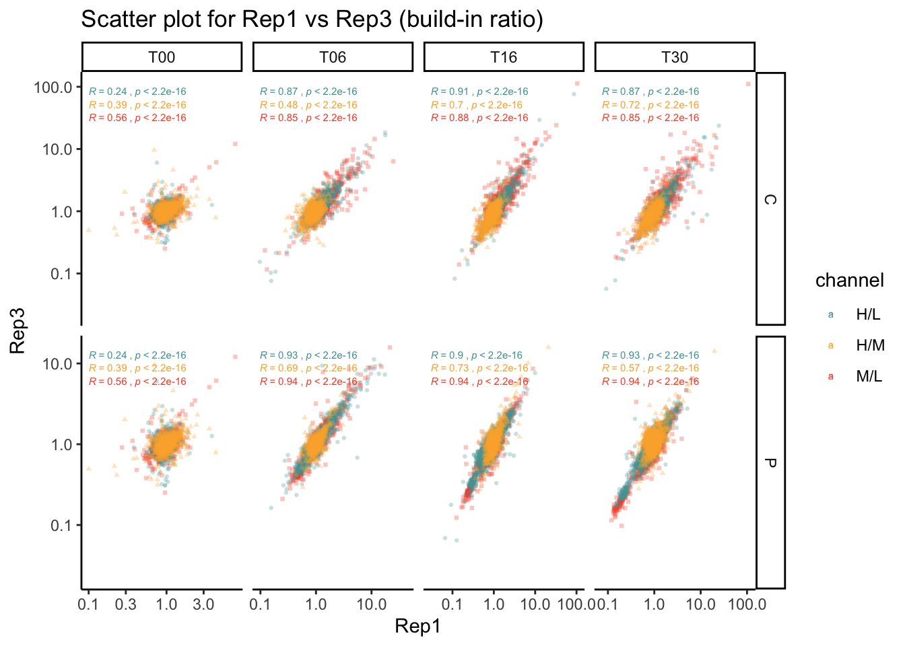
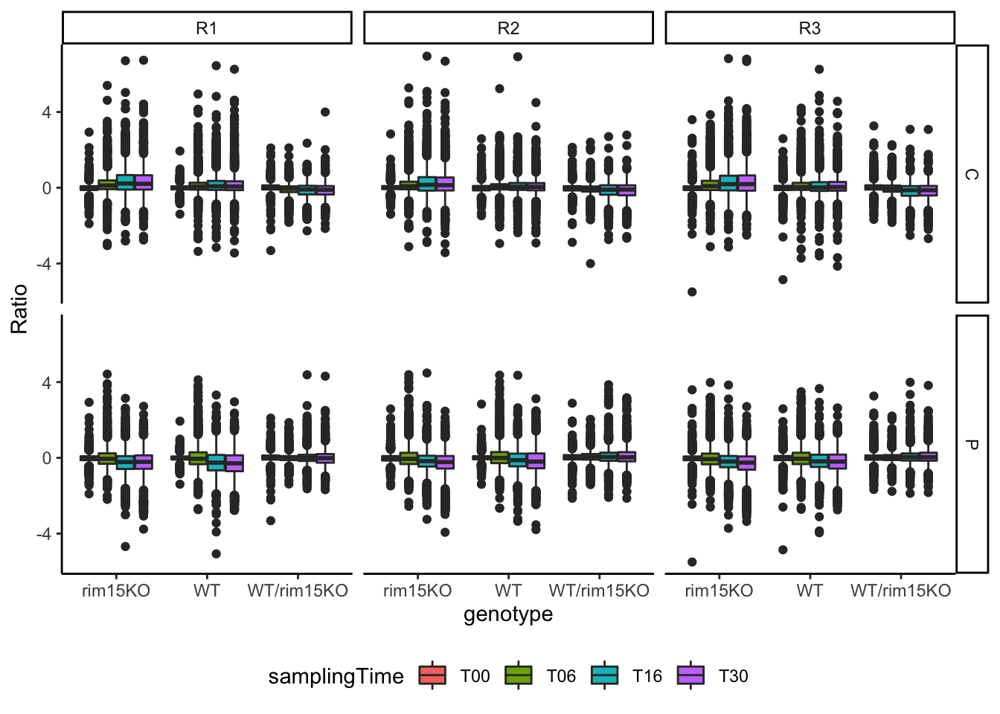
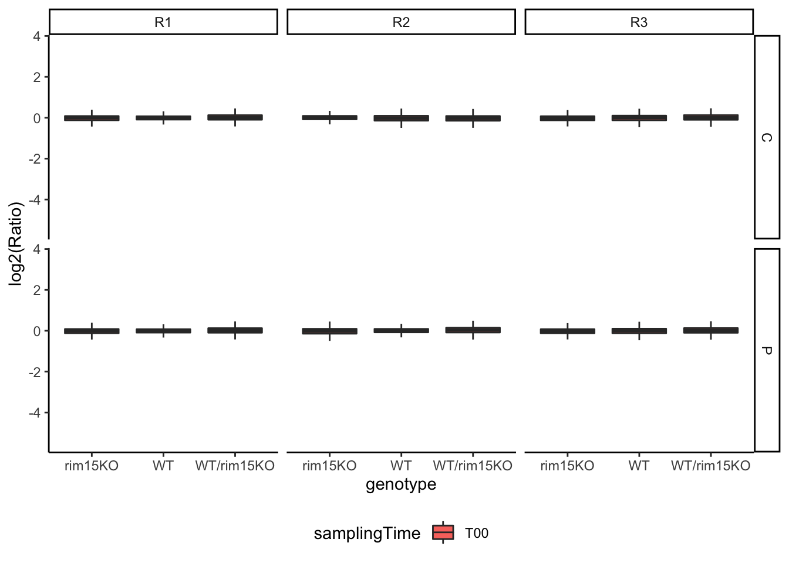
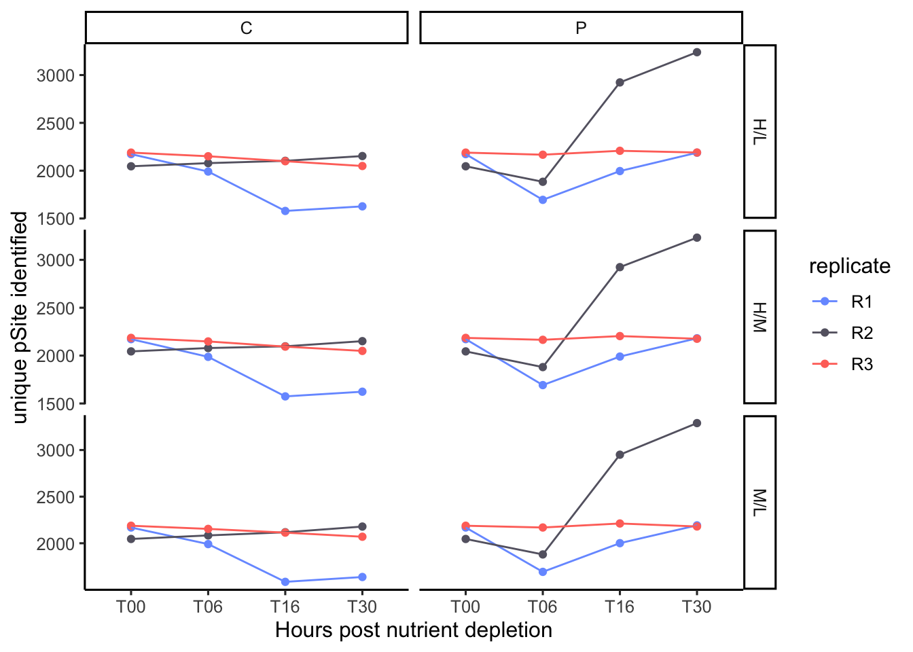

#read in files
#load packages


#read in protein files


#normalized ratios 
#add the corresponding attributes for time 0 in each condition
##build in ratio from Maxquant, un-normalized

```
## Using Protein IDs, Gene names, Protein names, Fasta headers as id variables
## Warning: Removed 127128 rows containing non-finite values (stat_boxplot).
```


```
## `summarise()` regrouping output by 'channel', 'nutrient', 'samplingTime' (override with `.groups` argument)
## `summarise()` regrouping output by 'channel', 'nutrient', 'samplingTime' (override with `.groups` argument)
## Warning: Ignoring unknown aesthetics: fill
```


```
## `stat_bin()` using `bins = 30`. Pick better value with `binwidth`.
## Warning: Removed 127128 rows containing non-finite values (stat_bin).
## Warning: Removed 127128 rows containing non-finite values (stat_density).
```


```
## Warning: Removed 46273 rows containing non-finite values (stat_cor).
## Warning: Removed 46273 rows containing missing values (geom_point).
```


```
## Warning: Removed 46530 rows containing non-finite values (stat_cor).
## Warning: Removed 46530 rows containing missing values (geom_point).
```



```
## Joining, by = c("Protein IDs", "Gene names", "Protein names", "Fasta headers", "channel", "nutrient", "samplingTime", "replicate", "value")
## Warning: Removed 127128 rows containing non-finite values (stat_boxplot).
```



```
## Warning: Removed 21176 rows containing non-finite values (stat_boxplot).
```



```
## `stat_bin()` using `bins = 30`. Pick better value with `binwidth`.
## Warning: Removed 127128 rows containing non-finite values (stat_bin).
## Warning: Removed 127128 rows containing non-finite values (stat_density).
```


```
## Warning: Removed 46273 rows containing non-finite values (stat_cor).
## Warning: Removed 46273 rows containing missing values (geom_point).
```


```
## Warning: Removed 46530 rows containing non-finite values (stat_cor).
## Warning: Removed 46530 rows containing missing values (geom_point).
```


```
## Warning: `as.tibble()` is deprecated as of tibble 2.0.0.
## Please use `as_tibble()` instead.
## The signature and semantics have changed, see `?as_tibble`.
## This warning is displayed once every 8 hours.
## Call `lifecycle::last_warnings()` to see where this warning was generated.
## pdf 
##   3
## pdf 
##   3
## [1]  48 869
## Warning: `select_()` is deprecated as of dplyr 0.7.0.
## Please use `select()` instead.
## This warning is displayed once every 8 hours.
## Call `lifecycle::last_warnings()` to see where this warning was generated.
## pdf 
##   3
## Importance of components:
##                            PC1     PC2     PC3     PC4     PC5     PC6     PC7
## Standard deviation     18.9662 13.9459 7.72892 6.56969 4.79319 4.42199 4.17806
## Proportion of Variance  0.4168  0.2254 0.06922 0.05001 0.02662 0.02266 0.02023
## Cumulative Proportion   0.4168  0.6422 0.71141 0.76142 0.78804 0.81070 0.83093
##                            PC8     PC9    PC10    PC11    PC12    PC13    PC14
## Standard deviation     4.11177 3.73406 3.38229 3.33381 3.22338 3.15764 2.53271
## Proportion of Variance 0.01959 0.01616 0.01326 0.01288 0.01204 0.01155 0.00743
## Cumulative Proportion  0.85052 0.86667 0.87993 0.89281 0.90485 0.91640 0.92383
##                           PC15    PC16    PC17    PC18    PC19   PC20    PC21
## Standard deviation     2.39319 2.23829 2.07424 1.95675 1.90651 1.8580 1.77001
## Proportion of Variance 0.00664 0.00581 0.00499 0.00444 0.00421 0.0040 0.00363
## Cumulative Proportion  0.93047 0.93628 0.94126 0.94570 0.94991 0.9539 0.95754
##                           PC22   PC23    PC24    PC25    PC26    PC27    PC28
## Standard deviation     1.71726 1.6605 1.63241 1.61192 1.56967 1.53783 1.49450
## Proportion of Variance 0.00342 0.0032 0.00309 0.00301 0.00286 0.00274 0.00259
## Cumulative Proportion  0.96096 0.9641 0.96724 0.97025 0.97311 0.97585 0.97843
##                           PC29    PC30    PC31    PC32    PC33   PC34    PC35
## Standard deviation     1.43294 1.38774 1.38209 1.32895 1.26410 1.2119 1.18132
## Proportion of Variance 0.00238 0.00223 0.00221 0.00205 0.00185 0.0017 0.00162
## Cumulative Proportion  0.98081 0.98304 0.98526 0.98730 0.98916 0.9909 0.99248
##                           PC36    PC37    PC38   PC39    PC40    PC41      PC42
## Standard deviation     1.15138 1.10257 1.06604 1.0174 0.96542 0.92137 8.423e-15
## Proportion of Variance 0.00154 0.00141 0.00132 0.0012 0.00108 0.00098 0.000e+00
## Cumulative Proportion  0.99401 0.99542 0.99674 0.9979 0.99902 1.00000 1.000e+00
##                             PC43      PC44      PC45      PC46      PC47
## Standard deviation     3.069e-15 1.334e-15 1.334e-15 1.334e-15 1.334e-15
## Proportion of Variance 0.000e+00 0.000e+00 0.000e+00 0.000e+00 0.000e+00
## Cumulative Proportion  1.000e+00 1.000e+00 1.000e+00 1.000e+00 1.000e+00
##                             PC48
## Standard deviation     1.334e-15
## Proportion of Variance 0.000e+00
## Cumulative Proportion  1.000e+00
## No scatter3d mode specifed:
##   Setting the mode to markers
##   Read more about this attribute -> https://plot.ly/r/reference/#scatter-mode
## Warning: `arrange_()` is deprecated as of dplyr 0.7.0.
## Please use `arrange()` instead.
## See vignette('programming') for more help
## This warning is displayed once every 8 hours.
## Call `lifecycle::last_warnings()` to see where this warning was generated.
## Warning in RColorBrewer::brewer.pal(N, "Set2"): n too large, allowed maximum for palette Set2 is 8
## Returning the palette you asked for with that many colors

## Warning in RColorBrewer::brewer.pal(N, "Set2"): n too large, allowed maximum for palette Set2 is 8
## Returning the palette you asked for with that many colors
```

<!--html_preserve--><div id="htmlwidget-39029bc3024c91477ed3" style="width:672px;height:480px;" class="plotly html-widget"></div>
<script type="application/json" data-for="htmlwidget-39029bc3024c91477ed3">{"x":{"visdat":{"9ac2bdd33c6":["function () ","plotlyVisDat"]},"cur_data":"9ac2bdd33c6","attrs":{"9ac2bdd33c6":{"x":[-7.96187911947884,-8.69111467297546,-6.66974402970703,-18.6033928371774,-14.7617297572603,-15.7431234137185,-30.7685681837374,-22.7022500621895,-25.2769002939108,-29.4987342233889,-22.7109995795007,-25.102448421408,-7.8787053560448,-6.58694667165971,-7.40560593050779,-12.2731538661571,-10.8602317664938,-12.0665588528522,-13.7083888748433,-11.9863222502047,-10.0059953097374,-11.2577008047352,-11.0029597905601,-11.2073997414842,-7.96187911947884,-6.58694667165971,-6.66974402970703,12.7708765861042,14.0930565989459,14.9451443386367,30.1611329536929,21.6786753058947,24.6888298320947,30.0011308067203,30.652909675735,31.7944458108416,-7.8787053560448,-8.69111467297546,-7.40560593050779,11.5796622048287,7.90797224454516,11.5394608598667,30.2961251706183,18.8511726018199,21.4219479360466,33.6382976914657,26.9204645271767,26.9835444450728],"y":[-21.4022998223272,-19.1428799639057,-20.1545840496095,3.65473655557968,2.24830984729571,4.49117714993221,24.1962887936713,23.5545027119377,24.4133608265413,24.6459271154842,23.6028598071383,25.6101084138461,-19.4245875829288,-20.0626161627,-19.4224221092725,-3.12336628351878,-8.79153902026766,-3.53430947494944,2.81582674347885,-4.15287846588145,1.09430122417289,2.89039724972349,-4.35376486271966,2.35246796906646,-21.4022998223272,-20.0626161627,-20.1545840496095,4.4208122419087,6.52270820928189,4.96666835323815,4.12135093135804,2.53834417090774,1.92478706814058,4.60416710584399,3.64662788714986,2.32199806279897,-19.4245875829288,-19.1428799639057,-19.4224221092725,9.78686093451705,7.32227234531591,8.80365275873433,6.06797591776661,7.15370871391845,4.61169034397205,5.7031385642923,7.82706740302833,5.26054206878323],"z":[4.77830321210994,0.101523779702065,4.52347277543084,4.55072414053735,-3.2457521898635,7.1494458659097,9.43463068626295,-7.47273346267668,9.11615477208695,4.19230298801187,-8.4045542557129,6.34641310975497,-0.653405994571895,3.77530868182137,-3.14716270499386,-3.80965013399877,0.149983413501308,-8.0184326318115,-9.18387279000448,-3.93994502447232,-12.1535304341591,-11.4887587094071,-4.24906263137051,-12.5822667825505,4.77830321210994,3.77530868182137,4.52347277543084,13.1751043975582,16.6580938260065,12.2235120357512,5.70727037682811,11.2581652317512,8.1424802394294,-0.573603819100787,4.56489258151127,2.32194514027733,-0.653405994571895,0.101523779702065,-3.14716270499386,7.61500855185757,2.94478303289982,-0.249588368406839,-2.78201238930681,-9.46889455760767,-8.23287969858601,-9.40333065653671,-15.8211668001158,-13.2269545532447],"color":["C_rim15KO_T00","C_rim15KO_T00","C_rim15KO_T00","C_rim15KO_T06","C_rim15KO_T06","C_rim15KO_T06","C_rim15KO_T16","C_rim15KO_T16","C_rim15KO_T16","C_rim15KO_T30","C_rim15KO_T30","C_rim15KO_T30","C_WT_T00","C_WT_T00","C_WT_T00","C_WT_T06","C_WT_T06","C_WT_T06","C_WT_T16","C_WT_T16","C_WT_T16","C_WT_T30","C_WT_T30","C_WT_T30","P_rim15KO_T00","P_rim15KO_T00","P_rim15KO_T00","P_rim15KO_T06","P_rim15KO_T06","P_rim15KO_T06","P_rim15KO_T16","P_rim15KO_T16","P_rim15KO_T16","P_rim15KO_T30","P_rim15KO_T30","P_rim15KO_T30","P_WT_T00","P_WT_T00","P_WT_T00","P_WT_T06","P_WT_T06","P_WT_T06","P_WT_T16","P_WT_T16","P_WT_T16","P_WT_T30","P_WT_T30","P_WT_T30"],"alpha_stroke":1,"sizes":[10,100],"spans":[1,20],"type":"scatter3d"}},"layout":{"margin":{"b":40,"l":60,"t":25,"r":10},"scene":{"xaxis":{"title":[]},"yaxis":{"title":[]},"zaxis":{"title":[]}},"hovermode":"closest","showlegend":true},"source":"A","config":{"showSendToCloud":false},"data":[{"x":[-7.96187911947884,-8.69111467297546,-6.66974402970703],"y":[-21.4022998223272,-19.1428799639057,-20.1545840496095],"z":[4.77830321210994,0.101523779702065,4.52347277543084],"type":"scatter3d","mode":"markers","name":"C_rim15KO_T00","marker":{"color":"rgba(102,194,165,1)","line":{"color":"rgba(102,194,165,1)"}},"textfont":{"color":"rgba(102,194,165,1)"},"error_y":{"color":"rgba(102,194,165,1)"},"error_x":{"color":"rgba(102,194,165,1)"},"line":{"color":"rgba(102,194,165,1)"},"frame":null},{"x":[-18.6033928371774,-14.7617297572603,-15.7431234137185],"y":[3.65473655557968,2.24830984729571,4.49117714993221],"z":[4.55072414053735,-3.2457521898635,7.1494458659097],"type":"scatter3d","mode":"markers","name":"C_rim15KO_T06","marker":{"color":"rgba(189,173,133,1)","line":{"color":"rgba(189,173,133,1)"}},"textfont":{"color":"rgba(189,173,133,1)"},"error_y":{"color":"rgba(189,173,133,1)"},"error_x":{"color":"rgba(189,173,133,1)"},"line":{"color":"rgba(189,173,133,1)"},"frame":null},{"x":[-30.7685681837374,-22.7022500621895,-25.2769002939108],"y":[24.1962887936713,23.5545027119377,24.4133608265413],"z":[9.43463068626295,-7.47273346267668,9.11615477208695],"type":"scatter3d","mode":"markers","name":"C_rim15KO_T16","marker":{"color":"rgba(245,146,102,1)","line":{"color":"rgba(245,146,102,1)"}},"textfont":{"color":"rgba(245,146,102,1)"},"error_y":{"color":"rgba(245,146,102,1)"},"error_x":{"color":"rgba(245,146,102,1)"},"line":{"color":"rgba(245,146,102,1)"},"frame":null},{"x":[-29.4987342233889,-22.7109995795007,-25.102448421408],"y":[24.6459271154842,23.6028598071383,25.6101084138461],"z":[4.19230298801187,-8.4045542557129,6.34641310975497],"type":"scatter3d","mode":"markers","name":"C_rim15KO_T30","marker":{"color":"rgba(217,150,141,1)","line":{"color":"rgba(217,150,141,1)"}},"textfont":{"color":"rgba(217,150,141,1)"},"error_y":{"color":"rgba(217,150,141,1)"},"error_x":{"color":"rgba(217,150,141,1)"},"line":{"color":"rgba(217,150,141,1)"},"frame":null},{"x":[-7.8787053560448,-6.58694667165971,-7.40560593050779],"y":[-19.4245875829288,-20.0626161627,-19.4224221092725],"z":[-0.653405994571895,3.77530868182137,-3.14716270499386],"type":"scatter3d","mode":"markers","name":"C_WT_T00","marker":{"color":"rgba(162,158,189,1)","line":{"color":"rgba(162,158,189,1)"}},"textfont":{"color":"rgba(162,158,189,1)"},"error_y":{"color":"rgba(162,158,189,1)"},"error_x":{"color":"rgba(162,158,189,1)"},"line":{"color":"rgba(162,158,189,1)"},"frame":null},{"x":[-12.2731538661571,-10.8602317664938,-12.0665588528522],"y":[-3.12336628351878,-8.79153902026766,-3.53430947494944],"z":[-3.80965013399877,0.149983413501308,-8.0184326318115],"type":"scatter3d","mode":"markers","name":"C_WT_T06","marker":{"color":"rgba(175,154,200,1)","line":{"color":"rgba(175,154,200,1)"}},"textfont":{"color":"rgba(175,154,200,1)"},"error_y":{"color":"rgba(175,154,200,1)"},"error_x":{"color":"rgba(175,154,200,1)"},"line":{"color":"rgba(175,154,200,1)"},"frame":null},{"x":[-13.7083888748433,-11.9863222502047,-10.0059953097374],"y":[2.81582674347885,-4.15287846588145,1.09430122417289],"z":[-9.18387279000448,-3.93994502447232,-12.1535304341591],"type":"scatter3d","mode":"markers","name":"C_WT_T16","marker":{"color":"rgba(215,144,197,1)","line":{"color":"rgba(215,144,197,1)"}},"textfont":{"color":"rgba(215,144,197,1)"},"error_y":{"color":"rgba(215,144,197,1)"},"error_x":{"color":"rgba(215,144,197,1)"},"line":{"color":"rgba(215,144,197,1)"},"frame":null},{"x":[-11.2577008047352,-11.0029597905601,-11.2073997414842],"y":[2.89039724972349,-4.35376486271966,2.35246796906646],"z":[-11.4887587094071,-4.24906263137051,-12.5822667825505],"type":"scatter3d","mode":"markers","name":"C_WT_T30","marker":{"color":"rgba(219,162,168,1)","line":{"color":"rgba(219,162,168,1)"}},"textfont":{"color":"rgba(219,162,168,1)"},"error_y":{"color":"rgba(219,162,168,1)"},"error_x":{"color":"rgba(219,162,168,1)"},"line":{"color":"rgba(219,162,168,1)"},"frame":null},{"x":[-7.96187911947884,-6.58694667165971,-6.66974402970703],"y":[-21.4022998223272,-20.0626161627,-20.1545840496095],"z":[4.77830321210994,3.77530868182137,4.52347277543084],"type":"scatter3d","mode":"markers","name":"P_rim15KO_T00","marker":{"color":"rgba(189,198,118,1)","line":{"color":"rgba(189,198,118,1)"}},"textfont":{"color":"rgba(189,198,118,1)"},"error_y":{"color":"rgba(189,198,118,1)"},"error_x":{"color":"rgba(189,198,118,1)"},"line":{"color":"rgba(189,198,118,1)"},"frame":null},{"x":[12.7708765861042,14.0930565989459,14.9451443386367],"y":[4.4208122419087,6.52270820928189,4.96666835323815],"z":[13.1751043975582,16.6580938260065,12.2235120357512],"type":"scatter3d","mode":"markers","name":"P_rim15KO_T06","marker":{"color":"rgba(186,217,78,1)","line":{"color":"rgba(186,217,78,1)"}},"textfont":{"color":"rgba(186,217,78,1)"},"error_y":{"color":"rgba(186,217,78,1)"},"error_x":{"color":"rgba(186,217,78,1)"},"line":{"color":"rgba(186,217,78,1)"},"frame":null},{"x":[30.1611329536929,21.6786753058947,24.6888298320947],"y":[4.12135093135804,2.53834417090774,1.92478706814058],"z":[5.70727037682811,11.2581652317512,8.1424802394294],"type":"scatter3d","mode":"markers","name":"P_rim15KO_T16","marker":{"color":"rgba(227,217,62,1)","line":{"color":"rgba(227,217,62,1)"}},"textfont":{"color":"rgba(227,217,62,1)"},"error_y":{"color":"rgba(227,217,62,1)"},"error_x":{"color":"rgba(227,217,62,1)"},"line":{"color":"rgba(227,217,62,1)"},"frame":null},{"x":[30.0011308067203,30.652909675735,31.7944458108416],"y":[4.60416710584399,3.64662788714986,2.32199806279897],"z":[-0.573603819100787,4.56489258151127,2.32194514027733],"type":"scatter3d","mode":"markers","name":"P_rim15KO_T30","marker":{"color":"rgba(252,214,66,1)","line":{"color":"rgba(252,214,66,1)"}},"textfont":{"color":"rgba(252,214,66,1)"},"error_y":{"color":"rgba(252,214,66,1)"},"error_x":{"color":"rgba(252,214,66,1)"},"line":{"color":"rgba(252,214,66,1)"},"frame":null},{"x":[-7.8787053560448,-8.69111467297546,-7.40560593050779],"y":[-19.4245875829288,-19.1428799639057,-19.4224221092725],"z":[-0.653405994571895,0.101523779702065,-3.14716270499386],"type":"scatter3d","mode":"markers","name":"P_WT_T00","marker":{"color":"rgba(241,204,114,1)","line":{"color":"rgba(241,204,114,1)"}},"textfont":{"color":"rgba(241,204,114,1)"},"error_y":{"color":"rgba(241,204,114,1)"},"error_x":{"color":"rgba(241,204,114,1)"},"line":{"color":"rgba(241,204,114,1)"},"frame":null},{"x":[11.5796622048287,7.90797224454516,11.5394608598667],"y":[9.78686093451705,7.32227234531591,8.80365275873433],"z":[7.61500855185757,2.94478303289982,-0.249588368406839],"type":"scatter3d","mode":"markers","name":"P_WT_T06","marker":{"color":"rgba(226,195,150,1)","line":{"color":"rgba(226,195,150,1)"}},"textfont":{"color":"rgba(226,195,150,1)"},"error_y":{"color":"rgba(226,195,150,1)"},"error_x":{"color":"rgba(226,195,150,1)"},"line":{"color":"rgba(226,195,150,1)"},"frame":null},{"x":[30.2961251706183,18.8511726018199,21.4219479360466],"y":[6.06797591776661,7.15370871391845,4.61169034397205],"z":[-2.78201238930681,-9.46889455760767,-8.23287969858601],"type":"scatter3d","mode":"markers","name":"P_WT_T16","marker":{"color":"rgba(204,187,165,1)","line":{"color":"rgba(204,187,165,1)"}},"textfont":{"color":"rgba(204,187,165,1)"},"error_y":{"color":"rgba(204,187,165,1)"},"error_x":{"color":"rgba(204,187,165,1)"},"line":{"color":"rgba(204,187,165,1)"},"frame":null},{"x":[33.6382976914657,26.9204645271767,26.9835444450728],"y":[5.7031385642923,7.82706740302833,5.26054206878323],"z":[-9.40333065653671,-15.8211668001158,-13.2269545532447],"type":"scatter3d","mode":"markers","name":"P_WT_T30","marker":{"color":"rgba(179,179,179,1)","line":{"color":"rgba(179,179,179,1)"}},"textfont":{"color":"rgba(179,179,179,1)"},"error_y":{"color":"rgba(179,179,179,1)"},"error_x":{"color":"rgba(179,179,179,1)"},"line":{"color":"rgba(179,179,179,1)"},"frame":null}],"highlight":{"on":"plotly_click","persistent":false,"dynamic":false,"selectize":false,"opacityDim":0.2,"selected":{"opacity":1},"debounce":0},"shinyEvents":["plotly_hover","plotly_click","plotly_selected","plotly_relayout","plotly_brushed","plotly_brushing","plotly_clickannotation","plotly_doubleclick","plotly_deselect","plotly_afterplot","plotly_sunburstclick"],"base_url":"https://plot.ly"},"evals":[],"jsHooks":[]}</script><!--/html_preserve-->

#Overall, we observed less differential expression between genotypes from PCA plot. Dan suggest a k-means (2-means) cluetering to visualize the data
#kmeans clustering of protein groups

```
## Welcome! Want to learn more? See two factoextra-related books at https://goo.gl/ve3WBa
## Using Gene names as id variables
## Warning: Expected 4 pieces. Additional pieces discarded in 21144 rows [42289,
## 42290, 42291, 42292, 42293, 42294, 42295, 42296, 42297, 42298, 42299, 42300,
## 42301, 42302, 42303, 42304, 42305, 42306, 42307, 42308, ...].
##                      R1          R2           R3
## AAP1_rim15KO -0.3167888 -0.42748484 -0.219684852
## AAP1_WT      -0.3030032 -0.33918557 -0.371384212
## AAT2_rim15KO  0.9436983  0.17967034 -0.003639618
## AAT2_WT      -0.1268524 -0.03253460 -0.398065497
## ABF2_rim15KO  0.1049084  0.46948828  0.527496729
## ABF2_WT      -0.1570608 -0.07698831  0.240618228
## No scatter3d mode specifed:
##   Setting the mode to markers
##   Read more about this attribute -> https://plot.ly/r/reference/#scatter-mode
```

<!--html_preserve--><div id="htmlwidget-3c2be750a1c06354249c" style="width:672px;height:480px;" class="plotly html-widget"></div>
<script type="application/json" data-for="htmlwidget-3c2be750a1c06354249c">{"x":{"visdat":{"9ac1641a9e4":["function () ","plotlyVisDat"]},"cur_data":"9ac1641a9e4","attrs":{"9ac1641a9e4":{"x":[0.95515,0.97491,2.7619,1.2274,1.5596,1.1841,0.96561,1.0734,0.74325,0.7385,1.8857,1.1105,21.401,17.131,2.4392,1.5216,1.4769,1.1951,0.57543,0.3466,1.1298,1.1981,3.3111,2.3321,2.6195,1.2196,2.3353,1.3995,1.2875,1.1193,5.1788,2.6693,3.6763,1.9673,1.0808,1.0348,2.3927,1.3272,1.0442,0.9508,1.2612,1.0898,1.1366,1.0852,2.2066,1.1963,0.81681,0.95268,0.99592,0.90498,0.80084,0.76524,2.2478,1.5197,0.74832,0.89807,5.72,6.1697,2.989,1.2661,1.2299,1.3731,1.4384,1.251,1.0817,0.95008,3.9772,8.9925,10.735,5.02,1.7134,1.6352,1.5192,0.77717,1.0232,1.1224,1.0857,1.4009,1.0942,1.3083,3.3244,3.1837,1.2697,0.82042,1.0998,0.80355,0.96264,0.97627,2.5957,1.9761,1.6974,1.5694,1.5954,1.5839,1.2752,1.328,1.0793,0.96202,2.1567,1.6209,1.1071,1.0776,0.96415,0.94157,0.97099,1.1108,1.4078,1.2654,0.95348,1.0908,1.0954,1.1191,1.3609,1.0716,0.77936,0.89273,2.2789,1.2444,1.3141,0.97663,1.6674,1.1066,1.0141,1.0085,1.4103,0.90436,0.86218,0.78294,2.2562,1.4809,1.626,1.1032,0.98002,0.94272,0.84416,0.85113,0.99314,1.2312,1.4968,1.322,0.92432,1.1591,1.1296,1.1027,1.3499,1.0693,0.92582,0.9424,1.0625,0.9495,1.0232,1.9076,3.2751,1.4028,0.65524,0.83106,5.339,1.4085,5.0995,2.2764,7.3368,3.4533,5.1765,2.0671,7.0013,3.0147,1.6775,1.1142,1.2443,1.3773,1.6773,1.6012,1.8188,1.2269,1.7554,1.5289,1.2171,0.8691,1.1793,1.5534,1.5384,1.8835,1.0566,0.97262,1.6744,0.6478,1.9564,1.4494,3.4096,1.9746,2.3433,3.3183,0.94521,1.0283,1.2883,1.1742,0.94771,1.0955,2.0124,1.4208,9.895,3.2075,7.9672,1.9539,1.608,0.92171,0.97855,1.0329,0.99777,1.1028,1.7286,1.5558,0.95355,0.88819,1.1704,1.0167,1.1295,0.96797,1.1583,0.87157,0.89855,0.99899,1.1128,1.0548,0.95538,0.87925,1.144,1.1897,1.6244,1.1271,1.9451,1.2905,0.94267,0.98235,1.062,1.0579,0.89233,0.85678,1.3391,0.86156,0.79481,0.92372,0.85622,0.92215,1.1906,1.1618,1.0468,0.95848,1.9582,1.0867,1.4854,1.1225,1.1005,1.1843,2.3368,1.2605,1.9863,0.9823,3.7537,1.8381,0.70806,0.78736,1.6046,1.1397,1.1477,1.014,1.3759,0.95991,1.8285,1.3801,1.6005,0.98147,1.2763,1.1296,3.0889,1.6588,1.9032,1.6543,3.2435,1.6263,2.5724,1.8434,1.7323,0.9503,0.68655,0.93966,1.365,1.0431,1.4932,0.98503,1.0774,1.1688,1.9147,1.5932,1.2047,1.0647,1.0816,1.1956,1.9637,1.6195,1.3637,1.0081,1.2651,1.0832,1.197,1.4239,1.0849,1.1139,1.3001,1.0387,6.8705,3.1646,1.821,1.3502,0.40861,0.47851,0.70264,0.7096,1.2267,1.165,1.6403,1.1098,1.8987,1.768,1.0789,1.1243,0.38541,0.43507,0.97764,0.93702,1.1448,0.80484,0.92164,0.99893,3.5295,1.2491,1.4518,1.1072,0.16322,0.14369,1.167,1.3846,1.3982,1.1143,0.6476,0.87567,0.95472,0.99996,1.5788,1.1385,1.3604,0.85984,1.0984,1.1532,0.7893,0.81496,1.2093,0.95916,1.9017,1.0948,1.0877,1.0968,0.87167,0.90382,0.99971,0.88585,0.48452,0.44035,4.1384,3.0149,0.74257,0.87618,1.4715,1.4819,1.5001,1.0173,1.1165,0.92903,0.99555,1.4003,0.94054,0.92805,0.79702,0.8158,0.14756,0.091769,1.08,0.99385,1.2223,1.0243,0.75464,0.65616,0.88415,0.82371,1.3792,1.1678,0.99691,0.80545,0.49855,0.49664,0.91615,0.75897,0.92061,0.92393,0.81843,0.89518,1.5282,0.98,2.1426,1.9511,1.0225,0.80422,2.3673,1.3122,0.81516,0.88838,0.87208,0.92334,1.1199,1.0653,0.59772,0.6379,0.16953,0.2031,1.0363,0.98748,2.3724,1.9406,0.7293,0.76744,0.88173,1.0107,2.0369,1.2162,0.87829,0.99933,1.2096,0.98332,0.70641,0.88693,5.167,1.9365,0.96182,0.94031,0.92763,1.03,1.5248,3.6577,0.98737,1.0737,0.62927,0.64959,1.3926,0.60653,0.72024,0.80565,0.75721,0.81642,1.1384,0.92469,0.61686,0.71964,8.9989,4.6723,1.9693,1.0535,3.3853,1.8962,1.727,2.7189,3.4162,0.69779,4.5327,3.2267,0.75371,0.95795,0.83598,1.0516,0.78506,1.1091,0.84146,0.92057,1.4411,0.89342,1.048,0.91133,0.98475,0.74323,2.5016,2.4907,1.7309,1.1565,1.2296,1.8421,1.969,1.4143,0.97825,0.99471,1.4481,1.4416,1.0551,1.0722,1.2841,1.0639,2.3678,1.2121,2.3993,1.0301,1.4494,1.2234,1.2873,1.1889,7.9068,3.9532,2.4999,2.3674,1.073,1.0825,2.6773,3.1618,0.93746,1.0181,0.33584,0.46364,0.83037,0.74845,3.6388,2.0632,2.1987,1.853,1.3408,1.0071,2.0156,1.4129,1.3657,1.4177,1.2933,0.99165,0.89981,0.97438,1.3692,1.175,3.4312,2.3572,0.88739,1.0031,1.3693,1.0779,1.3727,1.1114,17.589,6.8196,1.9535,1.37,1.1328,1.0188,1.1376,0.7804,1.2952,0.99616,0.7986,0.92186,0.94704,0.84343,0.86734,1.0888,1.1233,1.1568,1.1278,1.0284,0.61573,0.79288,1.6,1.025,1.0677,0.88305,1.856,1.4555,4.0464,1.8016,1.5663,1.0343,2.5145,1.4221,1.0134,0.98365,0.92992,0.97354,1.0379,1.1864,0.98169,0.90755,2.6012,1.8345,0.73851,0.85236,0.87692,0.81649,1.2623,1.1065,0.8879,1.0084,2.7923,3.0186,1.4402,1.1183,2.93,2.7495,1.738,1.8065,0.69402,0.63162,1.7542,1.0747,1.2801,0.92361,1.7727,1.3146,0.86558,0.86801,0.98166,0.94029,4.013,1.3269,2.8639,1.674,0.51314,0.34667,1.312,1.0186,1.0939,0.7627,1.0829,1.0972,1.006,0.95083,1.1357,0.9549,1.5821,0.78091,1.5483,1.1707,1.222,1.2509,0.79339,0.7553,0.89797,0.95196,1.0932,1.1579,1.3955,1.6168,1.9558,1.3935,0.96671,1.0983,1.134,1.0065,0.70844,0.72803,0.99118,0.86202,1.4247,1.3173,1.0092,0.92805,0.89453,0.90279,0.24188,0.21456,0.78416,0.99132,1.1885,1.4515,1.5546,0.88703,1.1455,1.097,0.95215,0.9102,0.7261,0.83763,5.4521,2.8488,4.1489,1.8859,1.0101,0.76592,0.62565,0.69928,2.5577,1.6343,1.0026,0.94543,3.6111,1.3481,1.7069,1.5024,3.1806,2.6395,1.1046,1.1025,1.6557,1.1094,1.2277,1.1791,1.5204,0.77741,1.0131,1.0098,1.34,1.3124,1.4088,1.093,0.69602,0.76326,1.2693,1.157,0.74606,0.83723,0.94692,1.0462,1.51,1.19,1.4333,2.0849,5.6991,2.2859,2.3863,1.5212,0.8346,1.1999,1.0489,0.95326,1.0022,1.1074,1.1984,0.8871,0.87137,0.89639,1.3484,1.505,1.4636,0.95736,7.2541,5.7966,1.2408,1.0771,3.6994,2.5145,1.2707,1.3322,1.4882,1.119,1.4625,1.1202,1.0206,1.5253,1.2524,1.0383,3.8256,1.698,6.222,2.3151,0.78957,1.0201,1.2574,0.93646,1.5199,1.2015,1.96,1.3644,0.81393,1.1762,0.6556,0.74763,0.95046,1.0425,2.7659,1.8191,1.3409,1.2584,17.929,22.039,1.0497,0.89477,1.6875,1.1865,1.0079,0.99416,1.0447,0.89353,1.5988,1.0552,0.85571,0.82679,1.2042,1.3224,0.93648,0.99023,1.2098,1.0031,1.3973,1.1034,1.0468,0.84406,3.0816,1.8621,2.3825,2.2366,0.80855,0.8059,1.4777,1.165,1.6502,1.0997,0.96389,1.1477,1.4653,1.3284,1.5264,1.0603,1.2903,1.079,1.0654,1.0361,0.9678,1.0171,0.7722,0.95179,1.1617,0.75557,0.83506,0.87126,1.0746,0.93898,0.9762,0.97785,1.0793,1.0487,1.1794,1.0987,0.59959,1.0651,0.41667,0.65251,1.496,0.94166,1.0866,1.0048,1.0615,1.0406,0.89889,1.1722,1.4786,1.0405,1.9568,1.4974,0.75421,0.63484,1.318,1.0522,1.4778,1.4056,0.85482,0.92117,1.7276,1.2394,0.86923,0.97824,19.846,12.396,0.8374,1.0362,1.9766,1.3356,1.0006,0.98702,1.2436,1.1245,1.1147,0.9495,0.9463,1.1788,1.5088,1.179,0.77355,1.0294,2.7706,1.8541,1.6438,1.3082,1.017,1.102,0.99016,1.0717,1.2706,0.95312,0.95917,1.0905,0.62635,0.86544,1.6401,1.1448,2.8055,1.7821,10.175,3.0282,1.2394,1.1381,1.2351,1.1008,1.0975,1.1335,1.0031,1.1424,1.0567,0.97426,2.08,2.5516,1.3543,1.211,0.84029,0.90163,4.2217,0.94291,2.1515,1.2848,0.76659,0.70263,2.9212,2.2111,0.59928,0.54207,1.0158,0.94919,0.8504,1.0021,0.84057,0.87728,1.0038,0.87923,1.6344,1.8189,1.6066,1.0932,0.92546,1.0006,1.2995,1.4409,1.776,1.5996,1.2498,1.3172,4.4017,2.561,0.84738,1.0685,1.3813,1.2856,1.9192,1.4639,1.3258,1.2303,1.4167,1.3129,1.7,1.2648,1.5352,1.2684,1.751,1.152,0.99793,1.1739,1.0708,0.95512,1.4516,1.002,0.84939,0.94521,1.0167,0.99808,1.3741,1.1915,1.2288,1.0851,0.9127,0.85609,0.73636,0.90976,0.89621,0.87215,1.0002,0.97465,1.633,1.9792,1.0186,0.98617,1.1079,1.0206,1.6089,1.4931,1.3869,1.0458,1.8427,1.2072,1.8118,1.3055,1.8599,1.2483,1.247,1.1704,2.1918,1.1023,1.0979,1.1148,2.6238,1.784,1.4309,1.1889,6.5164,2.5347,3.1629,2.0187,1.2304,1.1638,1.3235,1.1411,0.52436,0.77294,1.9464,1.113,1.1601,0.99951,1.2755,0.84471,0.58181,0.8506,0.64091,0.82265,1.3117,1.1787,0.97614,1.0573,0.81104,1.2214,1.8631,1.4576,1.1102,1.0023,1.0019,1.1344,2.4273,1.0668,2.1777,1.2993,0.99345,0.95957,1.2915,1.1597,2.5036,1.639,1.7294,1.2194,0.8707,1.0193,1.1008,1.0387,0.99446,0.92662,0.79029,0.7299,1.0074,0.83763,1.0658,0.97053,0.8143,0.83263,1.0581,1.0161,0.84991,0.88408,1.0481,0.94935,0.89574,0.8932,0.80649,0.94227,0.53302,0.8054,1.05,0.98433,1.0068,1.1195,1.267,0.98767,0.87922,1.0096,0.89457,0.95423,1.0488,1.0299,0.77403,0.908,0.98087,0.93855,1.006,0.98368,0.92052,0.93991,0.80035,0.84409,0.7114,0.86136,0.94805,0.97758,0.91544,0.99106,1.0302,0.90687,0.93954,0.98208,1.0254,1.0162,0.67803,0.93839,1.0442,1.0861,1.0451,0.98948,0.98674,0.91993,0.85112,0.89891,1.0909,1.0269,0.93547,0.98519,0.8367,0.90622,0.87093,0.91965,0.78879,0.85368,0.89578,1.309,0.92149,0.95776,0.71825,0.81297,1.0944,1.0579,1.2019,1.0473,1.8115,1.2269,1.6464,1.2064,1.3791,1.0459,1.2866,1.0063,1.8093,1.4996,1.7347,1.3694,1.2713,1.1171,1.3366,1.1507,1.7017,1.2952,1.0857,0.78478,0.85986,0.91483,1.0426,1.0114,0.75752,0.84237,0.73882,0.87109,0.91137,0.98673,1.1742,1.0498,0.40197,0.56955,1.0252,0.95584,0.91945,0.96497,0.8508,0.93306,1.1304,1.0027,1.0545,0.98805,0.97973,1.01,1.0694,1.0593,0.99764,1.0108,0.61792,0.8787,1.0897,1.0108,0.70935,0.70196,0.89515,0.9712,0.7392,0.84226,0.98957,0.9622,0.8391,0.86071,0.90282,0.95802,0.87074,0.7563,1.0731,0.99944,0.86921,0.95853,1.2529,0.95104,0.99014,0.94243,0.80341,0.85942,0.70553,0.90317,1.0227,0.97,1.0005,0.99417,0.90573,0.93293,0.96645,1.0025,0.72188,0.8483,0.92357,0.97354,0.81588,0.86866,1.1077,0.97623,2.0362,1.0972,1.0239,0.97397,1.5403,1.0566,1.1221,0.97709,0.85853,0.93674,0.94494,1.2929,0.87177,0.85286,1.0704,1.0119,1.3945,1.131,1.3697,1.0472,1.9428,1.2907,1.0429,1.1714,1.0129,1.1539,1.1431,1.0584,1.22,1.0791,1.085,1.0595,1.1105,1.3768,1.0925,1.011,2.0009,1.2119,0.94638,0.81858,1.1863,1.4623,1.2974,1.1878,1.4368,1.2239,1.3632,0.80142,1.0022,1.0708,0.73583,1.3167,1.6888,1.3637,1.0001,0.95741,0.88617,1.0061,8.5041,3.6695,2.248,2.1194,2.6331,1.8533,1.3123,1.2659,1.4739,1.0607,0.94519,0.79257,1.5256,0.97215,0.87535,0.89756,1.0755,1.0465,1.0522,1.0167,1.4682,1.0268,1.3094,0.94834,1.1658,1.0135,1.3694,1.1771,0.85852,0.90963,1.444,0.95279,1.2761,1.0308,1.2548,0.9384,1.3468,1.0969,1.784,1.2588,2.8526,2.7315,1.0096,1.0155,0.96464,1.1595,0.99347,1.0849,1.0973,0.88534,1.4112,1.1301,5.4401,2.7766,0.69853,0.75969,1.6272,1.1078,1.348,1.6093,0.91721,0.70595,1.3118,1.0049,1.0743,0.93328,0.72599,0.80178,0.79349,0.9949,1.0327,0.99864,1.5628,1.1632,3.3904,2.1899,1.3152,0.97287,1.5251,1.2316,1.0466,0.89602,0.95997,0.82068,1.2081,0.91181,1.0359,0.85593,1.2681,1.0568,1.4071,0.98436,1.3952,1.0108,1.4982,1.2226,1.4542,1.12,1.5952,1.1892,1.3577,1.2306,0.96613,0.97338,0.72261,0.86208,0.93715,0.92321,1.4056,1.1611,1.7314,1.3662,1.1515,1.0836,1.3636,2.5811,0.72025,0.97016,1.4911,1.181,1.0337,1.0496,0.80299,0.95804,1.6218,1.301,1.8202,1.2998,0.89183,0.915,0.77526,0.79786,1.4386,1.1486,0.81822,1.0826,1.1981,1.025,0.8956,0.80175,0.76027,0.80278,1.1758,0.93976,0.81035,0.87917,0.84678,0.83928,1.7488,1.0511,1.7143,1.1375,2.1924,1.5976,1.2701,1.3197,1.0917,0.92998,0.69373,1.0532,0.92573,0.88777,0.80115,0.90655,0.92211,1.0467,0.92507,1.0033,0.53842,0.57999,0.87731,0.90444,1.1178,0.92791,0.91734,0.96205,1.0931,0.99241,1.4257,1.0885,0.81901,0.79963,1.0523,0.98968,0.78523,0.95749,1.0385,1.0078,1.0553,1.0256,1.3671,0.85308,1.8062,0.97411,1.2536,1.069,1.0167,0.98426,1.7189,1.0344,1.738,1.1043,0.79063,0.81065,1.2976,1.0736,3.563,4.7449,1.0716,0.939,0.96603,1.0008,0.7903,0.8935,0.66697,0.73652,1.3298,1.1428,1.1876,1.2971,1.2568,1.0727,0.95953,1.0238,1.3498,1.1723,1.1019,1.0833,2.0113,2.324,1.303,0.9513,1.1972,0.87584,1.7685,2.0762,1.0181,1.5343,1.3225,1.1323,0.93478,0.94222,0.77583,0.74837,1.0443,0.97618,1.237,1.0024,0.94611,0.89712,0.73026,0.76477,1.0438,0.76426,0.96579,0.93222,0.96665,1.4526,1.7638,2.3471,1.1782,1.1475,1.2468,0.93639,1.0683,1.0015,0.9785,0.92102,1.5964,0.97439,1.159,1.1717,0.73023,0.77581,0.92498,0.88209,1.2066,1.0664,1.1835,1.1917,1.1076,0.88186,1.1427,1.176,2.871,1.9739,1.1814,1.2773,1.2379,1.0849,1.8651,3.098,1.1593,1.4468,1.8587,1.7305,2.1102,1.2269,1.3848,1.0508,0.95346,1.4141,1.6477,1.3574,1.3623,1.27,1.8212,1.2875,1.3551,1.3537,1.2921,1.3657,0.47006,0.40563,0.87723,0.95507,1.1029,1.0789,1.7699,1.3744,1.0713,0.94619,1.2796,0.89664,1.0756,1.1337,0.8467,0.88349,2.0125,1.1931,0.89386,0.93695,1.0046,0.95509,1.5711,1.231,1.0418,0.93805,0.71073,0.62986,1.1702,1.0106,1.3643,1.0873,1.4706,1.1091,1.0884,1.0117,1.2431,1.0358,1.4434,1.1076,1.2417,0.85817,0.82362,0.90952,1.6567,1.1413,1.1198,1.0367,1.162,0.9354,1.0227,0.80061,1.3982,0.80923,2.7996,0.80117,2.7125,1.0413,0.84553,0.89741,0.93886,0.96473,2.3371,2.864,1.3777,0.937,0.92696,0.8348,0.82008,0.79616,0.70349,0.7849,1.3529,1.4244,0.80764,0.82863,0.3306,0.49807,1.5664,1.1641,0.92293,0.97829,3.1542,4.6569,0.8785,1.0764,2.6787,2.2428,0.89157,0.74034,2.6506,0.84187,3.143,1.613,0.97869,0.92819,1.5431,1.203,0.92685,1.0343,0.9478,0.72201,1.3316,0.95547,1.1444,0.97931,3.9775,1.9913,3.4079,4.782,0.42267,0.64487,1.3784,1.0381,2.5626,1.516,0.95676,1.1746,1.3659,1.2179,1.5141,1.0594,1.6773,1.1433,1.6704,0.9772,1.3368,0.97178,1.3161,0.85919,1.1743,1.0981,2.1077,1.3168,1.8382,1.2274,1.2032,1.0256,0.99959,1.0109,1.1153,1.4327],"y":[0.75489,0.87685,1.5935,1.3004,1.9938,1.239,1.0872,1.0904,1.0256,0.91931,1.3614,1.021,22.276,2.4761,3.6133,1.3584,1.3132,1.1794,0.55548,0.36808,1.0895,1.1604,1.7326,1.5329,2.5223,1.6881,2.8672,1.4705,0.92213,1.0971,6.8848,2.2792,1.6703,1.6105,0.90846,1.0819,2.1169,1.1939,0.97503,0.98675,1.1065,1.076,1.3226,1.0806,2.1193,1.1555,0.78226,0.96581,1.4187,0.96466,0.70167,0.8131,2.5458,1.1796,0.85003,0.75382,6.101,5.4099,2.2023,1.4449,1.6481,1.1119,1.1424,1.1518,1.0528,0.92156,16.593,4.0553,5.2023,3.9036,1.7017,1.3861,0.9553,1.0561,1.1831,0.88186,1.2935,1.0618,1.0891,1.0576,3.3871,1.7097,1.0927,0.91999,1.0156,0.88411,0.95155,0.97987,2.8155,2.0391,1.3465,1.3618,1.4322,1.4235,1.0735,1.083,0.63942,0.84172,2.7457,1.2313,1.2885,1.0214,1.0029,1.066,1.1997,1.166,1.6721,1.2455,1.1083,1.0505,1.1628,1.0596,1.0961,1.0239,0.98491,0.87968,2.2031,1.0892,1.1157,0.73208,1.5625,1.1539,1.1431,0.97685,0.95668,0.8227,0.73481,0.93465,0.89628,1.2961,1.4817,1.015,0.94179,1.1452,0.79474,0.92995,0.94555,1.1379,1.858,1.3971,3.05,1.413,1.0571,1.0978,0.79268,1.158,0.92015,1.0112,0.9401,1.0732,1.7171,0.99292,3.8498,1.7829,1.2684,0.63443,3.8141,1.3019,4.2714,2.0768,7.6841,2.6256,3.5704,1.7653,6.4758,2.5566,2.2085,0.99208,1.0765,1.3097,1.5808,1.5745,1.8871,1.4246,1.0001,1.1016,0.97502,1.1075,1.4156,1.1668,1.4604,1.2719,0.94262,1.0523,1.1365,0.68908,1.9618,1.2957,2.7417,1.6885,1.8278,1.6752,1.0142,0.98031,1.6049,1.0663,1.2663,1.373,1.5851,1.3349,1.4466,1.954,6.5853,2.4004,1.3635,1.2539,0.98737,1.0905,0.97976,1.0458,2.0742,1.6924,0.95945,0.96229,0.97076,0.99054,1.1069,1.0474,1.0667,0.98365,0.72449,0.8813,1.1328,1.0222,0.97269,0.95848,0.99925,1.3352,1.3111,1.1752,1.7701,1.3684,0.98356,1.0303,0.99837,1.1248,1.0213,0.94252,1.5577,0.94982,0.74033,0.81214,0.833,0.91162,0.89637,1.6092,0.94595,1.0258,1.3599,1.0058,1.2699,1.0051,0.93288,1.0972,1.9233,1.2964,1.5878,0.86498,3.5902,1.5304,0.84512,0.9868,1.4128,1.1595,1.0609,1.0814,1.4061,0.85912,1.8044,1.1561,1.111,1.0576,1.1216,1.0501,2.6446,1.6888,1.6257,1.6935,5.6679,1.5491,5.5074,1.8064,1.199,1.0215,0.81123,0.75811,1.6123,1.1062,1.4002,0.98443,1.279,1.1678,1.4295,0.99227,1.3793,1.078,0.89648,1.0818,1.1611,1.3594,0.93285,1.0831,1.2121,0.94033,1.4024,1.4745,1.1044,1.1127,1.0436,1.0563,7.9449,2.3694,2.025,1.1454,0.38812,0.51479,0.7185,0.59538,1.0939,1.0542,1.3433,1.2826,1.8208,1.0602,1.741,0.85188,0.40059,0.47086,1.0284,1.0278,0.68399,0.70262,1.0502,1.1102,1.9078,2.1137,1.2059,1.1359,0.12808,0.27867,2.3135,1.4645,1.3612,1.1525,0.67334,0.92914,0.96354,0.93477,1.4283,1.0381,1.1954,0.87804,0.92661,1.0867,0.71799,0.93028,1.1638,0.9734,1.6625,1.3189,0.99176,0.97417,0.86666,0.91319,0.90097,0.93198,0.6911,0.56325,4.2688,2.0833,0.92685,0.74799,1.2941,1.2057,1.5582,0.98784,1.5368,0.95218,1.8613,0.96502,0.96414,0.98813,0.70906,0.77923,0.093023,0.19004,0.94601,1.1396,1.1858,0.96976,0.56078,0.71372,0.8012,0.83488,1.2312,1.074,0.82253,0.95549,0.36963,0.51057,0.80241,0.83602,0.90415,1.0999,0.79748,0.79106,1.0149,1.021,2.0576,1.0949,0.90824,1.0893,1.9101,1.2446,0.84351,0.87328,0.93951,0.91357,1.173,1.1193,0.6772,0.63619,0.31019,0.13234,0.81737,1.1637,2.6914,1.2515,0.74509,0.77344,0.77821,1.027,1.5121,1.302,0.83575,1.0029,1.1949,1.054,0.74887,0.676,4.6166,1.4485,0.90102,1.0233,0.73883,0.91051,2.8822,0.92137,0.91851,1.1032,0.71986,0.55072,1.317,0.65304,0.71928,0.91926,0.86962,0.92236,0.94434,0.99523,0.88743,0.95499,7.8575,3.4686,2.2216,1.6677,3.3563,1.8568,2.7586,1.4102,1.5438,1.4219,6.696,3.348,0.7814,0.86799,0.84911,0.94764,0.84827,0.99612,0.94025,1.1189,1.425,0.97564,0.87796,0.87047,1.093,0.66009,3.2399,1.7784,1.7799,1.1066,2.0156,1.3883,2.1746,0.84745,0.92167,1.0293,2.5159,0.79252,0.98407,0.83177,1.0729,0.87619,1.4559,1.2898,1.9015,0.96854,1.2415,1.196,1.4909,1.0924,6.4673,3.776,3.8394,1.1094,0.99614,1.0669,3.8874,1.8199,0.9786,1.0348,0.50157,0.3232,0.68742,0.85628,4.5289,1.5169,2.6118,1.4214,1.0099,1.0031,2.3559,1.2365,2.2135,1.0853,1.3277,0.83592,1.1132,0.76282,1.4289,1.1716,3.091,1.7782,0.89724,0.98786,1.2322,1.1233,1.165,0.97787,12.45,4.0261,1.907,1.2612,1.0439,1.1144,1.0958,1.1028,1.12,1.0081,0.83641,1.0381,0.87788,0.9738,1.0261,0.88561,1.6664,1.0773,1.3343,1.0398,0.72388,0.68972,1.5862,0.73596,0.86211,1.2163,3.1641,1.4563,2.3082,1.0828,1.5245,1.0901,1.4548,1.1638,0.96795,1.0047,0.90396,0.92586,1.0491,1.101,0.83582,0.87364,3.1708,1.7628,0.77509,0.93806,0.86591,0.92424,1.3998,1.1248,0.85889,1.1133,4.8813,1.648,1.4847,1.0736,3.6033,1.766,1.9243,1.3092,0.55087,0.74107,1.2935,1.1379,1.1831,0.97766,1.3806,1.2456,0.79987,0.94851,0.97831,0.95902,3.1778,1.6891,2.9514,1.6008,0.28841,0.42938,1.1887,0.95274,0.62961,0.67612,1.0475,1.1005,0.94304,0.98696,1.2394,0.98569,2.3308,1.0206,1.4703,1.0486,1.1528,0.94683,0.68772,0.81093,0.89443,0.95117,1.0345,0.99697,1.3531,1.2727,0.59717,0.87221,0.91296,1.0217,1.1058,0.94958,0.78781,0.7849,1.0201,0.84243,1.4566,1.2436,0.83307,1.0859,0.80828,1.0328,0.29533,0.20069,0.71581,0.92952,1.219,1.1988,1.6327,0.88793,1.0207,1.0021,1.0053,0.86467,0.87742,0.82142,3.278,2.5781,4.691,1.4322,1.0808,0.96393,0.6418,0.7727,3.815,1.6051,1.5719,1.0606,1.2311,1.0464,3.5341,1.5821,3.6371,1.7325,1.0178,1.245,1.4813,1.1837,0.85801,1.141,1.476,0.85996,0.84281,1.0657,1.1165,1.2533,1.1169,1.1947,0.70094,0.78269,0.85643,1.0348,0.97642,0.66863,1.3014,0.91433,0.75141,0.74488,1.931,1.3317,5.7223,1.7574,1.5238,1.7003,1.0124,0.95608,0.9214,0.85276,1.0715,0.98143,1.2784,0.91951,0.85506,0.99523,1.6219,1.9651,0.99824,0.78363,6.3421,3.1787,1.3179,1.171,10.475,4.2855,1.3717,1.1915,1.1937,1.14,1.4868,1.0209,0.97953,1.1225,1.3953,0.98993,2.9906,1.687,3.168,1.7275,0.80736,0.88361,1.0879,1.03,1.1341,0.91733,1.7225,1.2695,0.8376,0.81512,0.72918,0.787,0.93257,1.2077,3.0733,1.5413,1.1215,1.1901,19.418,5.5776,1.0564,0.8643,1.5951,1.0945,0.89892,1.0426,0.96606,0.83186,1.6058,0.92313,0.81849,1.0075,1.5415,1.1586,0.84102,0.93409,0.95711,0.97507,0.78462,1.1328,0.80218,0.91395,3.5216,1.3373,2.3042,2.5099,0.77817,0.83541,1.4444,0.97455,1.1056,0.85956,0.89677,1.288,1.6575,1.2227,1.6997,1.5109,1.2831,1.1608,1.1075,1.0089,0.91178,1.1558,0.6901,1.2313,0.77637,0.68206,0.77478,0.79056,0.90019,1.0382,0.82812,1.1051,0.95872,1.125,0.97373,1.237,0.68733,1.0432,1.1019,0.91272,1.248,1.0874,1.1022,1.0641,0.88934,1.0534,0.89053,1.0988,1.236,1.1138,1.6447,0.58078,0.51342,0.53289,1.161,1.0691,1.0968,1.2194,0.89707,0.99787,1.6792,1.5716,0.88391,0.98162,32.505,4.9803,1.0964,0.94353,1.4348,1.1617,0.81067,1.1542,1.3786,1.0942,1.0933,1.0096,1.4481,0.72915,1.3616,1.139,0.98759,0.82198,1.8039,1.2701,1.2649,1.1558,1.4191,1.2364,1.0439,1.094,1.0876,1.0194,1.2303,0.92342,0.84981,0.85185,0.96672,0.84932,2.5784,1.5536,6.9237,2.6932,1.2783,1.0573,1.3413,0.98788,1.3723,0.99272,1.2683,1.0102,1.0013,1.0673,4.4719,1.7269,1.0444,1.2906,1.0762,0.86194,0.90623,5.8181,1.1859,1.0238,0.68339,0.71812,2.656,1.5012,0.50404,0.5879,1.0089,1.0991,0.92669,1.0493,0.76456,0.76742,1.1377,0.80376,3.1017,1.4492,1.2235,1.132,1.0904,1.0482,1.5565,1.3858,1.7791,1.6388,1.2075,0.77644,4.4544,2.3977,0.87183,1.0782,1.2854,1.1943,1.8083,1.5086,1.1313,1.2237,1.1975,1.1172,1.1831,1.2286,1.6577,1.263,1.1274,1.1398,0.88597,1.157,1.2348,1.1281,1.2559,1.0314,0.76385,0.99278,1.2505,1.1732,1.43,1.1292,0.92547,1.1614,0.86906,0.8871,0.85127,0.88658,0.83944,0.98159,0.96028,1.0893,1.7912,1.0621,0.93536,0.96171,0.99802,0.90127,1.7388,1.2668,1.4558,1.0567,1.0529,1.063,1.5905,1.3254,1.2651,1.3134,1.0653,1.2459,3.3033,1.3725,1.1095,1.0316,2.5008,1.4443,1.3394,1.289,5.2126,2.3615,1.8097,1.4553,1.3236,1.4111,1.202,1.1084,0.55352,0.71254,1.8075,1.1111,1.0495,0.93041,1.0462,0.93335,0.79713,0.66143,0.6539,0.93465,1.2126,1.1517,1.066,1.2058,1.0348,1.1359,1.592,1.4388,0.93671,0.92243,1.0818,1.0645,1.9584,1.1749,3.2049,1.5854,1.0514,0.9508,1.0678,1.1538,3.0145,1.778,1.7941,1.4517,0.98425,1.0387,1.1188,1.0926,0.80279,1.1204,0.79758,0.77783,0.86356,0.9631,1.0094,0.95267,0.90936,0.74423,1.0454,0.96984,0.85686,0.9287,0.99174,0.98757,0.98573,0.98572,0.95605,0.86259,0.58175,0.70498,1.0592,1.0064,1.231,0.91255,1.2222,0.88226,0.95852,0.83792,0.97668,0.96528,1.0619,0.96801,0.72608,0.92248,0.98602,0.99846,0.9825,1.0267,0.96272,0.98122,0.7752,0.91057,0.72462,0.87222,0.94114,0.96847,1.0162,0.92347,0.94209,0.94159,1.0039,1.0013,1.0647,0.95077,0.67335,0.92653,1.0582,1.0382,1.0589,0.97646,0.93263,0.8872,0.81093,0.9563,1.1503,0.91108,0.9632,0.98971,1.0699,0.88484,0.78057,0.89458,0.78081,0.91892,0.99551,0.73318,0.98481,0.89837,0.95509,0.95347,1.2306,1.1628,1.1642,1.0256,1.4017,1.1871,0.98015,1.0813,1.4738,1.0683,1.0338,0.79815,1.6975,1.4303,1.6482,1.3068,1.3841,1.1873,1.0757,1.1343,1.5207,1.1535,1.0436,0.71175,0.87998,0.87651,1.0296,1.0773,0.71102,0.88431,0.82193,0.94111,0.97565,0.94619,1.1005,1.0848,0.39967,0.60856,0.99727,0.99086,0.95045,1.128,0.85362,0.86439,1.0501,0.96219,0.9957,0.98864,0.94568,1.047,1.1794,0.90447,1.0367,0.95789,0.75199,0.77598,1.0928,1.0358,0.68633,0.73306,0.98432,0.83635,1.0705,1.0951,0.94278,0.99015,0.93556,0.80923,0.84228,0.91197,0.77784,0.79622,0.90375,1.0456,0.99025,0.88096,1.1976,0.94128,0.95805,1.0076,0.82398,0.82908,0.78527,0.90622,1.1654,1.0437,0.90796,0.99541,0.9125,1.0133,0.92221,0.98075,0.78378,0.82733,0.89083,0.95531,0.96912,0.93811,1.1251,1.1396,1.4292,1.3864,1.0201,1.0662,1.4832,0.94559,1.0902,1.0484,0.84065,0.88966,1.27,1.3376,0.85954,0.97498,1.352,0.89677,1.1087,1.1597,1.3021,0.83357,1.6428,1.4873,1.2884,0.93708,1.1784,1.2614,1.2125,1.1551,1.5928,1.3843,1.0351,0.89774,1.7831,1.3893,1.1495,0.96478,1.861,1.1825,0.79424,0.87156,1.7451,1.3622,1.1393,1.2485,1.0821,1.2492,1.2398,0.82789,0.88385,0.99487,0.83138,1.0552,1.5563,1.2734,0.9434,1.0323,0.95001,0.90543,1.6358,2.1157,2.1568,1.6067,2.7051,1.6,1.7297,1.2002,1.1948,1.2331,0.91209,0.90574,1.6482,1.008,0.945,0.81478,1.0585,1.0383,1.0186,1.1245,1.2005,1.0412,1.1463,1.0422,0.9981,1.1308,1.2272,1.2172,1.2562,1.0375,1.4001,0.71526,1.163,1.0668,1.1703,0.88602,1.2473,0.9933,2.3465,1.3063,5.1953,2.289,1.0902,1.0751,1.1786,1.0611,1.0147,0.97532,1.1602,0.93784,1.2935,1.077,3.2807,2.4397,0.95483,0.79507,1.5099,0.89228,1.4805,1.3351,0.8448,1.1355,0.9626,0.858,1.1788,1.0159,0.72538,0.71646,1.122,1.0283,0.84646,1.1103,1.8479,0.97856,4.3051,1.6593,1.2406,1.1503,1.0681,1.1349,0.80157,1.0308,0.94221,0.64628,1.1331,1.0355,1.0234,0.89745,1.1637,1.0688,0.97355,1.0588,1.4461,0.97101,1.3004,1.0412,1.0259,0.88019,1.3021,1.1579,1.8103,1.1749,0.89384,1.1098,0.65777,0.96521,0.92521,0.96523,1.3781,1.123,1.9326,1.0346,1.1072,1.0863,3.3032,1.8981,0.89815,0.79973,1.4538,1.0974,0.88587,1.0718,1.5093,1.156,0.76838,0.74852,2.0394,1.1417,0.8987,0.86957,1.2271,0.81386,1.2652,1.164,0.92389,1.0244,0.98849,1.0204,0.9033,0.80715,0.86552,0.83861,1.0496,0.97146,0.84831,1.0151,0.80153,1.0909,1.5205,1.3667,1.5936,1.2514,2.3736,1.219,1.4551,1.2001,0.84186,0.87471,0.96198,0.87961,1.532,1.0155,1.1534,0.85709,0.99162,1.0657,1.078,1.0467,0.91143,0.78935,0.83428,1.1173,0.90993,0.99341,0.80304,0.96132,1.0062,1.0353,1.3553,1.0379,0.83783,0.92017,0.92686,0.94906,0.7394,0.99706,1.0002,1.0295,1.0793,1.0292,1.0913,0.81343,1.5518,1.1251,0.91472,0.86807,1.0199,1.2457,1.3606,1.2034,1.3424,1.1445,0.67024,0.8493,1.268,1.1264,7.558,2.5558,0.97208,0.92038,0.93563,1.0965,0.95347,1.0104,0.64261,0.73922,1.2271,0.99995,1.3433,1.3474,1.2608,1.0586,0.94808,1.0225,1.7713,1.0993,1.1136,1.0136,2.67,1.5772,1.1973,1.008,1.2198,1.0076,3.0279,1.5545,3.0871,0.97927,1.5925,0.98517,0.89451,1.099,0.78947,0.78715,0.98574,0.96476,1.1279,0.98362,0.84338,1.0083,0.76601,0.70286,1.07,0.73678,1.0046,0.96133,1.2424,1.0515,3.8956,1.3719,1.0339,1.29,1.1124,1.0693,1.1343,0.91593,0.9408,0.95885,1.1417,1.1578,1.4432,1.0744,0.72117,0.89003,0.94453,0.98351,0.9991,1.036,1.8126,1.5885,0.93557,0.9254,1.5133,1.1778,2.249,1.7017,1.3527,1.2307,2.2144,0.97099,2.6054,1.821,1.3442,0.97581,2.5452,1.1941,1.1941,1.0401,0.85422,1.089,3.0604,1.857,1.0217,1.0084,0.59057,0.93607,1.2285,1.2495,1.0437,0.91387,1.2856,1.0648,0.32049,0.38311,1.2372,0.91767,1.2213,1.0375,1.3057,1.1625,0.88217,1.0252,1.2654,0.97399,1.1117,0.962,0.87318,1.0091,1.8501,1.1353,0.92282,0.78425,1.0424,1.1329,1.8287,1.2324,0.95845,0.97294,0.83702,0.94061,1.1649,1.0491,1.2636,1.1416,1.2901,1.053,0.93304,1.0422,1.0981,1.0041,1.2138,1.1084,1.1664,0.99333,0.76401,0.88525,1.3954,1.3062,1.0818,1.1313,1.3708,1.0795,0.88094,1.0683,0.88655,1.5383,0.7638,3.2679,1.0691,2.6137,0.83166,0.81068,0.87099,1.0499,2.6407,1.8065,1.0992,0.95792,0.99912,0.93005,1.2209,0.65022,1.1407,0.79131,1.7702,0.9804,0.79722,0.84823,0.45155,0.42327,0.87523,1.1586,1.0784,0.87062,4.5771,1.9603,0.94552,1.0883,3.3184,0.96634,0.63685,1.0541,1.512,1.0261,1.3249,1.1317,0.86629,0.95547,0.6822,1.3246,1.1438,0.84165,0.85753,0.94248,1.3888,0.69672,1.3449,0.80533,3.5744,1.8723,4.5698,3.4539,0.72121,0.65018,1.3349,0.94843,2.3157,1.3805,1.2266,1.2132,1.8319,1.1715,1.5388,0.80185,1.7933,1.0417,1.6071,0.9475,1.371,1.0999,1.266,0.85377,1.1115,1.1856,2.0804,1.2792,1.7169,1.0597,1.2917,1.0324,0.99268,1.0715,1.4445,1.1773],"z":[1.1006,0.8995,1.387,0.86413,2.0911,1.7108,0.92081,1.1321,0.96248,0.81266,1.502,1.3197,10.588,4.6605,3.3362,1.0818,1.1563,1.1156,0.58193,0.24573,1.0616,1.1652,2.4424,1.4277,1.1803,1.2919,3.8274,1.7069,1.1468,1.2534,6.7004,2.6491,1.6136,1.2173,1.5649,1.0787,2.1335,1.1321,1.066,1.0508,1.0772,1.0339,1.5135,1.0743,2.5202,1.2255,0.7323,0.83758,1.0407,0.99877,0.6283,0.7338,1.5284,1.331,0.84593,0.99606,5.4148,6.152,2.7216,1.5203,1.7773,1.4026,1.53,1.4561,0.97628,0.94459,3.3039,9.3421,5.3766,3.8477,2.5187,1.5293,1.4641,0.7534,1.1935,1.2026,1.0374,1.1024,0.85858,1.2704,3.531,3.961,1.4897,0.74381,1.1611,0.91105,0.90149,1.0251,1.938,2.0093,1.5274,1.3896,1.3821,1.2902,0.86437,1.2981,0.69183,0.83256,1.8721,1.7264,1.0887,1.009,1.0429,0.9954,1.043,1.1074,1.7636,1.5338,1.4502,1.0436,1.0051,1.098,1.216,1.0171,0.65034,0.73064,2.2882,1.2291,0.90469,1.2873,1.8064,1.3255,1.2195,1.0447,1.2041,0.91794,0.92831,0.94617,2.2255,1.4063,1.0177,1.0526,0.85411,1.1518,0.95662,1.0007,0.9776,1.1525,1.4385,1.25,2.975,1.1636,1.109,1.0352,1.1172,0.89746,0.91604,0.97367,0.86753,1.0107,1.5837,2.1591,5.8344,1.9737,4.7668,1.5924,5.62,1.6273,7.1823,2.6283,6.8138,2.6905,4.4813,1.8333,6.9614,2.9993,2.2357,1.8092,1.3512,1.069,3.7474,1.6265,1.7052,1.47,1.1172,1.2586,0.93876,0.98106,1.085,1.4107,1.7755,1.3619,1.1647,1.1252,1.8978,1.1638,2.0607,1.489,3.1994,1.8747,2.0361,1.9723,0.90893,1.096,0.92963,1.2284,0.89774,1.0686,1.8921,1.297,11.385,3.5327,7.9184,2.3183,1.9949,1.139,1.0029,1.054,1.0156,1.0869,1.5349,1.6147,0.98353,0.93726,1.0428,0.94507,0.9989,1.0053,1.0529,0.96664,0.72941,0.92626,1.1358,1.0817,0.99059,0.90262,1.9287,1.4379,1.6855,1.1819,2.1127,1.3055,0.99224,1.0591,1.6804,1.1617,0.96527,0.96854,1.3061,0.97415,1.0333,0.95601,0.7563,0.86284,0.95095,1.1706,0.91366,0.96211,2.2556,1.0799,1.2589,1.0567,1.3964,1.3513,2.5978,1.3108,2.2946,1.2362,1.5704,1.4224,0.69324,0.8339,1.5813,1.1672,1.0209,0.94608,1.2861,0.85328,1.9256,1.4407,1.3146,1.0529,1.2924,1.0431,1.7538,2.0035,2.361,2.2355,4.4228,2.3307,1.6135,1.6456,0.85154,1.108,0.6862,0.89163,2.0602,1.0552,1.6951,1.0227,1.0322,1.1761,0.6738,0.92529,1.3477,1.2438,0.96497,1.2614,1.3447,1.59,1.4222,0.85494,1.1401,0.7521,1.2147,1.2062,0.99888,0.89653,1.1823,0.96984,10.004,3.6583,1.702,1.5181,0.36962,0.36168,0.67367,0.54154,1.1637,1.1401,1.3433,1.0812,1.1299,1.3356,0.96093,1.3093,0.39262,0.40084,1.1883,0.98984,0.81128,0.72037,1.3295,1.0186,8.8811,1.443,1.6373,1.1519,0.17618,0.077454,3.4244,1.8906,1.4301,1.2299,0.59371,0.91812,0.94048,0.92666,1.3372,1.0624,1.2701,0.84329,1.1981,1.2077,0.76785,0.83717,1.4131,1.0672,1.6206,1.0582,1.1062,1.0477,0.8566,0.88676,0.92485,0.98368,0.8871,0.37586,3.2471,2.4734,0.77827,0.90276,1.5983,1.4675,1.8905,1.2208,1.3574,1.0916,1.0316,1.5465,0.95016,0.96941,0.82838,0.70934,0.18412,0.056687,1.151,1.2027,1.5307,1.1353,0.76479,0.79436,0.91494,0.9341,1.3129,1.2233,0.89163,0.94739,0.42283,0.45288,0.88699,0.90807,0.89886,1.1517,0.78315,0.97012,1.5342,0.87219,2.4997,1.7566,1.0257,0.82712,2.183,1.1927,0.8947,1.1464,0.93475,1.2096,1.2103,1.0802,0.76054,0.58659,0.43274,0.23434,0.97832,1.0171,2.4263,1.3589,0.72803,0.70871,1.1025,1.1069,1.5081,1.1369,0.77155,0.94544,1.1956,1.0932,0.75776,1.1516,3.5411,1.6014,1.0197,0.96744,0.90501,0.99487,1.2023,3.8844,0.92213,1.0363,0.67258,0.72435,1.7601,0.7717,0.78829,0.86113,0.81243,0.86334,0.98809,1.0604,0.94758,0.82264,6.0216,2.1209,3.9285,1.5724,3.2216,1.0922,2.4353,2.4896,4.5883,1.0652,18.103,6.0211,0.76111,0.78474,0.74912,0.9281,0.68571,1.0603,0.7769,0.96237,1.622,0.99226,0.99762,0.93871,0.9298,0.8219,1.748,2.7051,0.90034,0.93292,1.2685,1.7101,2.0184,0.99299,0.93065,1.0087,1.3103,1.5583,1.146,0.97967,0.69525,0.61381,1.5688,1.5564,2.6991,1.0586,1.5255,1.1987,1.5111,1.201,7.0431,4.7707,2.1853,2.1487,0.92308,1.0432,2.1328,2.7009,0.9739,1.0522,0.26733,0.37188,0.92342,0.83041,2.5831,3.031,2.0117,1.8988,1.3137,1.0046,1.8513,1.6096,1.298,1.404,1.3038,0.83644,1.3048,1.0253,1.539,1.2648,2.2405,2.1064,0.97584,1.0195,1.3148,1.0137,0.90017,1.0209,7.4568,4.9655,2.0242,1.3792,1.0491,0.95712,1.384,0.85445,1.1762,0.96439,0.7904,0.97291,0.85061,0.78515,0.86324,1.1487,0.78069,0.99373,1.2365,1.0828,0.55557,0.61376,1.3463,0.85379,1.439,0.97922,1.8172,0.93847,4.0777,1.7066,1.5939,1.0577,1.6141,1.1166,0.80239,0.93233,0.90926,0.91215,0.93472,1.3265,0.87298,0.81198,2.8306,1.2565,0.86311,0.83125,1.1506,0.84414,1.1335,1.0626,0.92625,0.73895,2.9226,3.3905,1.3355,0.931,3.0471,2.129,1.789,1.7006,0.71599,0.57689,1.7328,0.97616,1.1799,0.94159,1.5503,1.1137,0.89512,0.81966,0.92434,0.99918,3.3088,0.8923,3.4509,1.4537,0.25612,0.26631,1.4493,1.0242,0.79389,0.67088,1.1098,1.0037,0.96298,0.96872,1.1475,1.178,0.89193,0.89144,1.579,1.0778,1.1862,1.1497,0.90498,0.83092,0.95043,0.95259,1.0849,0.97373,1.0155,1.175,0.94499,0.76176,0.8755,1.0077,1.0616,0.9581,0.85302,0.93069,0.89116,0.81516,1.6403,1.5115,0.72495,0.88808,0.85341,0.94953,0.22471,0.16859,0.83056,0.96264,1.4227,1.7477,2.9458,1.2229,1.2685,1.0944,0.95738,0.91691,0.70993,0.93653,4.0386,2.3385,4.3345,1.3068,0.99512,1.0403,0.62063,0.72937,4.2059,1.8202,1.0053,1.0079,3.9061,1.4319,3.0807,1.8153,3.4768,3.2111,1.4121,0.99685,2.0254,1.2218,1.7304,1.1616,1.4983,0.74026,1.0938,0.9054,1.2468,1.1345,1.308,1.2342,0.62169,0.70023,0.89722,1.0479,0.62778,0.78946,1.0925,1.0181,1.1923,0.80181,1.1736,1.8241,4.7528,1.4291,1.8278,0.91342,0.71149,0.93863,0.79901,0.8451,0.78934,1.0087,1.4337,0.90807,0.87582,0.91485,1.3991,1.1197,0.84602,0.75628,13.272,5.3419,1.2876,1.0486,2.5937,2.3494,1.1742,1.2628,1.3057,1.1841,1.2839,0.93341,0.84108,1.3971,2.0816,1.3966,3.92,2.0548,6.7064,2.1445,0.85494,1.0879,1.0759,0.93151,1.3681,0.92969,1.7809,1.2969,0.69903,0.9341,0.82152,0.66665,1.3473,1.1424,2.6926,2.0176,1.0076,1.0347,5.7501,15.006,0.79538,0.95551,1.5075,1.228,0.88847,1.1733,1.0842,0.91584,0.84078,1.1091,0.64501,0.70701,1.0895,1.456,0.78988,0.92694,0.94079,0.91047,1.076,1.0452,0.95349,0.94489,1.472,1.7184,4.7301,2.832,0.76317,0.79904,1.3036,1.0152,1.4964,1.0406,0.94961,1.1679,1.4562,0.98767,1.6741,1.1258,1.4469,1.1281,1.0538,1.0122,0.88351,1.1155,0.71961,0.84914,0.84672,0.72912,0.6603,0.86067,1.1178,1.0583,1.0772,0.96774,1.1317,1.0589,1.1681,1.1417,0.7216,1.0243,0.68398,0.74918,1.8455,1.1665,1.0166,1.0718,1.0152,1.0172,0.69949,0.94296,1.3011,0.94508,1.1627,1.776,0.67346,0.5132,1.3952,1.0459,1.6734,1.4426,0.83024,0.96007,1.8779,1.37,0.81581,0.98846,16.542,15.393,0.78445,1.0376,1.7652,1.4369,0.92013,0.85994,1.4446,1.1465,1.0534,0.8718,1.0147,0.92879,1.7353,1.1793,0.98479,1.0076,3.1763,1.8232,1.6217,1.2163,1.0566,1.1426,0.98005,1.0976,1.2045,1.0434,0.99339,0.82615,0.52609,0.79677,1.7293,0.70421,2.706,1.6335,9.5014,3.6034,1.2047,1.0564,1.2335,1.0278,1.1005,1.1144,1.021,1.0454,0.90903,1.115,2.3237,2.8842,2.1727,1.0309,1.2067,0.87176,7.0406,2.9557,2.1742,1.2898,0.6993,0.63905,2.3632,1.7968,0.64696,0.62364,1.0338,0.90275,0.71519,0.92963,0.88587,0.89683,1.2411,0.85406,1.7691,1.7652,1.2989,1.0636,1.2221,0.9983,1.0468,1.0202,3.5273,1.6817,0.97198,0.95696,3.4737,2.512,1.378,1.118,1.6377,1.1171,2.0169,1.4083,1.1936,1.1752,1.6675,1.2215,2.347,1.4522,1.6095,1.2023,1.4318,1.079,1.1701,1.2162,1.2915,0.97868,1.4544,1.0684,0.76926,0.88378,1.2702,1.0498,1.607,1.0968,0.96032,1.027,1.0843,0.95763,0.85744,0.94744,0.7921,0.99258,0.83845,0.99333,1.4411,1.2884,0.88578,0.90735,1.1249,0.97008,1.4881,1.4565,1.7949,1.0965,1.1212,1.0107,1.5909,1.2354,1.5016,1.3667,0.95871,1.0075,3.1667,1.6555,1.0996,1.0894,2.9268,1.4851,1.4691,1.3069,7.195,2.7972,2.3148,2.3365,1.2115,1.1145,0.9676,1.108,0.72147,0.63591,1.5275,1.4078,1.1771,1.031,1.077,0.82174,0.56058,0.69348,1.4299,0.75927,1.3683,1.1719,1.3596,1.1446,1.4125,1.2234,1.6538,1.3362,0.8724,0.80546,1.0499,1.1234,2.6269,1.1325,1.9024,1.415,0.8182,0.92809,1.2583,1.1153,1.9085,1.6883,2.2148,1.4358,1.0528,0.97178,1.113,0.94938,0.9855,0.92348,0.68606,0.68143,0.92203,0.87045,1.0668,1.0881,0.90622,0.84924,0.97901,0.96567,0.74424,0.85994,0.94401,0.99008,1.0097,0.93824,0.93167,0.96894,0.53161,0.77,1.0217,0.98346,0.87102,0.92554,0.8236,0.88407,0.78765,0.97229,1.0041,0.98716,0.95989,1.0144,0.68531,0.86435,0.78933,0.89227,1.0383,1.0044,0.88692,1.0134,0.68481,0.8493,0.60489,0.82036,0.89791,1.0254,0.86691,0.94424,0.94341,0.85118,1.0024,1.0169,0.96886,0.96986,0.69206,0.9054,0.95475,1.02,1.051,0.94134,0.90346,0.95016,0.73766,0.93772,0.97994,1.0031,0.80147,0.97086,0.91229,0.88253,0.75603,0.85497,0.7307,0.88621,0.83516,1.4145,0.85197,0.91006,0.76761,0.8562,1.2625,1.0926,1.4044,1.0347,2.158,1.5794,1.0915,1.1015,1.4493,1.0851,1.3184,0.98698,1.8391,1.4358,1.5651,1.3431,1.404,1.2531,1.2218,1.1434,1.9252,1.479,0.97039,0.64056,0.84657,0.87721,0.96976,0.99616,0.72356,0.84942,0.75617,1.0196,0.86706,0.93663,1.1276,1.0293,0.43966,0.61454,0.95729,0.90801,0.79846,0.9497,0.76465,0.79558,1.0238,1.0023,1.0044,0.93118,0.82557,0.99822,0.87033,0.96712,0.90988,0.97122,0.66213,0.83178,1.1072,1.035,0.65216,0.67379,0.8756,0.91072,0.77823,0.81248,0.97509,1.0156,0.76401,0.73149,0.81109,0.85858,0.70631,0.76136,0.66834,0.96741,0.90751,0.93967,1.152,1.0361,0.9152,0.7831,0.71219,0.85758,0.77007,0.83919,1.0641,0.94369,0.85893,0.97359,1.0103,0.98799,0.93209,0.98108,0.71065,0.83259,0.80012,0.94641,0.86321,0.85246,1.3675,1.0669,1.8314,1.396,0.99531,1.1152,1.3336,0.89814,1.0513,0.97234,0.70062,0.7216,1.1967,1.0978,0.89042,0.78053,1.4153,0.98308,1.9297,1.08,1.5939,0.80307,1.2006,1.4607,1.0102,1.1759,1.0645,1.0466,1.1309,1.0617,1.3114,1.053,1.113,1.0956,0.70533,1.4698,1.2089,1.0271,1.5917,1.3053,0.94348,0.88534,1.4206,1.1225,1.3005,1.3338,0.91415,1.0037,1.2239,0.91223,1.0792,1.0822,0.98338,1.0104,1.7604,1.2873,0.97968,0.96613,0.69457,0.97246,11.925,2.2162,16.991,4.1151,2.5598,2.073,1.6205,1.342,1.1028,1.1449,0.73084,0.76112,1.1547,0.98414,0.96334,0.83939,1.0486,1.101,1.1487,0.98608,1.2865,1.1293,1.2181,1.0615,1.2649,1.0341,1.4133,1.1073,1.0811,1.0087,1.127,0.9658,1.3886,1.0867,0.95432,0.89069,1.2771,0.97554,2.2703,1.5637,4.1372,2.4751,1.0588,1.0323,0.69314,1.0708,1.0937,0.93371,0.7451,0.94991,0.9918,1.0263,2.7897,1.6456,0.65552,0.81844,1.1782,1.0635,1.312,1.0274,1.1024,0.92225,1.2871,0.94221,0.91505,0.99469,0.51106,0.72462,0.81301,1.2317,0.94676,0.94407,1.3081,1.1825,3.3773,2.4733,1.1096,1.2821,1.0992,1.3119,0.85739,1.0454,0.83005,0.69894,1.0819,0.95836,0.73493,0.59597,1.1028,0.86347,1.5512,1.0924,1.1959,1.0391,0.89246,1.1275,1.3419,1.007,1.2682,1.295,1.3204,1.2127,0.94565,0.95601,0.63345,0.90956,0.95171,0.99005,1.4208,0.92647,1.8897,1.3038,1.0418,1.0947,1.6253,3.5564,0.85309,0.83966,1.4551,1.275,1.0294,1.0021,0.9859,1.0588,1.4714,1.1822,1.7292,1.3513,0.8089,0.90057,0.97307,0.94847,1.5407,1.1035,0.84171,0.89869,0.84331,1.0095,0.95543,0.88111,0.91929,0.88904,1.1158,0.88138,0.81948,0.90773,0.94789,0.75962,2.0569,1.3868,1.9936,1.3772,1.7663,1.6539,1.6929,1.3314,0.94338,0.85412,1.0867,1.5565,1.479,1.0563,0.91977,0.90218,0.81305,1.0828,0.85191,1.0408,0.54142,0.66441,0.94437,1.007,1.2412,0.92872,0.90974,0.94024,1.0917,0.97712,1.5098,1.0299,0.77969,0.7532,1.0194,0.9724,0.78618,0.8846,0.9445,0.92617,1.1019,0.99372,1.1776,0.68409,1.4727,1.0243,1.0021,0.69981,1.3581,1.4041,1.4737,0.96851,1.7035,0.94242,0.79347,0.80956,1.0505,1.1964,4.9223,5.9663,0.96141,0.87276,1.0901,1.133,0.74522,0.78028,0.689,0.55408,0.7091,0.8037,1.2313,1.1197,1.0952,0.97854,0.96751,0.95776,1.3264,1.2544,1.2694,1.046,2.7671,2.4179,1.31,1.072,1.2541,0.96464,1.6843,2.176,1.8963,1.7635,1.3404,1.2632,0.85238,0.92108,0.76266,0.80935,1.0238,0.98093,1.3878,1.0851,0.99618,0.90041,0.71955,0.77155,1.0633,0.76781,1.3478,1.1493,1.3466,2.0043,1.4278,1.8803,0.93433,1.0936,0.93349,0.92532,1.0652,0.902,0.99084,0.94441,1.5893,0.89142,1.3034,1.2675,0.85798,0.88272,1.0089,0.97972,1.1357,1.1073,1.5885,1.1668,0.79782,0.82809,0.67497,1.1624,3.0133,1.4405,1.6636,1.3238,1.2032,1.1046,1.7663,2.6473,1.0305,1.4385,1.8095,2.1051,1.5936,1.1855,1.2795,1.1251,0.93251,1.4153,1.502,0.99315,0.85448,0.81617,1.3671,1.2167,1.3083,1.4387,1.0936,1.1862,0.38877,0.48751,0.83686,1.189,1.2145,1.1646,1.8559,1.1762,0.85416,1.1167,1.0271,0.85092,1.0928,0.92229,0.84133,1.0057,1.9337,1.5504,1.0009,0.81561,1.292,1.0633,0.96409,1.1184,0.9952,0.9638,0.916,0.96521,1.1476,1.0317,1.1913,0.97423,1.2796,1.0926,1.0139,1.0301,1.016,1.0764,1.3231,1.0859,0.98748,0.88883,0.91896,0.89623,1.2893,1.1071,1.0579,1.0759,0.94173,1.0062,1.107,0.90233,1.4483,0.92588,3.9485,1.5827,2.7192,1.835,0.77191,0.88129,1.0377,1.0261,1.9294,2.0915,1.0065,0.77116,1.1901,0.9531,0.76676,0.76928,0.80098,0.82897,1.9919,1.3211,0.70818,0.68392,0.33241,0.46831,1.4222,1.0489,1.0062,0.96548,1.5876,3.6939,0.83279,0.91476,2.4218,2.2056,0.89726,0.86696,1.9026,1.0484,1.717,1.4522,0.89377,0.95684,1.54,1.1495,0.94265,1.2767,1.0559,0.71697,1.4186,1.2672,1.183,0.89542,2.3858,1.6179,4.3121,6.6461,0.75578,0.58324,1.3744,0.96715,2.5897,1.6826,1.5707,1.2946,1.3615,1.1939,1.2998,0.94731,1.3119,1.2998,1.1837,0.93988,1.7647,0.99015,1.6366,0.80329,1.2513,1.0828,1.5525,1.4564,1.6277,1.0642,1.2292,1.1458,1.0849,1.0381,1.1429,1.353],"alpha_stroke":1,"sizes":[10,100],"spans":[1,20],"type":"scatter3d"}},"layout":{"margin":{"b":40,"l":60,"t":25,"r":10},"scene":{"xaxis":{"title":[]},"yaxis":{"title":[]},"zaxis":{"title":[]}},"hovermode":"closest","showlegend":false},"source":"A","config":{"showSendToCloud":false},"data":[{"x":[0.95515,0.97491,2.7619,1.2274,1.5596,1.1841,0.96561,1.0734,0.74325,0.7385,1.8857,1.1105,21.401,17.131,2.4392,1.5216,1.4769,1.1951,0.57543,0.3466,1.1298,1.1981,3.3111,2.3321,2.6195,1.2196,2.3353,1.3995,1.2875,1.1193,5.1788,2.6693,3.6763,1.9673,1.0808,1.0348,2.3927,1.3272,1.0442,0.9508,1.2612,1.0898,1.1366,1.0852,2.2066,1.1963,0.81681,0.95268,0.99592,0.90498,0.80084,0.76524,2.2478,1.5197,0.74832,0.89807,5.72,6.1697,2.989,1.2661,1.2299,1.3731,1.4384,1.251,1.0817,0.95008,3.9772,8.9925,10.735,5.02,1.7134,1.6352,1.5192,0.77717,1.0232,1.1224,1.0857,1.4009,1.0942,1.3083,3.3244,3.1837,1.2697,0.82042,1.0998,0.80355,0.96264,0.97627,2.5957,1.9761,1.6974,1.5694,1.5954,1.5839,1.2752,1.328,1.0793,0.96202,2.1567,1.6209,1.1071,1.0776,0.96415,0.94157,0.97099,1.1108,1.4078,1.2654,0.95348,1.0908,1.0954,1.1191,1.3609,1.0716,0.77936,0.89273,2.2789,1.2444,1.3141,0.97663,1.6674,1.1066,1.0141,1.0085,1.4103,0.90436,0.86218,0.78294,2.2562,1.4809,1.626,1.1032,0.98002,0.94272,0.84416,0.85113,0.99314,1.2312,1.4968,1.322,0.92432,1.1591,1.1296,1.1027,1.3499,1.0693,0.92582,0.9424,1.0625,0.9495,1.0232,1.9076,3.2751,1.4028,0.65524,0.83106,5.339,1.4085,5.0995,2.2764,7.3368,3.4533,5.1765,2.0671,7.0013,3.0147,1.6775,1.1142,1.2443,1.3773,1.6773,1.6012,1.8188,1.2269,1.7554,1.5289,1.2171,0.8691,1.1793,1.5534,1.5384,1.8835,1.0566,0.97262,1.6744,0.6478,1.9564,1.4494,3.4096,1.9746,2.3433,3.3183,0.94521,1.0283,1.2883,1.1742,0.94771,1.0955,2.0124,1.4208,9.895,3.2075,7.9672,1.9539,1.608,0.92171,0.97855,1.0329,0.99777,1.1028,1.7286,1.5558,0.95355,0.88819,1.1704,1.0167,1.1295,0.96797,1.1583,0.87157,0.89855,0.99899,1.1128,1.0548,0.95538,0.87925,1.144,1.1897,1.6244,1.1271,1.9451,1.2905,0.94267,0.98235,1.062,1.0579,0.89233,0.85678,1.3391,0.86156,0.79481,0.92372,0.85622,0.92215,1.1906,1.1618,1.0468,0.95848,1.9582,1.0867,1.4854,1.1225,1.1005,1.1843,2.3368,1.2605,1.9863,0.9823,3.7537,1.8381,0.70806,0.78736,1.6046,1.1397,1.1477,1.014,1.3759,0.95991,1.8285,1.3801,1.6005,0.98147,1.2763,1.1296,3.0889,1.6588,1.9032,1.6543,3.2435,1.6263,2.5724,1.8434,1.7323,0.9503,0.68655,0.93966,1.365,1.0431,1.4932,0.98503,1.0774,1.1688,1.9147,1.5932,1.2047,1.0647,1.0816,1.1956,1.9637,1.6195,1.3637,1.0081,1.2651,1.0832,1.197,1.4239,1.0849,1.1139,1.3001,1.0387,6.8705,3.1646,1.821,1.3502,0.40861,0.47851,0.70264,0.7096,1.2267,1.165,1.6403,1.1098,1.8987,1.768,1.0789,1.1243,0.38541,0.43507,0.97764,0.93702,1.1448,0.80484,0.92164,0.99893,3.5295,1.2491,1.4518,1.1072,0.16322,0.14369,1.167,1.3846,1.3982,1.1143,0.6476,0.87567,0.95472,0.99996,1.5788,1.1385,1.3604,0.85984,1.0984,1.1532,0.7893,0.81496,1.2093,0.95916,1.9017,1.0948,1.0877,1.0968,0.87167,0.90382,0.99971,0.88585,0.48452,0.44035,4.1384,3.0149,0.74257,0.87618,1.4715,1.4819,1.5001,1.0173,1.1165,0.92903,0.99555,1.4003,0.94054,0.92805,0.79702,0.8158,0.14756,0.091769,1.08,0.99385,1.2223,1.0243,0.75464,0.65616,0.88415,0.82371,1.3792,1.1678,0.99691,0.80545,0.49855,0.49664,0.91615,0.75897,0.92061,0.92393,0.81843,0.89518,1.5282,0.98,2.1426,1.9511,1.0225,0.80422,2.3673,1.3122,0.81516,0.88838,0.87208,0.92334,1.1199,1.0653,0.59772,0.6379,0.16953,0.2031,1.0363,0.98748,2.3724,1.9406,0.7293,0.76744,0.88173,1.0107,2.0369,1.2162,0.87829,0.99933,1.2096,0.98332,0.70641,0.88693,5.167,1.9365,0.96182,0.94031,0.92763,1.03,1.5248,3.6577,0.98737,1.0737,0.62927,0.64959,1.3926,0.60653,0.72024,0.80565,0.75721,0.81642,1.1384,0.92469,0.61686,0.71964,8.9989,4.6723,1.9693,1.0535,3.3853,1.8962,1.727,2.7189,3.4162,0.69779,4.5327,3.2267,0.75371,0.95795,0.83598,1.0516,0.78506,1.1091,0.84146,0.92057,1.4411,0.89342,1.048,0.91133,0.98475,0.74323,2.5016,2.4907,1.7309,1.1565,1.2296,1.8421,1.969,1.4143,0.97825,0.99471,1.4481,1.4416,1.0551,1.0722,1.2841,1.0639,2.3678,1.2121,2.3993,1.0301,1.4494,1.2234,1.2873,1.1889,7.9068,3.9532,2.4999,2.3674,1.073,1.0825,2.6773,3.1618,0.93746,1.0181,0.33584,0.46364,0.83037,0.74845,3.6388,2.0632,2.1987,1.853,1.3408,1.0071,2.0156,1.4129,1.3657,1.4177,1.2933,0.99165,0.89981,0.97438,1.3692,1.175,3.4312,2.3572,0.88739,1.0031,1.3693,1.0779,1.3727,1.1114,17.589,6.8196,1.9535,1.37,1.1328,1.0188,1.1376,0.7804,1.2952,0.99616,0.7986,0.92186,0.94704,0.84343,0.86734,1.0888,1.1233,1.1568,1.1278,1.0284,0.61573,0.79288,1.6,1.025,1.0677,0.88305,1.856,1.4555,4.0464,1.8016,1.5663,1.0343,2.5145,1.4221,1.0134,0.98365,0.92992,0.97354,1.0379,1.1864,0.98169,0.90755,2.6012,1.8345,0.73851,0.85236,0.87692,0.81649,1.2623,1.1065,0.8879,1.0084,2.7923,3.0186,1.4402,1.1183,2.93,2.7495,1.738,1.8065,0.69402,0.63162,1.7542,1.0747,1.2801,0.92361,1.7727,1.3146,0.86558,0.86801,0.98166,0.94029,4.013,1.3269,2.8639,1.674,0.51314,0.34667,1.312,1.0186,1.0939,0.7627,1.0829,1.0972,1.006,0.95083,1.1357,0.9549,1.5821,0.78091,1.5483,1.1707,1.222,1.2509,0.79339,0.7553,0.89797,0.95196,1.0932,1.1579,1.3955,1.6168,1.9558,1.3935,0.96671,1.0983,1.134,1.0065,0.70844,0.72803,0.99118,0.86202,1.4247,1.3173,1.0092,0.92805,0.89453,0.90279,0.24188,0.21456,0.78416,0.99132,1.1885,1.4515,1.5546,0.88703,1.1455,1.097,0.95215,0.9102,0.7261,0.83763,5.4521,2.8488,4.1489,1.8859,1.0101,0.76592,0.62565,0.69928,2.5577,1.6343,1.0026,0.94543,3.6111,1.3481,1.7069,1.5024,3.1806,2.6395,1.1046,1.1025,1.6557,1.1094,1.2277,1.1791,1.5204,0.77741,1.0131,1.0098,1.34,1.3124,1.4088,1.093,0.69602,0.76326,1.2693,1.157,0.74606,0.83723,0.94692,1.0462,1.51,1.19,1.4333,2.0849,5.6991,2.2859,2.3863,1.5212,0.8346,1.1999,1.0489,0.95326,1.0022,1.1074,1.1984,0.8871,0.87137,0.89639,1.3484,1.505,1.4636,0.95736,7.2541,5.7966,1.2408,1.0771,3.6994,2.5145,1.2707,1.3322,1.4882,1.119,1.4625,1.1202,1.0206,1.5253,1.2524,1.0383,3.8256,1.698,6.222,2.3151,0.78957,1.0201,1.2574,0.93646,1.5199,1.2015,1.96,1.3644,0.81393,1.1762,0.6556,0.74763,0.95046,1.0425,2.7659,1.8191,1.3409,1.2584,17.929,22.039,1.0497,0.89477,1.6875,1.1865,1.0079,0.99416,1.0447,0.89353,1.5988,1.0552,0.85571,0.82679,1.2042,1.3224,0.93648,0.99023,1.2098,1.0031,1.3973,1.1034,1.0468,0.84406,3.0816,1.8621,2.3825,2.2366,0.80855,0.8059,1.4777,1.165,1.6502,1.0997,0.96389,1.1477,1.4653,1.3284,1.5264,1.0603,1.2903,1.079,1.0654,1.0361,0.9678,1.0171,0.7722,0.95179,1.1617,0.75557,0.83506,0.87126,1.0746,0.93898,0.9762,0.97785,1.0793,1.0487,1.1794,1.0987,0.59959,1.0651,0.41667,0.65251,1.496,0.94166,1.0866,1.0048,1.0615,1.0406,0.89889,1.1722,1.4786,1.0405,1.9568,1.4974,0.75421,0.63484,1.318,1.0522,1.4778,1.4056,0.85482,0.92117,1.7276,1.2394,0.86923,0.97824,19.846,12.396,0.8374,1.0362,1.9766,1.3356,1.0006,0.98702,1.2436,1.1245,1.1147,0.9495,0.9463,1.1788,1.5088,1.179,0.77355,1.0294,2.7706,1.8541,1.6438,1.3082,1.017,1.102,0.99016,1.0717,1.2706,0.95312,0.95917,1.0905,0.62635,0.86544,1.6401,1.1448,2.8055,1.7821,10.175,3.0282,1.2394,1.1381,1.2351,1.1008,1.0975,1.1335,1.0031,1.1424,1.0567,0.97426,2.08,2.5516,1.3543,1.211,0.84029,0.90163,4.2217,0.94291,2.1515,1.2848,0.76659,0.70263,2.9212,2.2111,0.59928,0.54207,1.0158,0.94919,0.8504,1.0021,0.84057,0.87728,1.0038,0.87923,1.6344,1.8189,1.6066,1.0932,0.92546,1.0006,1.2995,1.4409,1.776,1.5996,1.2498,1.3172,4.4017,2.561,0.84738,1.0685,1.3813,1.2856,1.9192,1.4639,1.3258,1.2303,1.4167,1.3129,1.7,1.2648,1.5352,1.2684,1.751,1.152,0.99793,1.1739,1.0708,0.95512,1.4516,1.002,0.84939,0.94521,1.0167,0.99808,1.3741,1.1915,1.2288,1.0851,0.9127,0.85609,0.73636,0.90976,0.89621,0.87215,1.0002,0.97465,1.633,1.9792,1.0186,0.98617,1.1079,1.0206,1.6089,1.4931,1.3869,1.0458,1.8427,1.2072,1.8118,1.3055,1.8599,1.2483,1.247,1.1704,2.1918,1.1023,1.0979,1.1148,2.6238,1.784,1.4309,1.1889,6.5164,2.5347,3.1629,2.0187,1.2304,1.1638,1.3235,1.1411,0.52436,0.77294,1.9464,1.113,1.1601,0.99951,1.2755,0.84471,0.58181,0.8506,0.64091,0.82265,1.3117,1.1787,0.97614,1.0573,0.81104,1.2214,1.8631,1.4576,1.1102,1.0023,1.0019,1.1344,2.4273,1.0668,2.1777,1.2993,0.99345,0.95957,1.2915,1.1597,2.5036,1.639,1.7294,1.2194,0.8707,1.0193,1.1008,1.0387,0.99446,0.92662,0.79029,0.7299,1.0074,0.83763,1.0658,0.97053,0.8143,0.83263,1.0581,1.0161,0.84991,0.88408,1.0481,0.94935,0.89574,0.8932,0.80649,0.94227,0.53302,0.8054,1.05,0.98433,1.0068,1.1195,1.267,0.98767,0.87922,1.0096,0.89457,0.95423,1.0488,1.0299,0.77403,0.908,0.98087,0.93855,1.006,0.98368,0.92052,0.93991,0.80035,0.84409,0.7114,0.86136,0.94805,0.97758,0.91544,0.99106,1.0302,0.90687,0.93954,0.98208,1.0254,1.0162,0.67803,0.93839,1.0442,1.0861,1.0451,0.98948,0.98674,0.91993,0.85112,0.89891,1.0909,1.0269,0.93547,0.98519,0.8367,0.90622,0.87093,0.91965,0.78879,0.85368,0.89578,1.309,0.92149,0.95776,0.71825,0.81297,1.0944,1.0579,1.2019,1.0473,1.8115,1.2269,1.6464,1.2064,1.3791,1.0459,1.2866,1.0063,1.8093,1.4996,1.7347,1.3694,1.2713,1.1171,1.3366,1.1507,1.7017,1.2952,1.0857,0.78478,0.85986,0.91483,1.0426,1.0114,0.75752,0.84237,0.73882,0.87109,0.91137,0.98673,1.1742,1.0498,0.40197,0.56955,1.0252,0.95584,0.91945,0.96497,0.8508,0.93306,1.1304,1.0027,1.0545,0.98805,0.97973,1.01,1.0694,1.0593,0.99764,1.0108,0.61792,0.8787,1.0897,1.0108,0.70935,0.70196,0.89515,0.9712,0.7392,0.84226,0.98957,0.9622,0.8391,0.86071,0.90282,0.95802,0.87074,0.7563,1.0731,0.99944,0.86921,0.95853,1.2529,0.95104,0.99014,0.94243,0.80341,0.85942,0.70553,0.90317,1.0227,0.97,1.0005,0.99417,0.90573,0.93293,0.96645,1.0025,0.72188,0.8483,0.92357,0.97354,0.81588,0.86866,1.1077,0.97623,2.0362,1.0972,1.0239,0.97397,1.5403,1.0566,1.1221,0.97709,0.85853,0.93674,0.94494,1.2929,0.87177,0.85286,1.0704,1.0119,1.3945,1.131,1.3697,1.0472,1.9428,1.2907,1.0429,1.1714,1.0129,1.1539,1.1431,1.0584,1.22,1.0791,1.085,1.0595,1.1105,1.3768,1.0925,1.011,2.0009,1.2119,0.94638,0.81858,1.1863,1.4623,1.2974,1.1878,1.4368,1.2239,1.3632,0.80142,1.0022,1.0708,0.73583,1.3167,1.6888,1.3637,1.0001,0.95741,0.88617,1.0061,8.5041,3.6695,2.248,2.1194,2.6331,1.8533,1.3123,1.2659,1.4739,1.0607,0.94519,0.79257,1.5256,0.97215,0.87535,0.89756,1.0755,1.0465,1.0522,1.0167,1.4682,1.0268,1.3094,0.94834,1.1658,1.0135,1.3694,1.1771,0.85852,0.90963,1.444,0.95279,1.2761,1.0308,1.2548,0.9384,1.3468,1.0969,1.784,1.2588,2.8526,2.7315,1.0096,1.0155,0.96464,1.1595,0.99347,1.0849,1.0973,0.88534,1.4112,1.1301,5.4401,2.7766,0.69853,0.75969,1.6272,1.1078,1.348,1.6093,0.91721,0.70595,1.3118,1.0049,1.0743,0.93328,0.72599,0.80178,0.79349,0.9949,1.0327,0.99864,1.5628,1.1632,3.3904,2.1899,1.3152,0.97287,1.5251,1.2316,1.0466,0.89602,0.95997,0.82068,1.2081,0.91181,1.0359,0.85593,1.2681,1.0568,1.4071,0.98436,1.3952,1.0108,1.4982,1.2226,1.4542,1.12,1.5952,1.1892,1.3577,1.2306,0.96613,0.97338,0.72261,0.86208,0.93715,0.92321,1.4056,1.1611,1.7314,1.3662,1.1515,1.0836,1.3636,2.5811,0.72025,0.97016,1.4911,1.181,1.0337,1.0496,0.80299,0.95804,1.6218,1.301,1.8202,1.2998,0.89183,0.915,0.77526,0.79786,1.4386,1.1486,0.81822,1.0826,1.1981,1.025,0.8956,0.80175,0.76027,0.80278,1.1758,0.93976,0.81035,0.87917,0.84678,0.83928,1.7488,1.0511,1.7143,1.1375,2.1924,1.5976,1.2701,1.3197,1.0917,0.92998,0.69373,1.0532,0.92573,0.88777,0.80115,0.90655,0.92211,1.0467,0.92507,1.0033,0.53842,0.57999,0.87731,0.90444,1.1178,0.92791,0.91734,0.96205,1.0931,0.99241,1.4257,1.0885,0.81901,0.79963,1.0523,0.98968,0.78523,0.95749,1.0385,1.0078,1.0553,1.0256,1.3671,0.85308,1.8062,0.97411,1.2536,1.069,1.0167,0.98426,1.7189,1.0344,1.738,1.1043,0.79063,0.81065,1.2976,1.0736,3.563,4.7449,1.0716,0.939,0.96603,1.0008,0.7903,0.8935,0.66697,0.73652,1.3298,1.1428,1.1876,1.2971,1.2568,1.0727,0.95953,1.0238,1.3498,1.1723,1.1019,1.0833,2.0113,2.324,1.303,0.9513,1.1972,0.87584,1.7685,2.0762,1.0181,1.5343,1.3225,1.1323,0.93478,0.94222,0.77583,0.74837,1.0443,0.97618,1.237,1.0024,0.94611,0.89712,0.73026,0.76477,1.0438,0.76426,0.96579,0.93222,0.96665,1.4526,1.7638,2.3471,1.1782,1.1475,1.2468,0.93639,1.0683,1.0015,0.9785,0.92102,1.5964,0.97439,1.159,1.1717,0.73023,0.77581,0.92498,0.88209,1.2066,1.0664,1.1835,1.1917,1.1076,0.88186,1.1427,1.176,2.871,1.9739,1.1814,1.2773,1.2379,1.0849,1.8651,3.098,1.1593,1.4468,1.8587,1.7305,2.1102,1.2269,1.3848,1.0508,0.95346,1.4141,1.6477,1.3574,1.3623,1.27,1.8212,1.2875,1.3551,1.3537,1.2921,1.3657,0.47006,0.40563,0.87723,0.95507,1.1029,1.0789,1.7699,1.3744,1.0713,0.94619,1.2796,0.89664,1.0756,1.1337,0.8467,0.88349,2.0125,1.1931,0.89386,0.93695,1.0046,0.95509,1.5711,1.231,1.0418,0.93805,0.71073,0.62986,1.1702,1.0106,1.3643,1.0873,1.4706,1.1091,1.0884,1.0117,1.2431,1.0358,1.4434,1.1076,1.2417,0.85817,0.82362,0.90952,1.6567,1.1413,1.1198,1.0367,1.162,0.9354,1.0227,0.80061,1.3982,0.80923,2.7996,0.80117,2.7125,1.0413,0.84553,0.89741,0.93886,0.96473,2.3371,2.864,1.3777,0.937,0.92696,0.8348,0.82008,0.79616,0.70349,0.7849,1.3529,1.4244,0.80764,0.82863,0.3306,0.49807,1.5664,1.1641,0.92293,0.97829,3.1542,4.6569,0.8785,1.0764,2.6787,2.2428,0.89157,0.74034,2.6506,0.84187,3.143,1.613,0.97869,0.92819,1.5431,1.203,0.92685,1.0343,0.9478,0.72201,1.3316,0.95547,1.1444,0.97931,3.9775,1.9913,3.4079,4.782,0.42267,0.64487,1.3784,1.0381,2.5626,1.516,0.95676,1.1746,1.3659,1.2179,1.5141,1.0594,1.6773,1.1433,1.6704,0.9772,1.3368,0.97178,1.3161,0.85919,1.1743,1.0981,2.1077,1.3168,1.8382,1.2274,1.2032,1.0256,0.99959,1.0109,1.1153,1.4327],"y":[0.75489,0.87685,1.5935,1.3004,1.9938,1.239,1.0872,1.0904,1.0256,0.91931,1.3614,1.021,22.276,2.4761,3.6133,1.3584,1.3132,1.1794,0.55548,0.36808,1.0895,1.1604,1.7326,1.5329,2.5223,1.6881,2.8672,1.4705,0.92213,1.0971,6.8848,2.2792,1.6703,1.6105,0.90846,1.0819,2.1169,1.1939,0.97503,0.98675,1.1065,1.076,1.3226,1.0806,2.1193,1.1555,0.78226,0.96581,1.4187,0.96466,0.70167,0.8131,2.5458,1.1796,0.85003,0.75382,6.101,5.4099,2.2023,1.4449,1.6481,1.1119,1.1424,1.1518,1.0528,0.92156,16.593,4.0553,5.2023,3.9036,1.7017,1.3861,0.9553,1.0561,1.1831,0.88186,1.2935,1.0618,1.0891,1.0576,3.3871,1.7097,1.0927,0.91999,1.0156,0.88411,0.95155,0.97987,2.8155,2.0391,1.3465,1.3618,1.4322,1.4235,1.0735,1.083,0.63942,0.84172,2.7457,1.2313,1.2885,1.0214,1.0029,1.066,1.1997,1.166,1.6721,1.2455,1.1083,1.0505,1.1628,1.0596,1.0961,1.0239,0.98491,0.87968,2.2031,1.0892,1.1157,0.73208,1.5625,1.1539,1.1431,0.97685,0.95668,0.8227,0.73481,0.93465,0.89628,1.2961,1.4817,1.015,0.94179,1.1452,0.79474,0.92995,0.94555,1.1379,1.858,1.3971,3.05,1.413,1.0571,1.0978,0.79268,1.158,0.92015,1.0112,0.9401,1.0732,1.7171,0.99292,3.8498,1.7829,1.2684,0.63443,3.8141,1.3019,4.2714,2.0768,7.6841,2.6256,3.5704,1.7653,6.4758,2.5566,2.2085,0.99208,1.0765,1.3097,1.5808,1.5745,1.8871,1.4246,1.0001,1.1016,0.97502,1.1075,1.4156,1.1668,1.4604,1.2719,0.94262,1.0523,1.1365,0.68908,1.9618,1.2957,2.7417,1.6885,1.8278,1.6752,1.0142,0.98031,1.6049,1.0663,1.2663,1.373,1.5851,1.3349,1.4466,1.954,6.5853,2.4004,1.3635,1.2539,0.98737,1.0905,0.97976,1.0458,2.0742,1.6924,0.95945,0.96229,0.97076,0.99054,1.1069,1.0474,1.0667,0.98365,0.72449,0.8813,1.1328,1.0222,0.97269,0.95848,0.99925,1.3352,1.3111,1.1752,1.7701,1.3684,0.98356,1.0303,0.99837,1.1248,1.0213,0.94252,1.5577,0.94982,0.74033,0.81214,0.833,0.91162,0.89637,1.6092,0.94595,1.0258,1.3599,1.0058,1.2699,1.0051,0.93288,1.0972,1.9233,1.2964,1.5878,0.86498,3.5902,1.5304,0.84512,0.9868,1.4128,1.1595,1.0609,1.0814,1.4061,0.85912,1.8044,1.1561,1.111,1.0576,1.1216,1.0501,2.6446,1.6888,1.6257,1.6935,5.6679,1.5491,5.5074,1.8064,1.199,1.0215,0.81123,0.75811,1.6123,1.1062,1.4002,0.98443,1.279,1.1678,1.4295,0.99227,1.3793,1.078,0.89648,1.0818,1.1611,1.3594,0.93285,1.0831,1.2121,0.94033,1.4024,1.4745,1.1044,1.1127,1.0436,1.0563,7.9449,2.3694,2.025,1.1454,0.38812,0.51479,0.7185,0.59538,1.0939,1.0542,1.3433,1.2826,1.8208,1.0602,1.741,0.85188,0.40059,0.47086,1.0284,1.0278,0.68399,0.70262,1.0502,1.1102,1.9078,2.1137,1.2059,1.1359,0.12808,0.27867,2.3135,1.4645,1.3612,1.1525,0.67334,0.92914,0.96354,0.93477,1.4283,1.0381,1.1954,0.87804,0.92661,1.0867,0.71799,0.93028,1.1638,0.9734,1.6625,1.3189,0.99176,0.97417,0.86666,0.91319,0.90097,0.93198,0.6911,0.56325,4.2688,2.0833,0.92685,0.74799,1.2941,1.2057,1.5582,0.98784,1.5368,0.95218,1.8613,0.96502,0.96414,0.98813,0.70906,0.77923,0.093023,0.19004,0.94601,1.1396,1.1858,0.96976,0.56078,0.71372,0.8012,0.83488,1.2312,1.074,0.82253,0.95549,0.36963,0.51057,0.80241,0.83602,0.90415,1.0999,0.79748,0.79106,1.0149,1.021,2.0576,1.0949,0.90824,1.0893,1.9101,1.2446,0.84351,0.87328,0.93951,0.91357,1.173,1.1193,0.6772,0.63619,0.31019,0.13234,0.81737,1.1637,2.6914,1.2515,0.74509,0.77344,0.77821,1.027,1.5121,1.302,0.83575,1.0029,1.1949,1.054,0.74887,0.676,4.6166,1.4485,0.90102,1.0233,0.73883,0.91051,2.8822,0.92137,0.91851,1.1032,0.71986,0.55072,1.317,0.65304,0.71928,0.91926,0.86962,0.92236,0.94434,0.99523,0.88743,0.95499,7.8575,3.4686,2.2216,1.6677,3.3563,1.8568,2.7586,1.4102,1.5438,1.4219,6.696,3.348,0.7814,0.86799,0.84911,0.94764,0.84827,0.99612,0.94025,1.1189,1.425,0.97564,0.87796,0.87047,1.093,0.66009,3.2399,1.7784,1.7799,1.1066,2.0156,1.3883,2.1746,0.84745,0.92167,1.0293,2.5159,0.79252,0.98407,0.83177,1.0729,0.87619,1.4559,1.2898,1.9015,0.96854,1.2415,1.196,1.4909,1.0924,6.4673,3.776,3.8394,1.1094,0.99614,1.0669,3.8874,1.8199,0.9786,1.0348,0.50157,0.3232,0.68742,0.85628,4.5289,1.5169,2.6118,1.4214,1.0099,1.0031,2.3559,1.2365,2.2135,1.0853,1.3277,0.83592,1.1132,0.76282,1.4289,1.1716,3.091,1.7782,0.89724,0.98786,1.2322,1.1233,1.165,0.97787,12.45,4.0261,1.907,1.2612,1.0439,1.1144,1.0958,1.1028,1.12,1.0081,0.83641,1.0381,0.87788,0.9738,1.0261,0.88561,1.6664,1.0773,1.3343,1.0398,0.72388,0.68972,1.5862,0.73596,0.86211,1.2163,3.1641,1.4563,2.3082,1.0828,1.5245,1.0901,1.4548,1.1638,0.96795,1.0047,0.90396,0.92586,1.0491,1.101,0.83582,0.87364,3.1708,1.7628,0.77509,0.93806,0.86591,0.92424,1.3998,1.1248,0.85889,1.1133,4.8813,1.648,1.4847,1.0736,3.6033,1.766,1.9243,1.3092,0.55087,0.74107,1.2935,1.1379,1.1831,0.97766,1.3806,1.2456,0.79987,0.94851,0.97831,0.95902,3.1778,1.6891,2.9514,1.6008,0.28841,0.42938,1.1887,0.95274,0.62961,0.67612,1.0475,1.1005,0.94304,0.98696,1.2394,0.98569,2.3308,1.0206,1.4703,1.0486,1.1528,0.94683,0.68772,0.81093,0.89443,0.95117,1.0345,0.99697,1.3531,1.2727,0.59717,0.87221,0.91296,1.0217,1.1058,0.94958,0.78781,0.7849,1.0201,0.84243,1.4566,1.2436,0.83307,1.0859,0.80828,1.0328,0.29533,0.20069,0.71581,0.92952,1.219,1.1988,1.6327,0.88793,1.0207,1.0021,1.0053,0.86467,0.87742,0.82142,3.278,2.5781,4.691,1.4322,1.0808,0.96393,0.6418,0.7727,3.815,1.6051,1.5719,1.0606,1.2311,1.0464,3.5341,1.5821,3.6371,1.7325,1.0178,1.245,1.4813,1.1837,0.85801,1.141,1.476,0.85996,0.84281,1.0657,1.1165,1.2533,1.1169,1.1947,0.70094,0.78269,0.85643,1.0348,0.97642,0.66863,1.3014,0.91433,0.75141,0.74488,1.931,1.3317,5.7223,1.7574,1.5238,1.7003,1.0124,0.95608,0.9214,0.85276,1.0715,0.98143,1.2784,0.91951,0.85506,0.99523,1.6219,1.9651,0.99824,0.78363,6.3421,3.1787,1.3179,1.171,10.475,4.2855,1.3717,1.1915,1.1937,1.14,1.4868,1.0209,0.97953,1.1225,1.3953,0.98993,2.9906,1.687,3.168,1.7275,0.80736,0.88361,1.0879,1.03,1.1341,0.91733,1.7225,1.2695,0.8376,0.81512,0.72918,0.787,0.93257,1.2077,3.0733,1.5413,1.1215,1.1901,19.418,5.5776,1.0564,0.8643,1.5951,1.0945,0.89892,1.0426,0.96606,0.83186,1.6058,0.92313,0.81849,1.0075,1.5415,1.1586,0.84102,0.93409,0.95711,0.97507,0.78462,1.1328,0.80218,0.91395,3.5216,1.3373,2.3042,2.5099,0.77817,0.83541,1.4444,0.97455,1.1056,0.85956,0.89677,1.288,1.6575,1.2227,1.6997,1.5109,1.2831,1.1608,1.1075,1.0089,0.91178,1.1558,0.6901,1.2313,0.77637,0.68206,0.77478,0.79056,0.90019,1.0382,0.82812,1.1051,0.95872,1.125,0.97373,1.237,0.68733,1.0432,1.1019,0.91272,1.248,1.0874,1.1022,1.0641,0.88934,1.0534,0.89053,1.0988,1.236,1.1138,1.6447,0.58078,0.51342,0.53289,1.161,1.0691,1.0968,1.2194,0.89707,0.99787,1.6792,1.5716,0.88391,0.98162,32.505,4.9803,1.0964,0.94353,1.4348,1.1617,0.81067,1.1542,1.3786,1.0942,1.0933,1.0096,1.4481,0.72915,1.3616,1.139,0.98759,0.82198,1.8039,1.2701,1.2649,1.1558,1.4191,1.2364,1.0439,1.094,1.0876,1.0194,1.2303,0.92342,0.84981,0.85185,0.96672,0.84932,2.5784,1.5536,6.9237,2.6932,1.2783,1.0573,1.3413,0.98788,1.3723,0.99272,1.2683,1.0102,1.0013,1.0673,4.4719,1.7269,1.0444,1.2906,1.0762,0.86194,0.90623,5.8181,1.1859,1.0238,0.68339,0.71812,2.656,1.5012,0.50404,0.5879,1.0089,1.0991,0.92669,1.0493,0.76456,0.76742,1.1377,0.80376,3.1017,1.4492,1.2235,1.132,1.0904,1.0482,1.5565,1.3858,1.7791,1.6388,1.2075,0.77644,4.4544,2.3977,0.87183,1.0782,1.2854,1.1943,1.8083,1.5086,1.1313,1.2237,1.1975,1.1172,1.1831,1.2286,1.6577,1.263,1.1274,1.1398,0.88597,1.157,1.2348,1.1281,1.2559,1.0314,0.76385,0.99278,1.2505,1.1732,1.43,1.1292,0.92547,1.1614,0.86906,0.8871,0.85127,0.88658,0.83944,0.98159,0.96028,1.0893,1.7912,1.0621,0.93536,0.96171,0.99802,0.90127,1.7388,1.2668,1.4558,1.0567,1.0529,1.063,1.5905,1.3254,1.2651,1.3134,1.0653,1.2459,3.3033,1.3725,1.1095,1.0316,2.5008,1.4443,1.3394,1.289,5.2126,2.3615,1.8097,1.4553,1.3236,1.4111,1.202,1.1084,0.55352,0.71254,1.8075,1.1111,1.0495,0.93041,1.0462,0.93335,0.79713,0.66143,0.6539,0.93465,1.2126,1.1517,1.066,1.2058,1.0348,1.1359,1.592,1.4388,0.93671,0.92243,1.0818,1.0645,1.9584,1.1749,3.2049,1.5854,1.0514,0.9508,1.0678,1.1538,3.0145,1.778,1.7941,1.4517,0.98425,1.0387,1.1188,1.0926,0.80279,1.1204,0.79758,0.77783,0.86356,0.9631,1.0094,0.95267,0.90936,0.74423,1.0454,0.96984,0.85686,0.9287,0.99174,0.98757,0.98573,0.98572,0.95605,0.86259,0.58175,0.70498,1.0592,1.0064,1.231,0.91255,1.2222,0.88226,0.95852,0.83792,0.97668,0.96528,1.0619,0.96801,0.72608,0.92248,0.98602,0.99846,0.9825,1.0267,0.96272,0.98122,0.7752,0.91057,0.72462,0.87222,0.94114,0.96847,1.0162,0.92347,0.94209,0.94159,1.0039,1.0013,1.0647,0.95077,0.67335,0.92653,1.0582,1.0382,1.0589,0.97646,0.93263,0.8872,0.81093,0.9563,1.1503,0.91108,0.9632,0.98971,1.0699,0.88484,0.78057,0.89458,0.78081,0.91892,0.99551,0.73318,0.98481,0.89837,0.95509,0.95347,1.2306,1.1628,1.1642,1.0256,1.4017,1.1871,0.98015,1.0813,1.4738,1.0683,1.0338,0.79815,1.6975,1.4303,1.6482,1.3068,1.3841,1.1873,1.0757,1.1343,1.5207,1.1535,1.0436,0.71175,0.87998,0.87651,1.0296,1.0773,0.71102,0.88431,0.82193,0.94111,0.97565,0.94619,1.1005,1.0848,0.39967,0.60856,0.99727,0.99086,0.95045,1.128,0.85362,0.86439,1.0501,0.96219,0.9957,0.98864,0.94568,1.047,1.1794,0.90447,1.0367,0.95789,0.75199,0.77598,1.0928,1.0358,0.68633,0.73306,0.98432,0.83635,1.0705,1.0951,0.94278,0.99015,0.93556,0.80923,0.84228,0.91197,0.77784,0.79622,0.90375,1.0456,0.99025,0.88096,1.1976,0.94128,0.95805,1.0076,0.82398,0.82908,0.78527,0.90622,1.1654,1.0437,0.90796,0.99541,0.9125,1.0133,0.92221,0.98075,0.78378,0.82733,0.89083,0.95531,0.96912,0.93811,1.1251,1.1396,1.4292,1.3864,1.0201,1.0662,1.4832,0.94559,1.0902,1.0484,0.84065,0.88966,1.27,1.3376,0.85954,0.97498,1.352,0.89677,1.1087,1.1597,1.3021,0.83357,1.6428,1.4873,1.2884,0.93708,1.1784,1.2614,1.2125,1.1551,1.5928,1.3843,1.0351,0.89774,1.7831,1.3893,1.1495,0.96478,1.861,1.1825,0.79424,0.87156,1.7451,1.3622,1.1393,1.2485,1.0821,1.2492,1.2398,0.82789,0.88385,0.99487,0.83138,1.0552,1.5563,1.2734,0.9434,1.0323,0.95001,0.90543,1.6358,2.1157,2.1568,1.6067,2.7051,1.6,1.7297,1.2002,1.1948,1.2331,0.91209,0.90574,1.6482,1.008,0.945,0.81478,1.0585,1.0383,1.0186,1.1245,1.2005,1.0412,1.1463,1.0422,0.9981,1.1308,1.2272,1.2172,1.2562,1.0375,1.4001,0.71526,1.163,1.0668,1.1703,0.88602,1.2473,0.9933,2.3465,1.3063,5.1953,2.289,1.0902,1.0751,1.1786,1.0611,1.0147,0.97532,1.1602,0.93784,1.2935,1.077,3.2807,2.4397,0.95483,0.79507,1.5099,0.89228,1.4805,1.3351,0.8448,1.1355,0.9626,0.858,1.1788,1.0159,0.72538,0.71646,1.122,1.0283,0.84646,1.1103,1.8479,0.97856,4.3051,1.6593,1.2406,1.1503,1.0681,1.1349,0.80157,1.0308,0.94221,0.64628,1.1331,1.0355,1.0234,0.89745,1.1637,1.0688,0.97355,1.0588,1.4461,0.97101,1.3004,1.0412,1.0259,0.88019,1.3021,1.1579,1.8103,1.1749,0.89384,1.1098,0.65777,0.96521,0.92521,0.96523,1.3781,1.123,1.9326,1.0346,1.1072,1.0863,3.3032,1.8981,0.89815,0.79973,1.4538,1.0974,0.88587,1.0718,1.5093,1.156,0.76838,0.74852,2.0394,1.1417,0.8987,0.86957,1.2271,0.81386,1.2652,1.164,0.92389,1.0244,0.98849,1.0204,0.9033,0.80715,0.86552,0.83861,1.0496,0.97146,0.84831,1.0151,0.80153,1.0909,1.5205,1.3667,1.5936,1.2514,2.3736,1.219,1.4551,1.2001,0.84186,0.87471,0.96198,0.87961,1.532,1.0155,1.1534,0.85709,0.99162,1.0657,1.078,1.0467,0.91143,0.78935,0.83428,1.1173,0.90993,0.99341,0.80304,0.96132,1.0062,1.0353,1.3553,1.0379,0.83783,0.92017,0.92686,0.94906,0.7394,0.99706,1.0002,1.0295,1.0793,1.0292,1.0913,0.81343,1.5518,1.1251,0.91472,0.86807,1.0199,1.2457,1.3606,1.2034,1.3424,1.1445,0.67024,0.8493,1.268,1.1264,7.558,2.5558,0.97208,0.92038,0.93563,1.0965,0.95347,1.0104,0.64261,0.73922,1.2271,0.99995,1.3433,1.3474,1.2608,1.0586,0.94808,1.0225,1.7713,1.0993,1.1136,1.0136,2.67,1.5772,1.1973,1.008,1.2198,1.0076,3.0279,1.5545,3.0871,0.97927,1.5925,0.98517,0.89451,1.099,0.78947,0.78715,0.98574,0.96476,1.1279,0.98362,0.84338,1.0083,0.76601,0.70286,1.07,0.73678,1.0046,0.96133,1.2424,1.0515,3.8956,1.3719,1.0339,1.29,1.1124,1.0693,1.1343,0.91593,0.9408,0.95885,1.1417,1.1578,1.4432,1.0744,0.72117,0.89003,0.94453,0.98351,0.9991,1.036,1.8126,1.5885,0.93557,0.9254,1.5133,1.1778,2.249,1.7017,1.3527,1.2307,2.2144,0.97099,2.6054,1.821,1.3442,0.97581,2.5452,1.1941,1.1941,1.0401,0.85422,1.089,3.0604,1.857,1.0217,1.0084,0.59057,0.93607,1.2285,1.2495,1.0437,0.91387,1.2856,1.0648,0.32049,0.38311,1.2372,0.91767,1.2213,1.0375,1.3057,1.1625,0.88217,1.0252,1.2654,0.97399,1.1117,0.962,0.87318,1.0091,1.8501,1.1353,0.92282,0.78425,1.0424,1.1329,1.8287,1.2324,0.95845,0.97294,0.83702,0.94061,1.1649,1.0491,1.2636,1.1416,1.2901,1.053,0.93304,1.0422,1.0981,1.0041,1.2138,1.1084,1.1664,0.99333,0.76401,0.88525,1.3954,1.3062,1.0818,1.1313,1.3708,1.0795,0.88094,1.0683,0.88655,1.5383,0.7638,3.2679,1.0691,2.6137,0.83166,0.81068,0.87099,1.0499,2.6407,1.8065,1.0992,0.95792,0.99912,0.93005,1.2209,0.65022,1.1407,0.79131,1.7702,0.9804,0.79722,0.84823,0.45155,0.42327,0.87523,1.1586,1.0784,0.87062,4.5771,1.9603,0.94552,1.0883,3.3184,0.96634,0.63685,1.0541,1.512,1.0261,1.3249,1.1317,0.86629,0.95547,0.6822,1.3246,1.1438,0.84165,0.85753,0.94248,1.3888,0.69672,1.3449,0.80533,3.5744,1.8723,4.5698,3.4539,0.72121,0.65018,1.3349,0.94843,2.3157,1.3805,1.2266,1.2132,1.8319,1.1715,1.5388,0.80185,1.7933,1.0417,1.6071,0.9475,1.371,1.0999,1.266,0.85377,1.1115,1.1856,2.0804,1.2792,1.7169,1.0597,1.2917,1.0324,0.99268,1.0715,1.4445,1.1773],"z":[1.1006,0.8995,1.387,0.86413,2.0911,1.7108,0.92081,1.1321,0.96248,0.81266,1.502,1.3197,10.588,4.6605,3.3362,1.0818,1.1563,1.1156,0.58193,0.24573,1.0616,1.1652,2.4424,1.4277,1.1803,1.2919,3.8274,1.7069,1.1468,1.2534,6.7004,2.6491,1.6136,1.2173,1.5649,1.0787,2.1335,1.1321,1.066,1.0508,1.0772,1.0339,1.5135,1.0743,2.5202,1.2255,0.7323,0.83758,1.0407,0.99877,0.6283,0.7338,1.5284,1.331,0.84593,0.99606,5.4148,6.152,2.7216,1.5203,1.7773,1.4026,1.53,1.4561,0.97628,0.94459,3.3039,9.3421,5.3766,3.8477,2.5187,1.5293,1.4641,0.7534,1.1935,1.2026,1.0374,1.1024,0.85858,1.2704,3.531,3.961,1.4897,0.74381,1.1611,0.91105,0.90149,1.0251,1.938,2.0093,1.5274,1.3896,1.3821,1.2902,0.86437,1.2981,0.69183,0.83256,1.8721,1.7264,1.0887,1.009,1.0429,0.9954,1.043,1.1074,1.7636,1.5338,1.4502,1.0436,1.0051,1.098,1.216,1.0171,0.65034,0.73064,2.2882,1.2291,0.90469,1.2873,1.8064,1.3255,1.2195,1.0447,1.2041,0.91794,0.92831,0.94617,2.2255,1.4063,1.0177,1.0526,0.85411,1.1518,0.95662,1.0007,0.9776,1.1525,1.4385,1.25,2.975,1.1636,1.109,1.0352,1.1172,0.89746,0.91604,0.97367,0.86753,1.0107,1.5837,2.1591,5.8344,1.9737,4.7668,1.5924,5.62,1.6273,7.1823,2.6283,6.8138,2.6905,4.4813,1.8333,6.9614,2.9993,2.2357,1.8092,1.3512,1.069,3.7474,1.6265,1.7052,1.47,1.1172,1.2586,0.93876,0.98106,1.085,1.4107,1.7755,1.3619,1.1647,1.1252,1.8978,1.1638,2.0607,1.489,3.1994,1.8747,2.0361,1.9723,0.90893,1.096,0.92963,1.2284,0.89774,1.0686,1.8921,1.297,11.385,3.5327,7.9184,2.3183,1.9949,1.139,1.0029,1.054,1.0156,1.0869,1.5349,1.6147,0.98353,0.93726,1.0428,0.94507,0.9989,1.0053,1.0529,0.96664,0.72941,0.92626,1.1358,1.0817,0.99059,0.90262,1.9287,1.4379,1.6855,1.1819,2.1127,1.3055,0.99224,1.0591,1.6804,1.1617,0.96527,0.96854,1.3061,0.97415,1.0333,0.95601,0.7563,0.86284,0.95095,1.1706,0.91366,0.96211,2.2556,1.0799,1.2589,1.0567,1.3964,1.3513,2.5978,1.3108,2.2946,1.2362,1.5704,1.4224,0.69324,0.8339,1.5813,1.1672,1.0209,0.94608,1.2861,0.85328,1.9256,1.4407,1.3146,1.0529,1.2924,1.0431,1.7538,2.0035,2.361,2.2355,4.4228,2.3307,1.6135,1.6456,0.85154,1.108,0.6862,0.89163,2.0602,1.0552,1.6951,1.0227,1.0322,1.1761,0.6738,0.92529,1.3477,1.2438,0.96497,1.2614,1.3447,1.59,1.4222,0.85494,1.1401,0.7521,1.2147,1.2062,0.99888,0.89653,1.1823,0.96984,10.004,3.6583,1.702,1.5181,0.36962,0.36168,0.67367,0.54154,1.1637,1.1401,1.3433,1.0812,1.1299,1.3356,0.96093,1.3093,0.39262,0.40084,1.1883,0.98984,0.81128,0.72037,1.3295,1.0186,8.8811,1.443,1.6373,1.1519,0.17618,0.077454,3.4244,1.8906,1.4301,1.2299,0.59371,0.91812,0.94048,0.92666,1.3372,1.0624,1.2701,0.84329,1.1981,1.2077,0.76785,0.83717,1.4131,1.0672,1.6206,1.0582,1.1062,1.0477,0.8566,0.88676,0.92485,0.98368,0.8871,0.37586,3.2471,2.4734,0.77827,0.90276,1.5983,1.4675,1.8905,1.2208,1.3574,1.0916,1.0316,1.5465,0.95016,0.96941,0.82838,0.70934,0.18412,0.056687,1.151,1.2027,1.5307,1.1353,0.76479,0.79436,0.91494,0.9341,1.3129,1.2233,0.89163,0.94739,0.42283,0.45288,0.88699,0.90807,0.89886,1.1517,0.78315,0.97012,1.5342,0.87219,2.4997,1.7566,1.0257,0.82712,2.183,1.1927,0.8947,1.1464,0.93475,1.2096,1.2103,1.0802,0.76054,0.58659,0.43274,0.23434,0.97832,1.0171,2.4263,1.3589,0.72803,0.70871,1.1025,1.1069,1.5081,1.1369,0.77155,0.94544,1.1956,1.0932,0.75776,1.1516,3.5411,1.6014,1.0197,0.96744,0.90501,0.99487,1.2023,3.8844,0.92213,1.0363,0.67258,0.72435,1.7601,0.7717,0.78829,0.86113,0.81243,0.86334,0.98809,1.0604,0.94758,0.82264,6.0216,2.1209,3.9285,1.5724,3.2216,1.0922,2.4353,2.4896,4.5883,1.0652,18.103,6.0211,0.76111,0.78474,0.74912,0.9281,0.68571,1.0603,0.7769,0.96237,1.622,0.99226,0.99762,0.93871,0.9298,0.8219,1.748,2.7051,0.90034,0.93292,1.2685,1.7101,2.0184,0.99299,0.93065,1.0087,1.3103,1.5583,1.146,0.97967,0.69525,0.61381,1.5688,1.5564,2.6991,1.0586,1.5255,1.1987,1.5111,1.201,7.0431,4.7707,2.1853,2.1487,0.92308,1.0432,2.1328,2.7009,0.9739,1.0522,0.26733,0.37188,0.92342,0.83041,2.5831,3.031,2.0117,1.8988,1.3137,1.0046,1.8513,1.6096,1.298,1.404,1.3038,0.83644,1.3048,1.0253,1.539,1.2648,2.2405,2.1064,0.97584,1.0195,1.3148,1.0137,0.90017,1.0209,7.4568,4.9655,2.0242,1.3792,1.0491,0.95712,1.384,0.85445,1.1762,0.96439,0.7904,0.97291,0.85061,0.78515,0.86324,1.1487,0.78069,0.99373,1.2365,1.0828,0.55557,0.61376,1.3463,0.85379,1.439,0.97922,1.8172,0.93847,4.0777,1.7066,1.5939,1.0577,1.6141,1.1166,0.80239,0.93233,0.90926,0.91215,0.93472,1.3265,0.87298,0.81198,2.8306,1.2565,0.86311,0.83125,1.1506,0.84414,1.1335,1.0626,0.92625,0.73895,2.9226,3.3905,1.3355,0.931,3.0471,2.129,1.789,1.7006,0.71599,0.57689,1.7328,0.97616,1.1799,0.94159,1.5503,1.1137,0.89512,0.81966,0.92434,0.99918,3.3088,0.8923,3.4509,1.4537,0.25612,0.26631,1.4493,1.0242,0.79389,0.67088,1.1098,1.0037,0.96298,0.96872,1.1475,1.178,0.89193,0.89144,1.579,1.0778,1.1862,1.1497,0.90498,0.83092,0.95043,0.95259,1.0849,0.97373,1.0155,1.175,0.94499,0.76176,0.8755,1.0077,1.0616,0.9581,0.85302,0.93069,0.89116,0.81516,1.6403,1.5115,0.72495,0.88808,0.85341,0.94953,0.22471,0.16859,0.83056,0.96264,1.4227,1.7477,2.9458,1.2229,1.2685,1.0944,0.95738,0.91691,0.70993,0.93653,4.0386,2.3385,4.3345,1.3068,0.99512,1.0403,0.62063,0.72937,4.2059,1.8202,1.0053,1.0079,3.9061,1.4319,3.0807,1.8153,3.4768,3.2111,1.4121,0.99685,2.0254,1.2218,1.7304,1.1616,1.4983,0.74026,1.0938,0.9054,1.2468,1.1345,1.308,1.2342,0.62169,0.70023,0.89722,1.0479,0.62778,0.78946,1.0925,1.0181,1.1923,0.80181,1.1736,1.8241,4.7528,1.4291,1.8278,0.91342,0.71149,0.93863,0.79901,0.8451,0.78934,1.0087,1.4337,0.90807,0.87582,0.91485,1.3991,1.1197,0.84602,0.75628,13.272,5.3419,1.2876,1.0486,2.5937,2.3494,1.1742,1.2628,1.3057,1.1841,1.2839,0.93341,0.84108,1.3971,2.0816,1.3966,3.92,2.0548,6.7064,2.1445,0.85494,1.0879,1.0759,0.93151,1.3681,0.92969,1.7809,1.2969,0.69903,0.9341,0.82152,0.66665,1.3473,1.1424,2.6926,2.0176,1.0076,1.0347,5.7501,15.006,0.79538,0.95551,1.5075,1.228,0.88847,1.1733,1.0842,0.91584,0.84078,1.1091,0.64501,0.70701,1.0895,1.456,0.78988,0.92694,0.94079,0.91047,1.076,1.0452,0.95349,0.94489,1.472,1.7184,4.7301,2.832,0.76317,0.79904,1.3036,1.0152,1.4964,1.0406,0.94961,1.1679,1.4562,0.98767,1.6741,1.1258,1.4469,1.1281,1.0538,1.0122,0.88351,1.1155,0.71961,0.84914,0.84672,0.72912,0.6603,0.86067,1.1178,1.0583,1.0772,0.96774,1.1317,1.0589,1.1681,1.1417,0.7216,1.0243,0.68398,0.74918,1.8455,1.1665,1.0166,1.0718,1.0152,1.0172,0.69949,0.94296,1.3011,0.94508,1.1627,1.776,0.67346,0.5132,1.3952,1.0459,1.6734,1.4426,0.83024,0.96007,1.8779,1.37,0.81581,0.98846,16.542,15.393,0.78445,1.0376,1.7652,1.4369,0.92013,0.85994,1.4446,1.1465,1.0534,0.8718,1.0147,0.92879,1.7353,1.1793,0.98479,1.0076,3.1763,1.8232,1.6217,1.2163,1.0566,1.1426,0.98005,1.0976,1.2045,1.0434,0.99339,0.82615,0.52609,0.79677,1.7293,0.70421,2.706,1.6335,9.5014,3.6034,1.2047,1.0564,1.2335,1.0278,1.1005,1.1144,1.021,1.0454,0.90903,1.115,2.3237,2.8842,2.1727,1.0309,1.2067,0.87176,7.0406,2.9557,2.1742,1.2898,0.6993,0.63905,2.3632,1.7968,0.64696,0.62364,1.0338,0.90275,0.71519,0.92963,0.88587,0.89683,1.2411,0.85406,1.7691,1.7652,1.2989,1.0636,1.2221,0.9983,1.0468,1.0202,3.5273,1.6817,0.97198,0.95696,3.4737,2.512,1.378,1.118,1.6377,1.1171,2.0169,1.4083,1.1936,1.1752,1.6675,1.2215,2.347,1.4522,1.6095,1.2023,1.4318,1.079,1.1701,1.2162,1.2915,0.97868,1.4544,1.0684,0.76926,0.88378,1.2702,1.0498,1.607,1.0968,0.96032,1.027,1.0843,0.95763,0.85744,0.94744,0.7921,0.99258,0.83845,0.99333,1.4411,1.2884,0.88578,0.90735,1.1249,0.97008,1.4881,1.4565,1.7949,1.0965,1.1212,1.0107,1.5909,1.2354,1.5016,1.3667,0.95871,1.0075,3.1667,1.6555,1.0996,1.0894,2.9268,1.4851,1.4691,1.3069,7.195,2.7972,2.3148,2.3365,1.2115,1.1145,0.9676,1.108,0.72147,0.63591,1.5275,1.4078,1.1771,1.031,1.077,0.82174,0.56058,0.69348,1.4299,0.75927,1.3683,1.1719,1.3596,1.1446,1.4125,1.2234,1.6538,1.3362,0.8724,0.80546,1.0499,1.1234,2.6269,1.1325,1.9024,1.415,0.8182,0.92809,1.2583,1.1153,1.9085,1.6883,2.2148,1.4358,1.0528,0.97178,1.113,0.94938,0.9855,0.92348,0.68606,0.68143,0.92203,0.87045,1.0668,1.0881,0.90622,0.84924,0.97901,0.96567,0.74424,0.85994,0.94401,0.99008,1.0097,0.93824,0.93167,0.96894,0.53161,0.77,1.0217,0.98346,0.87102,0.92554,0.8236,0.88407,0.78765,0.97229,1.0041,0.98716,0.95989,1.0144,0.68531,0.86435,0.78933,0.89227,1.0383,1.0044,0.88692,1.0134,0.68481,0.8493,0.60489,0.82036,0.89791,1.0254,0.86691,0.94424,0.94341,0.85118,1.0024,1.0169,0.96886,0.96986,0.69206,0.9054,0.95475,1.02,1.051,0.94134,0.90346,0.95016,0.73766,0.93772,0.97994,1.0031,0.80147,0.97086,0.91229,0.88253,0.75603,0.85497,0.7307,0.88621,0.83516,1.4145,0.85197,0.91006,0.76761,0.8562,1.2625,1.0926,1.4044,1.0347,2.158,1.5794,1.0915,1.1015,1.4493,1.0851,1.3184,0.98698,1.8391,1.4358,1.5651,1.3431,1.404,1.2531,1.2218,1.1434,1.9252,1.479,0.97039,0.64056,0.84657,0.87721,0.96976,0.99616,0.72356,0.84942,0.75617,1.0196,0.86706,0.93663,1.1276,1.0293,0.43966,0.61454,0.95729,0.90801,0.79846,0.9497,0.76465,0.79558,1.0238,1.0023,1.0044,0.93118,0.82557,0.99822,0.87033,0.96712,0.90988,0.97122,0.66213,0.83178,1.1072,1.035,0.65216,0.67379,0.8756,0.91072,0.77823,0.81248,0.97509,1.0156,0.76401,0.73149,0.81109,0.85858,0.70631,0.76136,0.66834,0.96741,0.90751,0.93967,1.152,1.0361,0.9152,0.7831,0.71219,0.85758,0.77007,0.83919,1.0641,0.94369,0.85893,0.97359,1.0103,0.98799,0.93209,0.98108,0.71065,0.83259,0.80012,0.94641,0.86321,0.85246,1.3675,1.0669,1.8314,1.396,0.99531,1.1152,1.3336,0.89814,1.0513,0.97234,0.70062,0.7216,1.1967,1.0978,0.89042,0.78053,1.4153,0.98308,1.9297,1.08,1.5939,0.80307,1.2006,1.4607,1.0102,1.1759,1.0645,1.0466,1.1309,1.0617,1.3114,1.053,1.113,1.0956,0.70533,1.4698,1.2089,1.0271,1.5917,1.3053,0.94348,0.88534,1.4206,1.1225,1.3005,1.3338,0.91415,1.0037,1.2239,0.91223,1.0792,1.0822,0.98338,1.0104,1.7604,1.2873,0.97968,0.96613,0.69457,0.97246,11.925,2.2162,16.991,4.1151,2.5598,2.073,1.6205,1.342,1.1028,1.1449,0.73084,0.76112,1.1547,0.98414,0.96334,0.83939,1.0486,1.101,1.1487,0.98608,1.2865,1.1293,1.2181,1.0615,1.2649,1.0341,1.4133,1.1073,1.0811,1.0087,1.127,0.9658,1.3886,1.0867,0.95432,0.89069,1.2771,0.97554,2.2703,1.5637,4.1372,2.4751,1.0588,1.0323,0.69314,1.0708,1.0937,0.93371,0.7451,0.94991,0.9918,1.0263,2.7897,1.6456,0.65552,0.81844,1.1782,1.0635,1.312,1.0274,1.1024,0.92225,1.2871,0.94221,0.91505,0.99469,0.51106,0.72462,0.81301,1.2317,0.94676,0.94407,1.3081,1.1825,3.3773,2.4733,1.1096,1.2821,1.0992,1.3119,0.85739,1.0454,0.83005,0.69894,1.0819,0.95836,0.73493,0.59597,1.1028,0.86347,1.5512,1.0924,1.1959,1.0391,0.89246,1.1275,1.3419,1.007,1.2682,1.295,1.3204,1.2127,0.94565,0.95601,0.63345,0.90956,0.95171,0.99005,1.4208,0.92647,1.8897,1.3038,1.0418,1.0947,1.6253,3.5564,0.85309,0.83966,1.4551,1.275,1.0294,1.0021,0.9859,1.0588,1.4714,1.1822,1.7292,1.3513,0.8089,0.90057,0.97307,0.94847,1.5407,1.1035,0.84171,0.89869,0.84331,1.0095,0.95543,0.88111,0.91929,0.88904,1.1158,0.88138,0.81948,0.90773,0.94789,0.75962,2.0569,1.3868,1.9936,1.3772,1.7663,1.6539,1.6929,1.3314,0.94338,0.85412,1.0867,1.5565,1.479,1.0563,0.91977,0.90218,0.81305,1.0828,0.85191,1.0408,0.54142,0.66441,0.94437,1.007,1.2412,0.92872,0.90974,0.94024,1.0917,0.97712,1.5098,1.0299,0.77969,0.7532,1.0194,0.9724,0.78618,0.8846,0.9445,0.92617,1.1019,0.99372,1.1776,0.68409,1.4727,1.0243,1.0021,0.69981,1.3581,1.4041,1.4737,0.96851,1.7035,0.94242,0.79347,0.80956,1.0505,1.1964,4.9223,5.9663,0.96141,0.87276,1.0901,1.133,0.74522,0.78028,0.689,0.55408,0.7091,0.8037,1.2313,1.1197,1.0952,0.97854,0.96751,0.95776,1.3264,1.2544,1.2694,1.046,2.7671,2.4179,1.31,1.072,1.2541,0.96464,1.6843,2.176,1.8963,1.7635,1.3404,1.2632,0.85238,0.92108,0.76266,0.80935,1.0238,0.98093,1.3878,1.0851,0.99618,0.90041,0.71955,0.77155,1.0633,0.76781,1.3478,1.1493,1.3466,2.0043,1.4278,1.8803,0.93433,1.0936,0.93349,0.92532,1.0652,0.902,0.99084,0.94441,1.5893,0.89142,1.3034,1.2675,0.85798,0.88272,1.0089,0.97972,1.1357,1.1073,1.5885,1.1668,0.79782,0.82809,0.67497,1.1624,3.0133,1.4405,1.6636,1.3238,1.2032,1.1046,1.7663,2.6473,1.0305,1.4385,1.8095,2.1051,1.5936,1.1855,1.2795,1.1251,0.93251,1.4153,1.502,0.99315,0.85448,0.81617,1.3671,1.2167,1.3083,1.4387,1.0936,1.1862,0.38877,0.48751,0.83686,1.189,1.2145,1.1646,1.8559,1.1762,0.85416,1.1167,1.0271,0.85092,1.0928,0.92229,0.84133,1.0057,1.9337,1.5504,1.0009,0.81561,1.292,1.0633,0.96409,1.1184,0.9952,0.9638,0.916,0.96521,1.1476,1.0317,1.1913,0.97423,1.2796,1.0926,1.0139,1.0301,1.016,1.0764,1.3231,1.0859,0.98748,0.88883,0.91896,0.89623,1.2893,1.1071,1.0579,1.0759,0.94173,1.0062,1.107,0.90233,1.4483,0.92588,3.9485,1.5827,2.7192,1.835,0.77191,0.88129,1.0377,1.0261,1.9294,2.0915,1.0065,0.77116,1.1901,0.9531,0.76676,0.76928,0.80098,0.82897,1.9919,1.3211,0.70818,0.68392,0.33241,0.46831,1.4222,1.0489,1.0062,0.96548,1.5876,3.6939,0.83279,0.91476,2.4218,2.2056,0.89726,0.86696,1.9026,1.0484,1.717,1.4522,0.89377,0.95684,1.54,1.1495,0.94265,1.2767,1.0559,0.71697,1.4186,1.2672,1.183,0.89542,2.3858,1.6179,4.3121,6.6461,0.75578,0.58324,1.3744,0.96715,2.5897,1.6826,1.5707,1.2946,1.3615,1.1939,1.2998,0.94731,1.3119,1.2998,1.1837,0.93988,1.7647,0.99015,1.6366,0.80329,1.2513,1.0828,1.5525,1.4564,1.6277,1.0642,1.2292,1.1458,1.0849,1.0381,1.1429,1.353],"type":"scatter3d","mode":"markers","marker":{"color":"rgba(31,119,180,1)","line":{"color":"rgba(31,119,180,1)"}},"error_y":{"color":"rgba(31,119,180,1)"},"error_x":{"color":"rgba(31,119,180,1)"},"line":{"color":"rgba(31,119,180,1)"},"frame":null}],"highlight":{"on":"plotly_click","persistent":false,"dynamic":false,"selectize":false,"opacityDim":0.2,"selected":{"opacity":1},"debounce":0},"shinyEvents":["plotly_hover","plotly_click","plotly_selected","plotly_relayout","plotly_brushed","plotly_brushing","plotly_clickannotation","plotly_doubleclick","plotly_deselect","plotly_afterplot","plotly_sunburstclick"],"base_url":"https://plot.ly"},"evals":[],"jsHooks":[]}</script><!--/html_preserve-->

```
## Warning: did not converge in 10 iterations
## Warning: did not converge in 10 iterations
```


```
## List of 9
##  $ cluster     : Named int [1:1762] 1 1 1 1 1 1 1 1 1 1 ...
##   ..- attr(*, "names")= chr [1:1762] "AAP1_rim15KO" "AAP1_WT" "AAT2_rim15KO" "AAT2_WT" ...
##  $ centers     : num [1:2, 1:3] -0.1068 5.1186 -0.0908 4.3541 -0.1103 ...
##   ..- attr(*, "dimnames")=List of 2
##   .. ..$ : chr [1:2] "1" "2"
##   .. ..$ : chr [1:3] "R1" "R2" "R3"
##  $ totss       : num 5283
##  $ withinss    : num [1:2] 1062 1534
##  $ tot.withinss: num 2596
##  $ betweenss   : num 2687
##  $ size        : int [1:2] 1726 36
##  $ iter        : int 1
##  $ ifault      : int 0
##  - attr(*, "class")= chr "kmeans"
```


```
## `summarise()` regrouping output by 'k2.cluster' (override with `.groups` argument)
## # A tibble: 4 x 3
## # Groups:   k2.cluster [2]
##   k2.cluster genotype `n()`
##        <int> <chr>    <int>
## 1          1 rim15KO    853
## 2          1 WT         873
## 3          2 rim15KO     28
## 4          2 WT           8
```

#normalize every data point in relative to time 0
##look at the logFC for both protein

```
## Parsed with column specification:
## cols(
##   .default = col_double(),
##   `Protein IDs` = col_character(),
##   `Protein names` = col_character(),
##   `Gene names` = col_character(),
##   `Fasta headers` = col_character()
## )
## See spec(...) for full column specifications.
## Using Protein IDs, Protein names, Gene names, Fasta headers as id variables
## Using Protein IDs, Protein names, Gene names, Fasta headers, cond as id variables
## Warning: Removed 29867 row(s) containing missing values (geom_path).
```


```
## Using Protein IDs, Protein names, Gene names, Fasta headers, nutrient, time as id variables
## Warning: Expected 2 pieces. Additional pieces discarded in 34542 rows [69085,
## 69086, 69087, 69088, 69089, 69090, 69091, 69092, 69093, 69094, 69095, 69096,
## 69097, 69098, 69099, 69100, 69101, 69102, 69103, 69104, ...].
## Warning: `summarise_each_()` is deprecated as of dplyr 0.7.0.
## Please use `across()` instead.
## This warning is displayed once every 8 hours.
## Call `lifecycle::last_warnings()` to see where this warning was generated.
## Warning: `funs()` is deprecated as of dplyr 0.8.0.
## Please use a list of either functions or lambdas: 
## 
##   # Simple named list: 
##   list(mean = mean, median = median)
## 
##   # Auto named with `tibble::lst()`: 
##   tibble::lst(mean, median)
## 
##   # Using lambdas
##   list(~ mean(., trim = .2), ~ median(., na.rm = TRUE))
## This warning is displayed once every 8 hours.
## Call `lifecycle::last_warnings()` to see where this warning was generated.
## Using Protein IDs, Protein names, Gene names, Fasta headers, nutrient, time as id variables
## Warning: Expected 2 pieces. Additional pieces discarded in 34542 rows [69085,
## 69086, 69087, 69088, 69089, 69090, 69091, 69092, 69093, 69094, 69095, 69096,
## 69097, 69098, 69099, 69100, 69101, 69102, 69103, 69104, ...].
## Warning: Removed 21 rows containing missing values (geom_point).
## Warning: Removed 1 rows containing missing values (geom_point).
```


```
## Warning: Removed 21 rows containing missing values (geom_point).

## Warning: Removed 1 rows containing missing values (geom_point).
## Warning in grid.Call(C_textBounds, as.graphicsAnnot(x$label), x$x, x$y, : font
## metrics unknown for Unicode character U+0394
## Warning in grid.Call(C_textBounds, as.graphicsAnnot(x$label), x$x, x$y, :
## conversion failure on ' (WT / rim15)' in 'mbcsToSbcs': dot substituted for <ce>
## Warning in grid.Call(C_textBounds, as.graphicsAnnot(x$label), x$x, x$y, :
## conversion failure on ' (WT / rim15)' in 'mbcsToSbcs': dot substituted for <94>
## Warning in grid.Call(C_textBounds, as.graphicsAnnot(x$label), x$x, x$y, : font
## metrics unknown for Unicode character U+0394
## Warning in grid.Call(C_textBounds, as.graphicsAnnot(x$label), x$x, x$y, :
## conversion failure on ' (WT / rim15)' in 'mbcsToSbcs': dot substituted for <ce>
## Warning in grid.Call(C_textBounds, as.graphicsAnnot(x$label), x$x, x$y, :
## conversion failure on ' (WT / rim15)' in 'mbcsToSbcs': dot substituted for <94>
## Warning in grid.Call(C_textBounds, as.graphicsAnnot(x$label), x$x, x$y, : font
## metrics unknown for Unicode character U+0394
## Warning in grid.Call(C_textBounds, as.graphicsAnnot(x$label), x$x, x$y, :
## conversion failure on ' (WT / rim15)' in 'mbcsToSbcs': dot substituted for <ce>
## Warning in grid.Call(C_textBounds, as.graphicsAnnot(x$label), x$x, x$y, :
## conversion failure on ' (WT / rim15)' in 'mbcsToSbcs': dot substituted for <94>
## Warning in grid.Call(C_textBounds, as.graphicsAnnot(x$label), x$x, x$y, : font
## metrics unknown for Unicode character U+0394
## Warning in grid.Call(C_textBounds, as.graphicsAnnot(x$label), x$x, x$y, :
## conversion failure on ' (WT / rim15)' in 'mbcsToSbcs': dot substituted for <ce>
## Warning in grid.Call(C_textBounds, as.graphicsAnnot(x$label), x$x, x$y, :
## conversion failure on ' (WT / rim15)' in 'mbcsToSbcs': dot substituted for <94>
## Warning in grid.Call(C_textBounds, as.graphicsAnnot(x$label), x$x, x$y, : font
## metrics unknown for Unicode character U+0394
## Warning in grid.Call(C_textBounds, as.graphicsAnnot(x$label), x$x, x$y, :
## conversion failure on ' (WT / rim15)' in 'mbcsToSbcs': dot substituted for <ce>
## Warning in grid.Call(C_textBounds, as.graphicsAnnot(x$label), x$x, x$y, :
## conversion failure on ' (WT / rim15)' in 'mbcsToSbcs': dot substituted for <94>
## Warning in grid.Call(C_textBounds, as.graphicsAnnot(x$label), x$x, x$y, : font
## metrics unknown for Unicode character U+0394
## Warning in grid.Call(C_textBounds, as.graphicsAnnot(x$label), x$x, x$y, :
## conversion failure on ' (WT / rim15)' in 'mbcsToSbcs': dot substituted for <ce>
## Warning in grid.Call(C_textBounds, as.graphicsAnnot(x$label), x$x, x$y, :
## conversion failure on ' (WT / rim15)' in 'mbcsToSbcs': dot substituted for <94>
## Warning in grid.Call(C_textBounds, as.graphicsAnnot(x$label), x$x, x$y, : font
## metrics unknown for Unicode character U+0394
## Warning in grid.Call(C_textBounds, as.graphicsAnnot(x$label), x$x, x$y, :
## conversion failure on ' (WT / rim15)' in 'mbcsToSbcs': dot substituted for <ce>
## Warning in grid.Call(C_textBounds, as.graphicsAnnot(x$label), x$x, x$y, :
## conversion failure on ' (WT / rim15)' in 'mbcsToSbcs': dot substituted for <94>
## Warning in grid.Call(C_textBounds, as.graphicsAnnot(x$label), x$x, x$y, : font
## metrics unknown for Unicode character U+0394
## Warning in grid.Call(C_textBounds, as.graphicsAnnot(x$label), x$x, x$y, :
## conversion failure on ' (WT / rim15)' in 'mbcsToSbcs': dot substituted for <ce>
## Warning in grid.Call(C_textBounds, as.graphicsAnnot(x$label), x$x, x$y, :
## conversion failure on ' (WT / rim15)' in 'mbcsToSbcs': dot substituted for <94>
## Warning in grid.Call(C_textBounds, as.graphicsAnnot(x$label), x$x, x$y, : font
## metrics unknown for Unicode character U+0394
## Warning in grid.Call(C_textBounds, as.graphicsAnnot(x$label), x$x, x$y, :
## conversion failure on ' (WT / rim15)' in 'mbcsToSbcs': dot substituted for <ce>
## Warning in grid.Call(C_textBounds, as.graphicsAnnot(x$label), x$x, x$y, :
## conversion failure on ' (WT / rim15)' in 'mbcsToSbcs': dot substituted for <94>
## Warning in grid.Call(C_textBounds, as.graphicsAnnot(x$label), x$x, x$y, : font
## metrics unknown for Unicode character U+0394
## Warning in grid.Call(C_textBounds, as.graphicsAnnot(x$label), x$x, x$y, :
## conversion failure on ' (WT / rim15)' in 'mbcsToSbcs': dot substituted for <ce>
## Warning in grid.Call(C_textBounds, as.graphicsAnnot(x$label), x$x, x$y, :
## conversion failure on ' (WT / rim15)' in 'mbcsToSbcs': dot substituted for <94>
## Warning in grid.Call(C_textBounds, as.graphicsAnnot(x$label), x$x, x$y, : font
## metrics unknown for Unicode character U+0394
## Warning in grid.Call(C_textBounds, as.graphicsAnnot(x$label), x$x, x$y, :
## conversion failure on ' (WT / rim15)' in 'mbcsToSbcs': dot substituted for <ce>
## Warning in grid.Call(C_textBounds, as.graphicsAnnot(x$label), x$x, x$y, :
## conversion failure on ' (WT / rim15)' in 'mbcsToSbcs': dot substituted for <94>
## Warning in grid.Call(C_textBounds, as.graphicsAnnot(x$label), x$x, x$y, : font
## metrics unknown for Unicode character U+0394
## Warning in grid.Call(C_textBounds, as.graphicsAnnot(x$label), x$x, x$y, :
## conversion failure on ' (WT / rim15)' in 'mbcsToSbcs': dot substituted for <ce>
## Warning in grid.Call(C_textBounds, as.graphicsAnnot(x$label), x$x, x$y, :
## conversion failure on ' (WT / rim15)' in 'mbcsToSbcs': dot substituted for <94>
## Warning in grid.Call(C_textBounds, as.graphicsAnnot(x$label), x$x, x$y, : font
## metrics unknown for Unicode character U+0394
## Warning in grid.Call(C_textBounds, as.graphicsAnnot(x$label), x$x, x$y, :
## conversion failure on ' (WT / rim15)' in 'mbcsToSbcs': dot substituted for <ce>
## Warning in grid.Call(C_textBounds, as.graphicsAnnot(x$label), x$x, x$y, :
## conversion failure on ' (WT / rim15)' in 'mbcsToSbcs': dot substituted for <94>
## Warning in grid.Call(C_textBounds, as.graphicsAnnot(x$label), x$x, x$y, : font
## metrics unknown for Unicode character U+0394
## Warning in grid.Call(C_textBounds, as.graphicsAnnot(x$label), x$x, x$y, :
## conversion failure on ' (WT / rim15)' in 'mbcsToSbcs': dot substituted for <ce>
## Warning in grid.Call(C_textBounds, as.graphicsAnnot(x$label), x$x, x$y, :
## conversion failure on ' (WT / rim15)' in 'mbcsToSbcs': dot substituted for <94>
## Warning in grid.Call.graphics(C_text, as.graphicsAnnot(x$label), x$x, x$y, :
## font metrics unknown for Unicode character U+0394
## Warning in grid.Call.graphics(C_text, as.graphicsAnnot(x$label), x$x, x$y, :
## conversion failure on ' (WT / rim15)' in 'mbcsToSbcs': dot substituted for <ce>
## Warning in grid.Call.graphics(C_text, as.graphicsAnnot(x$label), x$x, x$y, :
## conversion failure on ' (WT / rim15)' in 'mbcsToSbcs': dot substituted for <94>
## Warning in grid.Call.graphics(C_text, as.graphicsAnnot(x$label), x$x, x$y, :
## font metrics unknown for Unicode character U+0394
## Warning in grid.Call.graphics(C_text, as.graphicsAnnot(x$label), x$x, x$y, :
## conversion failure on ' (WT / rim15)' in 'mbcsToSbcs': dot substituted for <ce>
## Warning in grid.Call.graphics(C_text, as.graphicsAnnot(x$label), x$x, x$y, :
## conversion failure on ' (WT / rim15)' in 'mbcsToSbcs': dot substituted for <94>
## Warning in grid.Call.graphics(C_text, as.graphicsAnnot(x$label), x$x, x$y, :
## conversion failure on ' (WT / rim15)' in 'mbcsToSbcs': dot substituted for <ce>
## Warning in grid.Call.graphics(C_text, as.graphicsAnnot(x$label), x$x, x$y, :
## conversion failure on ' (WT / rim15)' in 'mbcsToSbcs': dot substituted for <94>
## Warning in grid.Call.graphics(C_text, as.graphicsAnnot(x$label), x$x, x$y, :
## conversion failure on ' (WT / rim15)' in 'mbcsToSbcs': dot substituted for <ce>
## Warning in grid.Call.graphics(C_text, as.graphicsAnnot(x$label), x$x, x$y, :
## conversion failure on ' (WT / rim15)' in 'mbcsToSbcs': dot substituted for <94>
## `summarise()` regrouping output by 'nutrient', 'time' (override with `.groups` argument)
```


#Now, let's see what are the differentially expressed proteins between conditions overtime for each genotype

```
## Parsed with column specification:
## cols(
##   .default = col_double(),
##   `Protein IDs` = col_character(),
##   `Protein names` = col_character(),
##   `Gene names` = col_character(),
##   `Fasta headers` = col_character()
## )
## See spec(...) for full column specifications.
## Using Protein IDs, Protein names, Gene names, Fasta headers as id variables
## Using Protein IDs, Protein names, Gene names, Fasta headers, genotype, time as id variables
## Using Protein IDs, Protein names, Gene names, Fasta headers, genotype, time as id variables
## Warning: Removed 12 rows containing missing values (geom_point).
## Warning: Removed 1 rows containing missing values (geom_point).
## Warning: Removed 10 rows containing missing values (geom_point).
```


```
## Warning: Removed 12 rows containing missing values (geom_point).
## Warning: Removed 1 rows containing missing values (geom_point).
## Warning: Removed 10 rows containing missing values (geom_point).
## `summarise()` regrouping output by 'genotype', 'time' (override with `.groups` argument)
```




